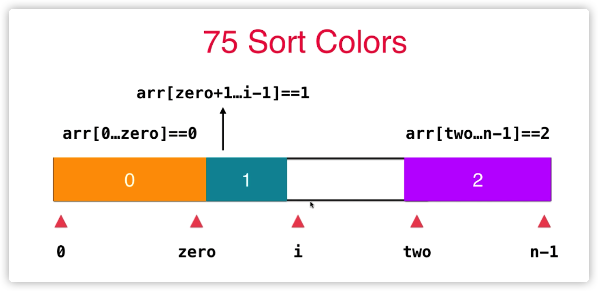
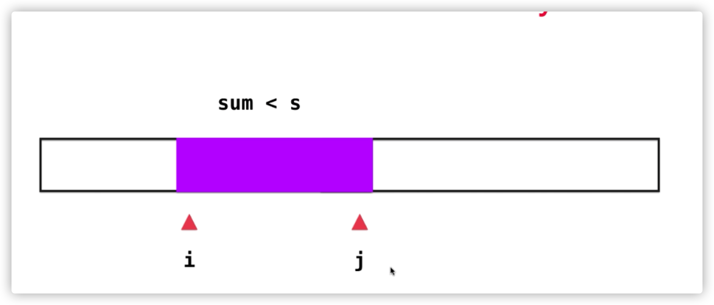

## 第三章：数组中的问题其实最常见
* 排序：选择排序、插入排序、归并排序、快速排序
* 查找：二分查找
* 数据结构：栈；队列；堆
### 如何写出一个正确的程序
* 要清晰明了的定义变量代表的含义
* 找到循环不变量，eg：改变变量的取值，并不一定改变变量的定义
* 小数据量调试（耐心）
* 大数据量测试
[binarySearch](./src/main/java/org/example/three/binarySearch/Solution.java)
### 算法需要背诵吗？
  * 思路上可以记忆
  * 代码不需要背诵
### 力扣：Move Zeros
* 283  扩展 27、26、80
[movezeros](./src/main/java/org/example/three/movezeros/Solution.java)
### 三路快排partition思路的应用 Sort Color

[movezeros](./src/main/java/org/example/three/sortcolor/Solution.java)
* 75 扩展 88、215
### 对撞指针 Two Sum II - Input Array is Sorted
[twoSum](./src/main/java/org/example/three/twoSum/Solution.java)
* 167 扩展 125 344 345 11
### 滑动窗口 Minimum Size Subarray Sum

### 在滑动窗口中做记录
* 3 扩展 438、76
https://leetcode.cn/problems/longest-substring-without-repeating-characters/
## 第4章 查找表相关问题
### set的使用 Intersection of Two Arrays
* 349. Intersection of Two Arrays
[IntersectionOfTwoArrays](./src/main/java/org/example/four/IntersectionOfTwoArrays/Solution.java)
###  map的使用 Intersection of Two Arrays II
* 350  Intersection of Two Arrays II
## 第八章：递归与回溯
### 组合
[combine](./src/main/java/org/example/egiht/combine/Solution.java)
### 全排列
[permutations](./src/main/java/org/example/egiht/permutations/Solution.java)
### wordSearch
   
[wordsearch](./src/main/java/org/example/egiht/wordsearch/Solution.java)
### floodfill 算法
编号：200   扩展 130、417
[numberofIslands](./src/main/java/org/example/egiht/numberofIslands/Solution.java)
### n皇后问题
编号：51 扩展 52、37
[numberofIslands](./src/main/java/org/example/egiht/nqueens/Solution.java)

