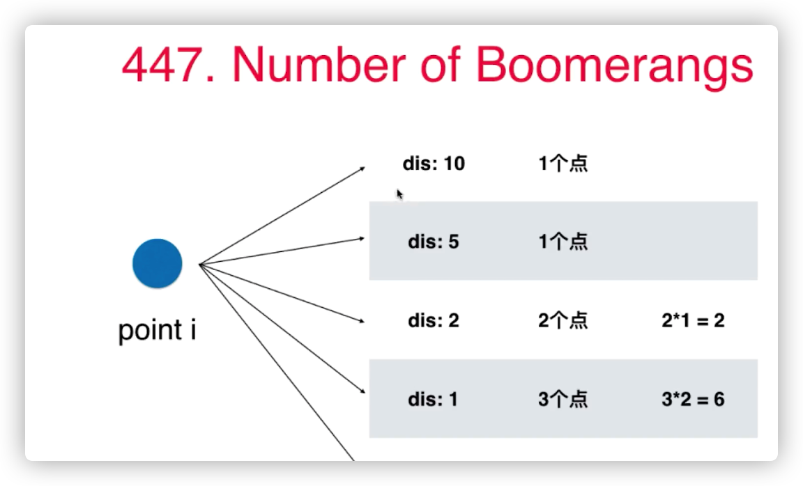

* todo递归遍历方式，前序/中序/后续
## 第三章：数组中的问题其实最常见
* 排序：选择排序、插入排序、归并排序、快速排序
* 查找：二分查找
* 数据结构：栈；队列；堆
### 如何写出一个正确的程序
* 要清晰明了的定义变量代表的含义
* 找到循环不变量，eg：改变变量的取值，并不一定改变变量的定义
* 小数据量调试（耐心）
* 大数据量测试
[binarySearch](./src/main/java/org/example/three/binarySearch/Solution.java)
### 算法需要背诵吗？
  * 思路上可以记忆
  * 代码不需要背诵
### 力扣：Move Zeros
* 283  扩展 27、26、80
[movezeros](./src/main/java/org/example/three/movezeros/Solution.java)
### 三路快排partition思路的应用 Sort Color

[movezeros](./src/main/java/org/example/three/sortcolor/Solution.java)
* 75 扩展 88、215
### 对撞指针 Two Sum II - Input Array is Sorted
[twoSum](./src/main/java/org/example/three/twoSum/Solution.java)
* 167 扩展 125 344 345 11
### 滑动窗口 Minimum Size Subarray Sum

### 在滑动窗口中做记录
* 3 扩展 438、76
https://leetcode.cn/problems/longest-substring-without-repeating-characters/
## 第4章 查找表相关问题
### set的使用 Intersection of Two Arrays
* 349. Intersection of Two Arrays
[IntersectionOfTwoArrays](./src/main/java/org/example/four/IntersectionOfTwoArrays/Solution.java)
###  map的使用 Intersection of Two Arrays II
* 350  Intersection of Two Arrays II
[IntersectionOfTwoArraysII](./src/main/java/org/example/four/IntersectionOfTwoArraysII/Solution.java)
### 使用查找表的经典问题 Two Sum
* 1 https://leetcode.com/problems/two-sum/description/ 15 3sum 18 16
[twoSum](./src/main/java/org/example/four/twoSum/Solution.java)
### 灵活选择键值 4Sum II
* 454 扩展 49
[fourSum](./src/main/java/org/example/four/fourSum/Solution.java)
### 灵活选择键值 Number of Boomerangs
* 447 扩展149

[numberOfBoomerangs](./src/main/java/org/example/four/numberOfBoomerangs/Solution.java)
### 查找表和滑动窗口 Contain Duplicate II
* 219 扩展 217
[ContainsDuplicateII](./src/main/java/org/example/four/ContainsDuplicateII/Solution.java)
### 二分搜索树底层实现的顺序性 Contain Duplicate III
* 220 扩展 217
[ContainsDuplicateII](./src/main/java/org/example/four/ContainDuplicateIII/Solution.java)
## 第5章 在链表中穿针引线
### 5-1 链表，在节点间穿针引线 Reverse Linked List
* 206 扩展 92
[reverseLinkedList](./src/main/java/org/example/five/reverseLinkedList/Solution.java)
### 5-2 测试你的链表程序
* 扩展 86、328、2、445、
## 第七章：二叉树和递归
* 完全二叉树
  * 除最后一层，所有层的节点数达到最大，于此同时最后一层所有节点都在最左侧
* 满二叉树
  * 所有层的节点数达到最大
* 平衡二叉树
  * 每一个节点的左右子树的高度差不超过1

### 7-1 二叉树天然的递归结构
* 104 Maximum Depth of Binary Tree
[MaximumDepth](./src/main/java/org/example/seven/maximumDepth/Solution.java)
* 扩展 111
### 7-2 一个简单的二叉树问题引发的血案 Invert Binary Tree
* 226 Invert Binary Tree
[invertTree](./src/main/java/org/example/seven/invertTree/Solution.java)
* 扩展 100、222、110
### 7-4 注意递归的终止条件 Path Sum
* 112 Path Sum
[pathSum](./src/main/java/org/example/seven/pathSum/Solution.java)

* 扩展 111、404

## 第八章：递归与回溯
### 组合
[combine](./src/main/java/org/example/egiht/combine/Solution.java)
### 全排列
[permutations](./src/main/java/org/example/egiht/permutations/Solution.java)
### wordSearch
   
[wordsearch](./src/main/java/org/example/egiht/wordsearch/Solution.java)
### floodfill 算法
编号：200   扩展 130、417
[numberofIslands](./src/main/java/org/example/egiht/numberofIslands/Solution.java)
### n皇后问题
编号：51 扩展 52、37
[numberofIslands](./src/main/java/org/example/egiht/nqueens/Solution.java)

