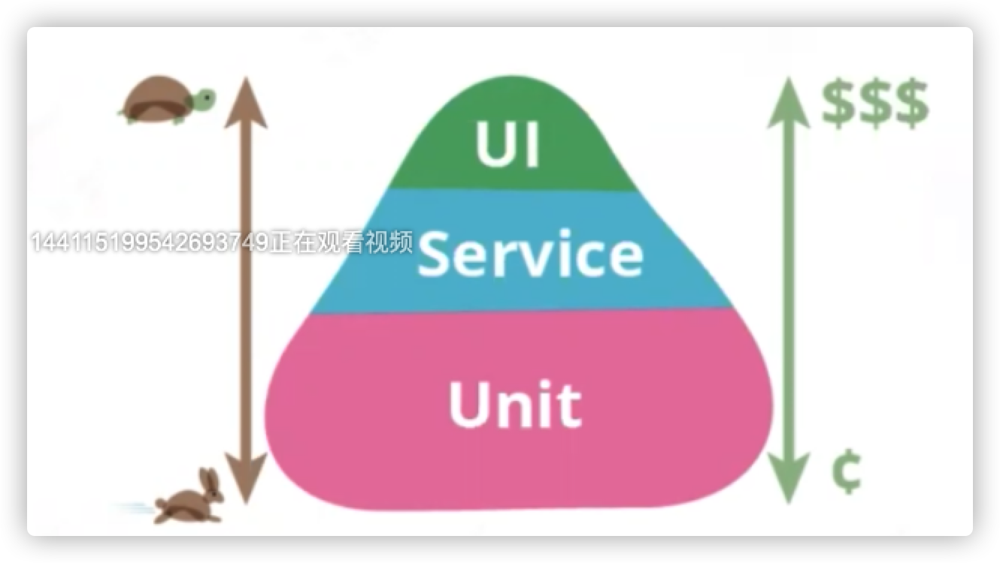
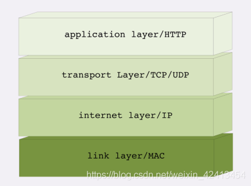
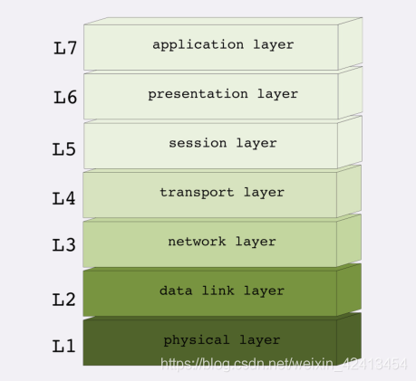
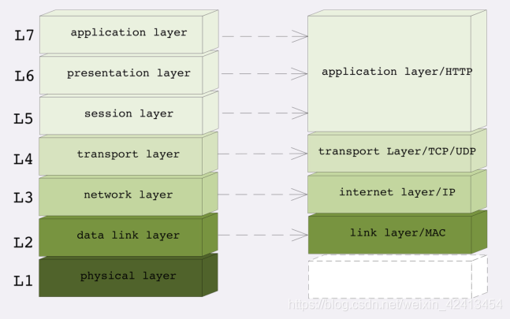
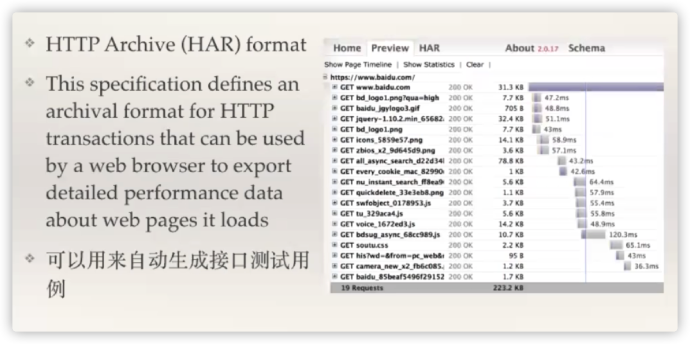
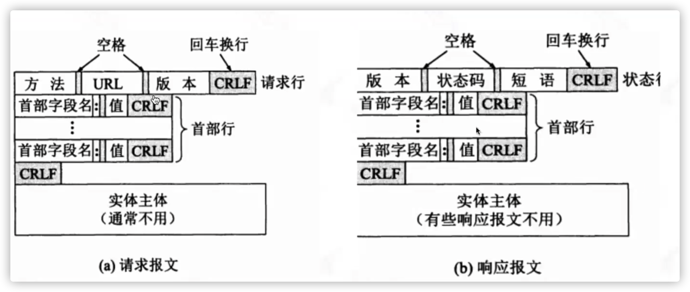
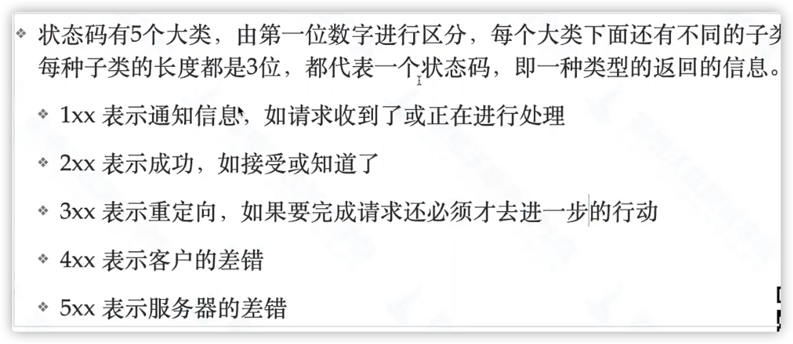
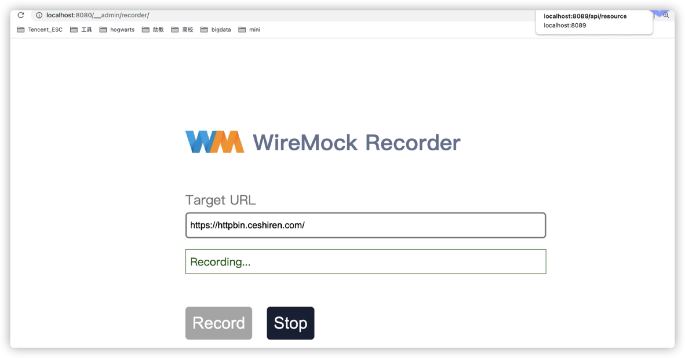

## 接口协议抓包分析
### 接口测试价值与体系

当系统架构越来越负责、变更越来越快的时候，依靠传动瀑布无法支撑测试
#### 思路
* 测试分层
  * 前端ui测试
  * 后端测试
* 微服务化
  * 微服务接口测试
  * 端到端接口测试
* 测试自动化
#### 接口测试必要性

* 行业成熟方案
* 更早的发现问题
* 更快的质量反馈
#### 接口测试不能取代UI测试
* 接口测试虽然有很多的优点，但是保证的时候后端工程师的产出质量，不能解决移动端的质量
* **大前端工程师**的产出质量只能通过UI测试保证
* 大前端研发团队：
  * 前端工程师：HTML、JS、CSS、Vue、React
  * 移动开发工程师：Java、Kotlin、IOS、Android
  * 跨端研发工程师：React Native、Flutter、Weex
* 后端研发团队：
  * springboot
### 常见协议
* IP
* TCP UDP
* HTTP DNS RPC
* Soap RESTful Dubbo
* ProtoBuf[google] MCPack[Baidu]...
### 网络分层
#### 网络四层

* link layer（链接层）：负责在以太网、WiFi这样的底层网络上发送原始数据包，工作在网卡这个层次，使用MAC地址来标记网络上的设备，也叫MAC层 ，传输单位 ：帧（frame）
* internet layer（网络互连层）：IP协议就处在这一层。因为IP协议定义了“IP地址”的概念，在“链接层”的基础上，用IP地址取代MAC地址，把局域网、广域网连接成一个虚拟的巨大网络，在这个网络里找设备时把IP地址再“翻译”成MAC地址即可。传输单位：包（packet）
* transport layer（传输层）：这层次协议的职责是保证数据在IP地址标记的两点之间“可靠”地传输，TCP、UDP协议工作层。传输单位：段（segment）
* application layer（应用层）：各种面向具体应用的协议，如HTTP、Telnet、SSH、FTP、SMTP等等。传输单位：消息、报文（message）
#### 网络七层（OSI网络分层模型）

* 第一层：物理层，网络的物理形式，如电缆、光纤、网卡、集线器等；
* 第二层：数据链路层，相当于TCP/IP的链接层；
* 第三层：网络层，相当于TCP/IP里的网际层；
* 第四层：传输层，相当于TCP/IP里的传输层；
* 第五层：会话层，维护网络中的连接状态，保持会话和同步；
* 第六层：表示层，把数据转换为合适、可理解的语法和语义；
* 第七层：应用层，面向具体的应用传输数据。
#### 四层 vs 七层

* 第一层：物理层，TCP/IP里无对应；
* 第二层：数据链路层，对应TCP/IP的链接层；
* 第三层：网络层，对应TCP/IP的网际层；
* 第四层：传输层，对应TCP/IP的传输层；
* 第五、六、七层：统一对应到TCP/IP的应用层
### 协议分析工具
* 网络嗅探
  * WireShark
  * TcpDump
  * 使用场景：tcpdump转文件，wireshark导入文件
    ```
      sudo tcpdump host www.baidu.com -w /tmp/tcpdump.log
      curl http://www.baidu.com
      停止tcpdump
      使用wireshark打开/tmp/tcpdump.log
    ```
* Proxy
  * fiddler[window]、AnyProxy[全平台]
  * 推荐工具：charles[全平台]、burpsuite[全平台java]
* 分析工具与协议客户端工具
  * curl
  * chrome devtool
    * 导出请求为curl
    * har格式
      
### 使用postman发送请求
[官网](https://www.postman.com)
### 使用curl发送请求
[官网](https://curl.se/)
### 常用代理工具
#### Charles
[跳转](./charles/README.md)
### http协议讲解
#### http报文结构

#### 常见状态码

1XX   
2XX   
3XX  重定向     
  301 永久移动   
  302 临时移动   
4XX   
  403   未授权   
  404   未找到       
5XX   
  503   服务不可用   
  500   服务内部错误   
#### http实例分析
* 右键左侧数据，选择Copy -> copy as curl，并可把请求内容转化为curl命令
* 将命令copy在gitbash或bash上运行，则会看到返回信息
* 对上面命令进行细化，加入"-v"参数可以打印更详细的内容，用"2>&1"(标准错误流等同于正确流)将标准错误重定向到标准输出，发送此命令将得到细化后的内容
### get、post区别实战详解
* GET 
  * 用于获取信息
  * 是幂等的
  * 且可缓存
  * 编码类型：application/x-www-form-urlencoded
    * 只允许 ASCII 字符。
* POST 
  * 用于修改服务器上的数据
  * 非幂等
  * 不可缓存
  * 编码类型：application/x-www-form-urlencoded 或 multipart/form-data。为二进制数据使用多重编码。
    * 没有限制。也允许二进制数据。
## wireMock
### 使用实例
[BaseMock](./wiremock/src/test/java/com/example/wiremock/BaseMock.java)
### wireMock录制
#### 1.下载jar包，启动wiremock服务
java -jar wiremock-jre8-standalone-2.32.0.jar
#### 2.访问页面，进行录制
http://localhost:8080/__admin/recorder

## REST-assured
[官网](http://rest-assured.io/)   
[跳转](./rest-assured/README.md)
### 简介
* 是由 Java 实现的 REST API 测试框架
* 支持发起 POST,GET,PUT,DELETE 等请求
* 可以用来验证和校对响应信息
## Jmeter+mvn
### ExtentReport
[跳转](./extent-reports/README.md)