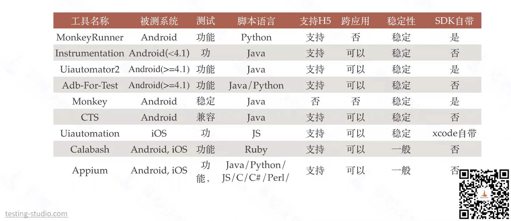
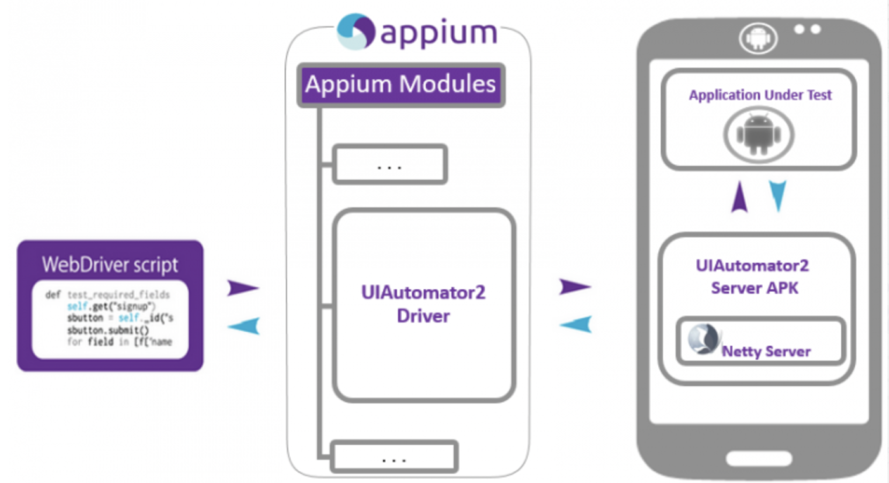

* 疑问
  * scrcpy投屏工具？
## mobile 自动化解决方案
### IOS
* calabash-ios
* Frank
* UIAutomation
* ios-driver
* KeepItFunctional
### Android
* calabash-android
* MonkeyTalk
* Robotium
* UiAutomator
* selendroid
### 工具选择

#### 考虑因素
* 单平台测试 or 多平台测试？
* 是否有多设备同时测试的场景？
* 不局限于测试环境，任何版本任何环境都可以测试？
* 最擅长哪种开发语言？
* 当前市面是否有满足项目需求的测试工具？是否需要二次开发？
## Appium
> Appium是一个移动端的自动化测试框架 ，可用于测试原生应用，移动网页应用和混合应用，且是跨平台的。
> 可用于iOS和Android操作系统。原生应用是指用android或iOS编写的应用，移动网页应用是指网页应用，
> 类似于iOS中safari应用或者Chrome应用或者类似浏览器的应用。混合应用是指一种包裹webview的应用，
> 原生应用网页内容交互性的应用。重要的是Appium是跨平台的。
> 何为跨平台，意思是可以针对不同平台用一套api来编写脚本   

[appium官方入门手册](https://github.com/appium/appium/blob/master/docs/en/about-appium/getting-started.md)
### 推荐Appium原因
* 跨语言：java/python/nodejs等
* 跨平台：
  * android/ios
  * windows/mac
* 底层多引擎切换
* 生态丰富，社区强大
### Appium 引擎列表
* iOS
  * The XCUITest Driver（推荐）
  * (DEPRECATED)The UIAutomation Driver
* Android
  * (BETA)The Espresso Driver
  * The UiAutomator2 Driver（推荐）
  * (DEPRECATED) The UiAutomator Driver
  * (DEPRECATED) The Selendroid Driver
* Windows：The Windows Driver(for Windows Desktop apps)
* Mac：The Mac Driver(for Mac Desktop apps)
### Appium原理

* webdriver是基于http协议的，第一连接会建立一个session会话，并通过post发送一个json告知服务端相关测试信息
* Client/Server设计模式
  * 客户端通过WebDriver json wire协议与服务端通讯
  * 多语言支持
* Server可以放在任何地方
* 服务端NODEJS开发的HTTP服务
* appium使用appium-xcuitest-driver来测试iPhone设备，其中需要安装facebook出的WDA(webdriveragent)来驱动iOS测试
### Appium生态工具
* adb：android的控制工具，用于获取android的各种数据控制
* Appium Desktop：内嵌了appium server和inspecter的综合工具
* Appium Server：appium的核心工具，命令行工具
* Appium client：各种语言的客户端封装库，用于连接appium server
* python、java、ruby、robotframework-appium
* AppCrawler自动遍历工具
### 环境安装
#### Java 版本
https://www.oracle.com/java/technologies/downloads
#### Android sdk
* 下载sdk
  * Android studio地址：https://developer.android.com/studio/index.html
  * 中文官网下载地址：http://tools.android-studio.org/index.php/sdk
* 安装sdk
  * 其实sdk就是个文件夹，下载之后需要手动更新，配上环境变量就可以使用，不需要手动安装
* 配置android SDK环境变量，如下:
  * ANDROID_HOME D:-bundle-mac-x86_.64-20140702
  * PATH %ANDROID_HOME%;%ANDROID_HOME%-tools
* 检查是否安装成功，cmd输出
  * adb回车或者adb shell然后回车
#### appium-desktop
* 下载对应操作系统的安装包：https://github.com/appium/appium-desktop/releases
* 如果不需要appium inspector，也可以通过npm直接安装appium
```
  npm install -g appium
淘宝提供（推荐）：
  npm install -g cnpm --registry=https://registry.npm.taobao.org
  cnpm install -g appium
运行appium(不报错说明安装成功)：
  appium
```
Appium java client
### Appium 用例录制
#### 下载安装API Demos.apk
[ApiDemos-debug.apk](https://raw.githubusercontent.com/appium/appium/master/sample-code/apps/ApiDemos-debug.apk)
#### 获取 App 的启动页面
```
mac:adb logcat ActivityManager:I | grep cmp
win: adb logcat ActivityManager:I | findstr "cmp"

Mac/Linux: 'adb shell dumpsys window windows | grep mFocusedApp’
在 Windows 终端运行 'adb shell dumpsys window windows’ 然后去看mFocusedApp这一行的内容。
```
#### adb启动APP
命令： adb shell am start -n <包名>/<avticity名>
#### 实战场景
录制内容：
* 1、打开api demo.apk
* 2、点击 OS
* 3、sms messaging
* 4、输入收件人，信息body
* 5、点击【SEND】   
[AppiumSMSTest示例](./appium/src/test/java/org/study/appium/apidemo/AppiumSMSTest.java)
### Appium Capability设置
[官方文档](https://github.com/appium/appium/blob/master/docs/en/writing-running-appium/caps.md)
* app 
  * apk地址
* appPackage
  * 包名
* appActivity 
  * Activity名字 
* automationName
  * 默认使用uiautomator2 (andorid默认使用uiautomator2, ias默认使用XCUITest)
* udid 
  * 描述：Unique device identifier of the connected physical device
* newCommandTimeout
  * 在appiumClient发送指令后，没有新指令，默认60s断开appium连接
--- 
* autoGrantPermissions
  * 让appium自动确定应用程序需要哪些权限，安装时自动授权，默认为false
  * 如何noReset为真，此功能失效
* noReset 
  * 是否在测试前后重置相关环境（例如首次打开弹框，或者是登录信息)
* fullReset
  * 完全重置应用
* dontStopAppOnReset
  * ture：首次启动的时候，不停止 app (可以调试或者运行的时候提升运行速度)
  * 默认为false，表示：app已经启动了，会再次重新启动
---
* skipDeviceInitialization
  * 跳过安装，权限设置等操作（可以调试或者运行的时候提升运行速度)
* skipServerInstallation
* skipUnlock
* skipLogcatCapture
* systemPort
* relaxed-securty
  * appium启动的时候设置


### appium元素定位
* 要想一个脚本同时支持android/ios俩个系统，就得保证元素属性（id、aid、xpath等）一致
#### 常用的两种定位方式Id, AccessibilityId
* driver.findElementsById(resource-id)
* driver.findElementsByAccessibilityId(content-desc)
#### 实例
* 打开”雪球”app
* 向搜索输入框中输入文本”阿里巴巴”
* 获取”阿里巴巴”这只股票的价格
* 判断股票的价格大于200
[XueQiuTestTest示例](./appium/src/test/java/org/study/appium/xueqiudemo/XueQiuTest.java)
#### Xpath定位
参考webauto笔记
#### uiautomator 定位
[官网](https://developer.android.com/reference/android/support/test/uiautomator/UiSelector.html)
* 优点:
  * 定位速度比xpath快
  * uiautomator是android的工作引擎，速度快
* 缺点:
  * 表达式书写复杂，容易写错IDE没有提示
* uiautomator 定位方法   
  通过resourceid定位   
  new UiSelector().reseurceId("id")   
  通过classname定位   
  new UiSelector().className("className")   
  通过content-desc定位   
  new UiSelector().description("contenet-des属性")   
### appium常用方法
* getAttribute()获取属性
* text()获取内容
* 获取坐标
  * element.getLocation()
* 获取尺寸
  * element.getSize()
### appium触屏操作
[官方touch-actions](https://github.com/appium/appium/blob/master/docs/en/writing-running-appium/touch-actions.md)
* TouchAction可用的事件：
  * press (手势)按下
  * release (手势)抬起,释放
  * moveTo 移动
  * tap 点击
  * wait 等待
  * longPress 长按
  * cancel 取消
  * perform 执行
#### 滑动示例
[XueQiuMoveTest示例](./appium/src/test/java/org/study/appium/xueqiudemo/XueQiuMoveTest.java)

### 三种经典等待方式
* 强制等待:
  * sleep(不推荐)
* 隐式等待(全局性)
  * 设置一个超时时间，服务端appium会在给定的时间内，不停的查找，默认值是0
  * 用法: driver.manage().timeouts().implicitlyWait(10,TimeUnit.SECONDS);
  * 在服务端等待
  * time 单位是秒
* 显式等待(等待某个元素)
  * wait=new WebDriverWait(driver,10,1);
  * wait.until(ExpectedConditions.visibilityOfElementLocated(MobileBy.id("com.android.settings:id/title")));
  * 在客户端等待

### 踩坑
* appium启动app，appActivity查找错误，会抛异常
```java
Exception occurred while executing 'start':
java.lang.SecurityException: Permission Denial: starting Intent { act=android.intent.action.MAIN cat=[android.intent.category.LAUNCHER] flg=0x10200000 cmp=com.xueqiu.android/.main.view.MainActivity } from null (pid=4257, uid=2000) not exported from uid 10271
	at com.android.server.wm.ActivityStackSupervisor.checkStartAnyActivityPermission(ActivityStackSupervisor.java:1344)
	at com.android.server.wm.ActivityStarter.executeRequest(ActivityStarter.java:1260)
	at com.android.server.wm.ActivityStarter.execute(ActivityStarter.java:894)
```


---2/27

adb tcpip 5555


