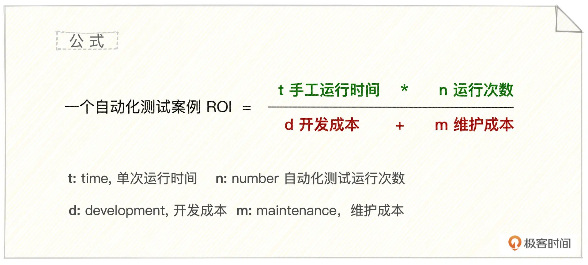
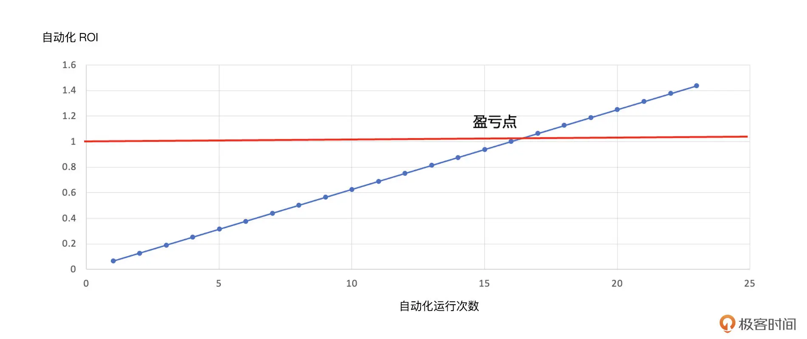
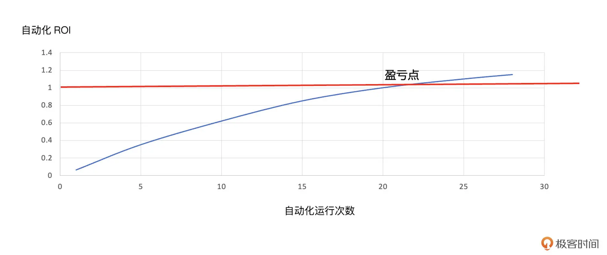
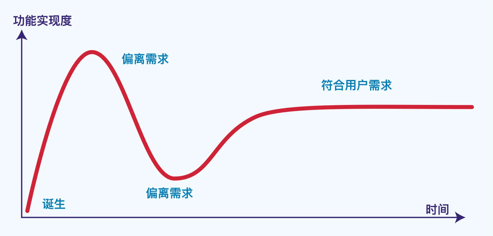
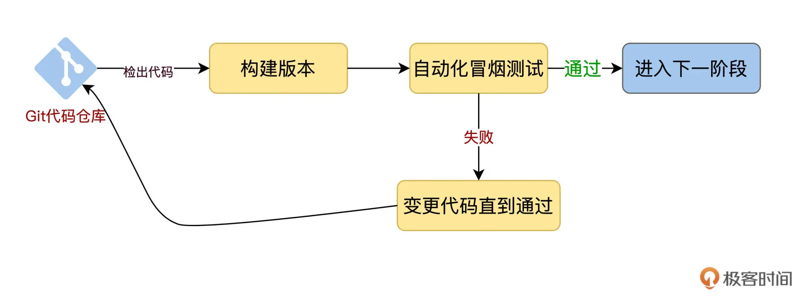
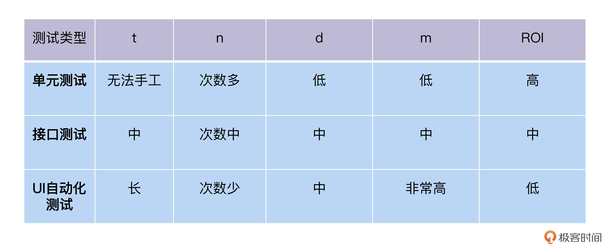
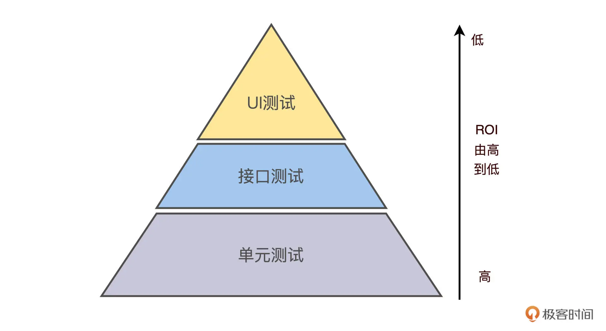
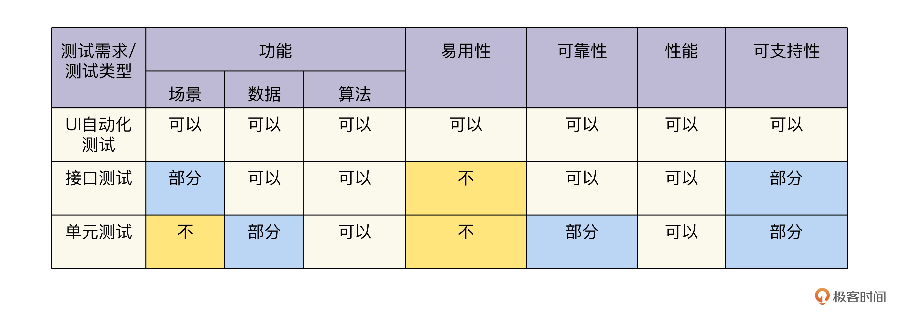
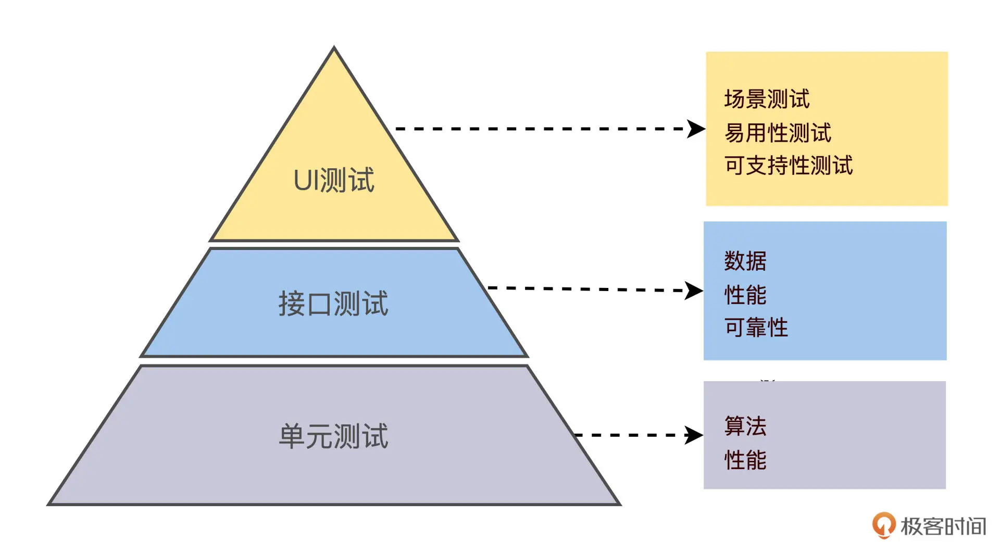

# 活着还是死去-价值篇
## 01 ROI价值内核：自动化测试的价值可以量化么？
### ROI计算公式

* ROI 大于 1 就是赚了，小于 1 就是亏了。那么，给定一个测试案例，要不要对它做自动化，判断的依据是（自动化测试）预期 ROI 至少要大于 1
* 自动化测试是一个长收益模式。在理想情况下，是一次性投入（投入为开发成本），之后每运行一次，就会增加一份产出。所以，时间越长，次数越多，收到的回报就会越大
* 开发成本 d 和维护成本 m
    * 开发成本
        * 开发成本工作量一般为线性增长
        * 度量方法：
            * 类似估算软件开发工作量，代码行法、功能点法，实际自动化脚本工时eg：jira登记工时
    * 维护成本
        * 维护成本就有点模糊了，这里包含了多种可变因素，是**自动化测试项目风险的主要来源**
        * 维护成本工作量一般以非线性来增长的
        * 自动化测试代码的维护成本更复杂，
            * 不仅面临着腐化的问题：一个陈旧的老破系统，加入一个新功能需要写 10 行代码，只要花 5 分钟。但是搞清楚这 10 行代码，应该加到哪个文件里，要花费 3 天时间。在这种时候，这个软件系统就已经不可维护了，它要寿终正寝了
            * 还有被测产品更新带来的维护等等
* 从 ROI 公式，我们很容易推导出业界熟知的经验“自动化测试是用来做回归测试的”
* 自动化是开发出来不会只运行一次，除非它的 t 特别大，实现了手工测试做不到的事情，比如单元测试、性能测试
* 这里我们又得到一个结论：软件发布周期变短是自动化测试 ROI 提升的产物。
### ROI与运行次数关系图
* 理想情况
  
* 实际情况
  
* 分析
    * 在实践中，你看不到前面图里，那样简单漂亮的 ROI 直线，它会表现为一段曲线：自动化的 ROI 增长速度，要比运行次数增长慢一些，直到最后，每运行一次，花费的维护工作量，比节省的工作量还多，自动化就该退休了，也就是下线，重构完了再上线
### ROI 得出的三个核心观点
* 1.自动化测试是用来做回归的
    * n 是测试案例的稳定回归次数，稳定这两个字，它代表功能 A 已经稳固下来，不再变了。更精确地说，功能 A 即使有变化，但是变化规律已经可以被自动化测试吸纳。这种情况下，自动化测试运行才能发挥效益。
    * 加特纳的技术成熟曲线
        * 
        * 通过加特纳成熟度曲线可以看出，新功能在产生初期，一般是不稳定的，和它的预期有一个差距。经过几轮调整后，才会进入到一个平缓的阶段，这也是稳定回归测试的阶段。而不同类型的软件，它的功能成熟时间长短，变化剧烈程度可能是非常不一样。
* 2.自动化测试从哪里开始？实施顺序从 ROI 高到低，也就是（给定一个软件系统），优先做回归次数最高的那部分功能，先做自动化回归次数最高的案例，再做低的，直到 ROI 等于 1 的案例。在功能模块的初期，可以考虑先做手工测试。
* 3.自动化测试什么时候开始？功能模块稳定的时候。
### 冒烟测试是你自动化的开始
> 在软件领域，80% 用户，常用的是系统中 20% 的功能。冒烟测试覆盖的这部分 20% 功能，是常用的，一般也是核心的，最先被开发出来的。所以，它同时满足稳定和回归次数高两个特点。

* 实际上，有一个很好的测试实践可以匹配上面的要求，那就是冒烟测试。冒烟测试是测试用例的子集，用来验证系统中基础的、影响发布软件的功能。甄选冒烟测试的一个常用办法就是二八原则。
* 进而我们就可以得到推论：在实践中，可以设定目标，冒烟测试 100% 自动化。这时，自动化测试就可以和手工测试配合，形成一个新版本发布 + 冒烟测试的简单流水线。
  
### 问题
1. “产品要上线了，QA 人手紧，能不能搞一下测试自动化，减少点人手?”
   自动化测试是长收益模型，所谓远水解不了近渴
2. “什么？你还要再增加 2 个自动化测试开发工程师来完成这个项目，怎么算出来的？”
   通过一个时间窗口内比如一年内，所需要的手工测试总工时，以及自动化ROI来计算吧
3. “听说你开发了个什么自动化脚本，它给公司带来了什么价值？用量化的数据给我讲一讲。”
   价值：1、测试效率提升：ROI，比手工测试速度快
   2、发布效率提升：缩短发布周期
   3、线上bug逃逸率
   前提是要有完善的度量体系才能通过指标的变化体现自动化测试的价值

## 02｜3KU法则：如何找出最优自动化实施截面？
> 目标，制定自动化测试策略，能够让这个自动化测试设计获得尽可能大的 ROI
### ROI vs 分层测试

* ROI和分层测试关系图

  * 根源在于 ROI，金字塔是表现出来的形态而已
### 寻找最优 ROI 策略
#### 1.分层测试为啥会“内卷”?
* 实际落地时却存在问题：
  * 一批人做 UI 测试自动化，
  * 另外一批人去做接口测试，
  * 然后开发人员做单元测试。   
* 三路人马忙得不亦乐乎，都说自己贡献大，等到 bug 发生了泄漏到生产环境，又开始甩锅
* 测试截面分析

三个测试截面测的是一个请求在不同层面上的形态，那么每一个截面都可以测试全部的案例，也可以测试部分的案例。就像 3 个人负责 1 个项目一样，如果没有经过事先的协调和安排，3 个人可能做了重复的事情，造成浪费，也可能存在一件事 3 个人都没干，形成测试盲区。
#### 2.需求 / 策略矩阵
* 这种“内卷”是不是一个问题？可能你会说没问题，各层独立测试能够加强质量保障。说这话的底气在于测试上的投入充足，不计内卷成本。
* 实际上，在 DevOps 风行的今天，趋势是追求效果和效率。所以，在资源有限的条件下，我们需要在整体上看待分层测试的最优 ROI。
* FURPS 是用 5 个维度来描述一个软件的功能需求.FURPS 这个单词对应着每个需求的英文首字母：
  * F=Function 功能
  * U=Usability 易用性
  * R=Reliability 可靠性
  * P=Performance 性能
  * S=Supportability 可支持性
* 测试需求 vs 测试类型

#### 3.3KU 整体策略
好，有了需求 / 策略矩阵后，结合上面讲到的自动化测试 ROI 金字塔，我们的整体最优 ROI 策略就呼之欲出了。什么是整体最优 ROI 呢？
* 有 3 个 Key（关键因素）：
  * Useful: 每个测试需求都是有效的；
  * Ultimate: 每个测试需求的验证都在优先寻找自动化 ROI 高的层面去实现，如果不可行，按照 ROI 高到低回退，直到 UI 层；
  * Unique: 每个层面上验证的测试需求都和别的层面都不是重复的。这样分配的工作，既不重复，又没遗漏，还遵循了 ROI 的原则。我管它叫 3KU 原则。

#### 4.思考题
* 软件大师马丁·福勒曾经说过：“在微服务时代，分层测试不再呈现金字塔形状。”这是为什么？试着用 ROI 来解释一下。
* 2 学完今天的内容，如果你是测试主管，你希望你的团队是全栈（一个人负责一个模块的所有层面测试），还是精细分工（一个人负责所有模块的一个层面测试）？有什么优劣?

