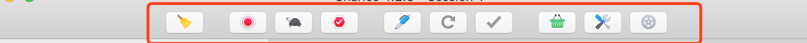
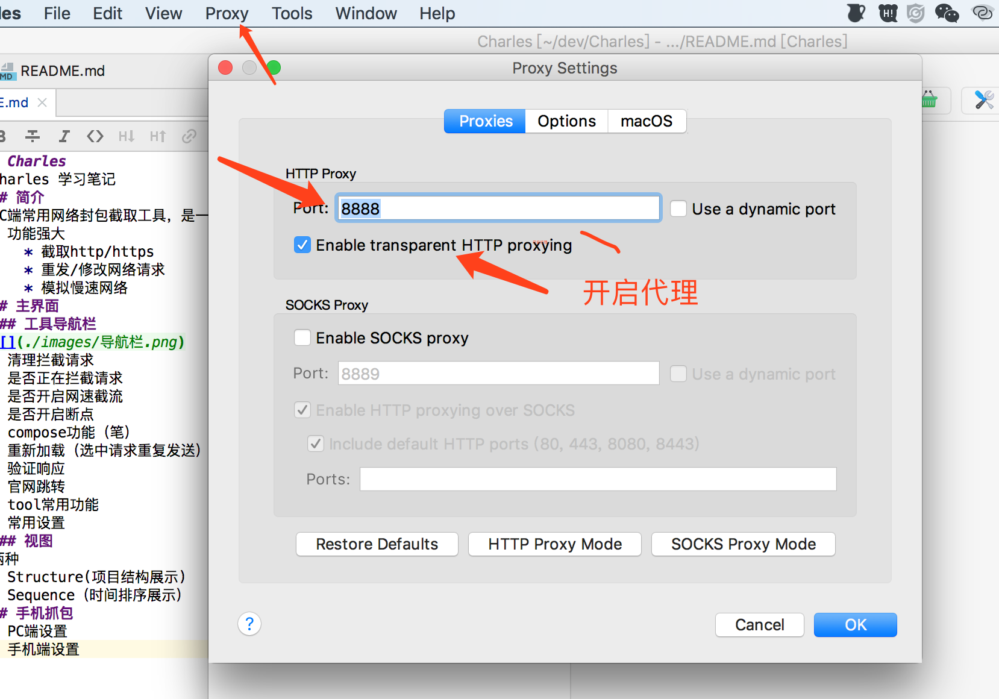
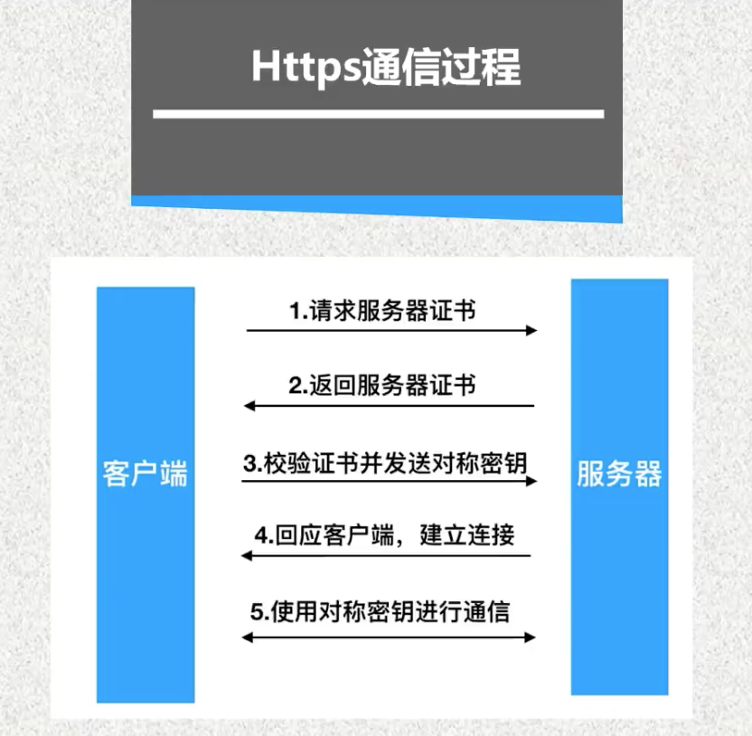
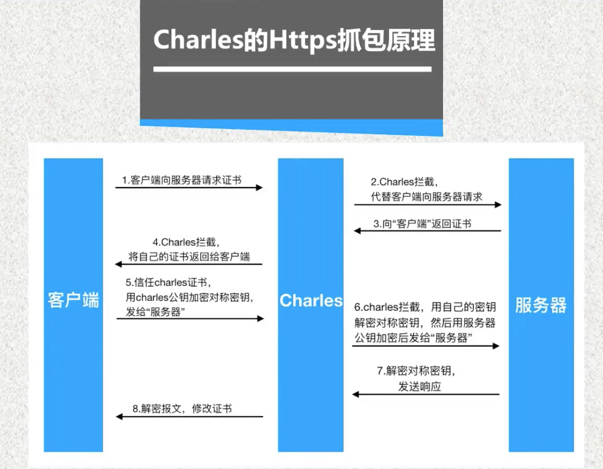
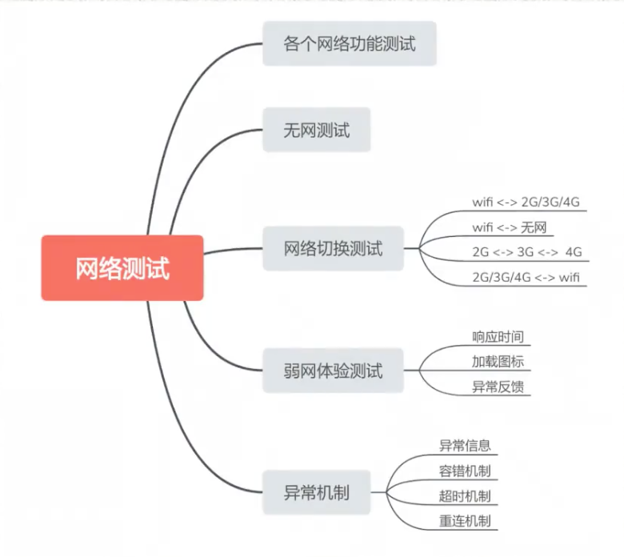
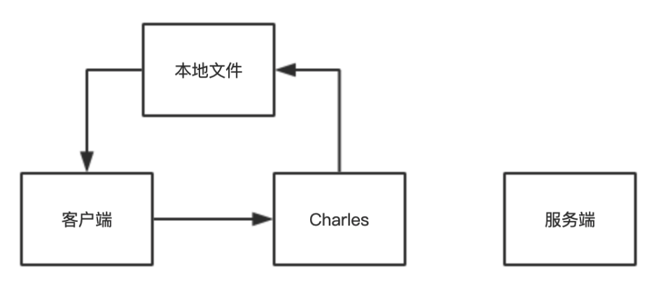
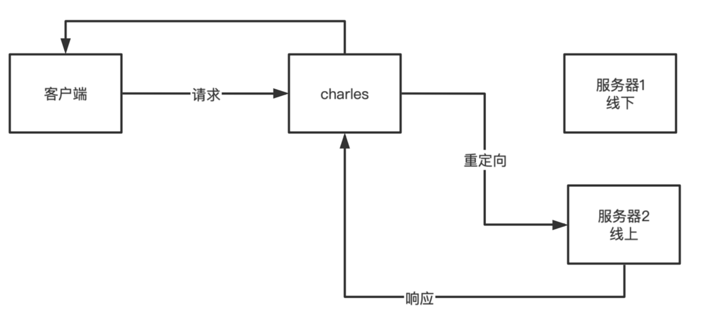
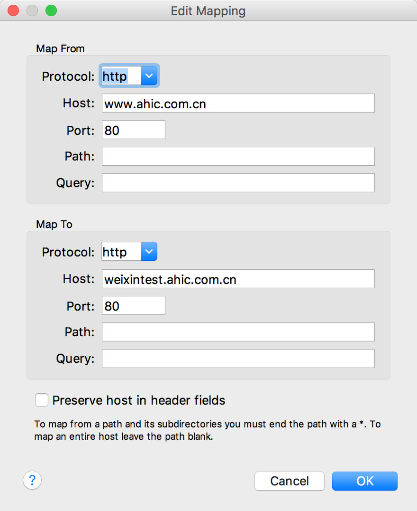
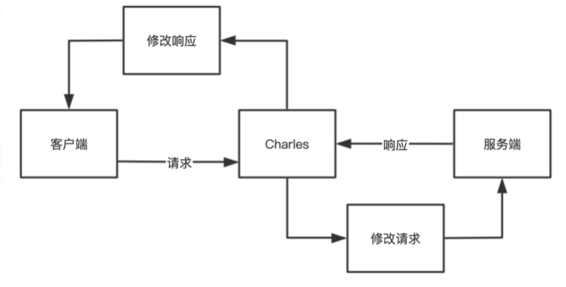

# Charles
Charles 学习笔记
## 简介
PC端常用网络封包截取工具，是一个同fiddler同类型的http抓包工具
* 功能强大
    * 截取http/https
    * 重发/修改网络请求
    * 模拟慢速网络
## 主界面
### 工具导航栏

* 清理拦截请求
* 是否正在拦截请求
* 是否开启网速截流
* 是否开启断点
* compose功能（笔）
* 重新加载（选中请求重复发送）
* 验证响应
* 官网跳转
* tool常用功能
* 常用设置
### 视图
两种
* Structure(项目结构展示)
* Sequence（时间排序展示）
## 手机抓包
* PC端设置

* 手机端设置
    * 电脑手机同一个Wi-Fi
    * 查看电脑IP（HELP->Local Ip Address）
    * 设置手机http代理
    
* 注意
    * 电脑手机同一个Wi-Fi
    * 关闭电脑防火墙
    * 手机抓完包后关闭Wi-Fi设置
    * 
## HTTPS抓包
 
 
[参考资料](https://blog.csdn.net/weixin_43291944/article/details/90675879)
* 代理配置步骤
  * step1：配置代理
  * step2：获取证书
  * step3：安装证书
  * step4：信任证书
### PC配置
* 安装Charles证书：HELP->SSL Proxying->Install Charles Root Certificate
* 配置SSL的抓取域名：Proxy-> SSL Proxying Settings->添加Location:*
### PHONE配置
* 在移动设备/远程浏览器安装SSL证书
* 手机浏览器输入网址"chls.pro/ssl"
* 下载信任证书
* Android 6 以上的系统 app 默认不信任抓包证书 
  * 需要开发修改代码 
  * 大部分测试app安装包默认打开状态
* IOS 安装证书没有版本限制
  * 需要注意要信任证书
## Charles弱网测试

### 什么样的网络属于弱网
2G的网速：150Kbps，折合下载速度15-20K/s。   
3G的网速：1-6Mbps，折合下载速度120K/s-600K/s。   
4G的网速：10-100Mbps，折合下载速度1.5M/s-10M/s。   
2G速率的时候都属于弱网，3G也可划分为弱网。    
一般Wi-Fi不划入弱网测试范畴。   
弱网场景测试，常见场景包括：地铁/巴士、电梯、楼梯间、停车场
### 操作步骤
1）选择 “Proxy”->”Throttle Setting” 项   
2）勾选上 “Enable Throttling”，only for selected host可以设置一个指定的主机访问进行限制网络。   
3）在Throttle preset中有多种预置的网络情况   

* Throttle preset —— 多种预置的网络情况
* bandwidth —— 带宽，即上行、下行数据传输速度。
* utilisation —— 带宽可用率，大部分modern是100%。
* round-trip latency —— 第一个请求的时延，单位是ms。
* MTU —— 最大传输单元，即TCP包的最大size，可以更真实模拟TCP层，每次传输的分包情况。
* Releability —— 指连接的可靠性。这里指的是10kb的可靠率。用于模拟网络不稳定。
* Stability —— 连接稳定性，也会影响带宽可用性。用于模拟移动网络，移动网络连接一般不可靠

## 过滤网络请求
Charles过滤网络有三种方式：
* 【临时性过滤】在主界面的 Filter 栏中输入需要过滤出来的关键字。   
* 【经常性顾虑】在菜单栏选择 “Proxy”->”Recording Settings”，在弹出的窗口中选择 Include 栏，再点击“Add”，在弹出的窗口中输入需要监控的协议，主机地址，端口号等信息，来添加一个项目。
* 【临时性+快速性过滤】在想过滤的网络请求上点击右键，选择 “Focus”，之后在 Filter 一栏勾选上 Focussed
## Map重定向
### 功能点：
Charles的Map功能可以将某个请求进行重定向，用重定向的内容响应请求的内容；
使用通配符，批量匹配      
重定向的方式可以分为两种：Map Local和Map Remote。
### 分类
* Map Local：将某个网络请求重定向到本地某个文件
    * 设置 Map Local：请求右键直接设置
    * 取消 Map Local：Tool->Map Local

* Map Remote：将某个网络请求重定向到另一个网络请求

## rewrite功能

Rewrite 功能适合对某一类网络请求进行一些正则替换，以达到修改结果的目的。
## Breakpoints功能
Breakpoint :打断点
它的作用：在抓包工具Charles里可以通过Breakpoint 打断点来修改Response数据。
## Compose功能
Compose功能可以在原有的请求基础上进行修改。   
使用场景：在进行接口测试时，临时修改请求参数、参数值或者header等等。
## 服务器压力测试
使用 Charles 的 Repeat 功能来简单地测试服务器的并发处理能力，方法：   
1)在想打压的网络请求上右击，然后选择 「Repeat Advanced」   
2)可以在弹出的对话框中，选择打压的并发线程数以及打压次数，确定之后，即可开始打压。    

