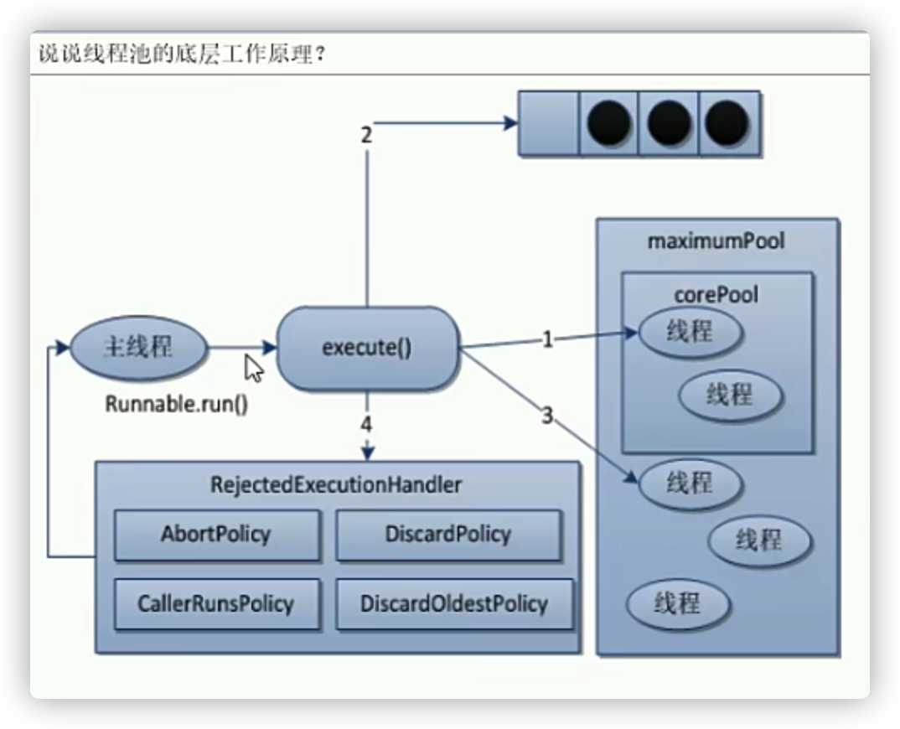

尚硅谷互联网大厂高频重点面试题（第2季）46->54
### 线程池的使用及优势
* 降低资源消耗(通过重复利用已经创建的线程，降低线程创建销毁造成的损耗)
* 提高响应速度(无须创建线程，直接执行线程)
* 提高线程的可管理性(线程为稀缺资源，进行统一分配、调优、监控)
### 核心 ThreadPoolExecutor 7大参数
```
public ThreadPoolExecutor(int corePoolSize, //线程池中常驻核心线程数
                              int maximumPoolSize, //线程池能够容纳同时执行的最大线程数 >=1
                              long keepAliveTime, /* 多余的空闲线程存活时间
                                                     线程池数量超过corePoolSize，空闲时间达到keepAliveTime，
                                                     多余的空闲线程会被销毁，只剩下corePoolSize个线程为止
                                                   */
                              TimeUnit unit, // keepAliveTime的单位
                              BlockingQueue<Runnable> workQueue, // 任务队列，被提交尚未被执行的的任务
                              ThreadFactory threadFactory, // 创建工作线程的工厂，一般默认即可
                              RejectedExecutionHandler handler // 拒绝策略，当队列满了，且工作线程>=maximumPoolSize
                              ) {
        if (corePoolSize < 0 ||
            maximumPoolSize <= 0 ||
            maximumPoolSize < corePoolSize ||
            keepAliveTime < 0)
            throw new IllegalArgumentException();
        if (workQueue == null || threadFactory == null || handler == null)
            throw new NullPointerException();
        this.corePoolSize = corePoolSize;
        this.maximumPoolSize = maximumPoolSize;
        this.workQueue = workQueue;
        this.keepAliveTime = unit.toNanos(keepAliveTime);
        this.threadFactory = threadFactory;
        this.handler = handler;
    }

```
* 【注意】新来的顾客会跳过等候区直接到新加的临时窗口去办理业务
  * [ThreadPoolExecutorExample](src/main/java/com/example/thread/ThreadPoolExecutorExample.java)
#### 工作原理

#### 拒绝策略
* 触发拒绝策略
  * 等待队列满了
  * maximumPoolSize满了
* 四种拒绝策略
  * AbortPolicy（默认，生产不敢用）
    * 抛异常 RejectedExecutionException，阻止系统允许
  * CallerRunsPolicy
    * 调用者允许机制；不抛弃任务，也不抛出异常，讲任务回退给调用着（哪个线程调用就给哪个线程，eg：主线程）
    * 换句话说就是回退给主线程
  * DiscardOldestPolicy
    * 抛弃队列中等待最久的任务，然后把当前任务加入到队列中再次提交任务
  * DiscardPolicy
    * 直接丢弃任务，不处理也不抛异常，如果业务允许这是最好的处理方法
### 创建线程的4种方法
* 区别
  * 方法一、二没有返回值、方法三有返回值
  * 方法一、二、三不能控制资源
  * 方法四可以控制资源，性能稳定
#### 方法一：继承Thread
#### 方法二：实现runnable接口
#### 方法三：实现Callable接口+FutureTask（可以拿到返回结果，可以处理异常）
* [MyThreadDemo](src/main/java/com/example/thread/MyThreadDemo.java)
#### 方法四：线程池
* [MyThreadPoolDemo](src/main/java/com/example/thread/MyThreadPoolDemo.java)
* 【注意】生产不能使用此方式
  * newFixedThreadPool、newSingleThreadExecutor容易导致请求堆积，造成oom
  * newCachedThreadPool容易导致线程堆积，造成oom
##### 生产环境只能手写线程池
* [ThreadPoolExecutorExample](src/main/java/com/example/thread/ThreadPoolExecutorExample.java)
##### 生产环境七大参数如何合理配置 or 如何考虑
* 查看核心数字：Runtime.getRuntime().availableProcessors()
  * cpu密集型
    * cpu数+1
  * io密集型
    * cpu数*2
    * cpu数字/\[1-阻塞系数（0.8-0.9)]
### CompletableFuture（jdk1.8+）
* 异步会点、流式处理、多个Future组合处理的能力，使Java在处理多任务的协同工作时更加顺畅便利
#### 1、创建异步任务
##### supplyAsync
1. supplyAsync是创建带有返回值的异步任务。它有如下两个方法，一个是使用默认线程池（ForkJoinPool.commonPool()）的方法，一个是带有自定义线程池的重载方法
2. runAsync是创建没有返回值的异步任务。它有如下两个方法，一个是使用默认线程池（ForkJoinPool.commonPool()）的方法，一个是带有自定义线程池的重载方法
3. 获取任务结果的方法
```java
// 如果完成则返回结果，否则就抛出具体的异常
public T get() throws InterruptedException, ExecutionException 
 
// 最大时间等待返回结果，否则就抛出具体异常
public T get(long timeout, TimeUnit unit) throws InterruptedException, ExecutionException, TimeoutException
 
// 完成时返回结果值，否则抛出unchecked异常。为了更好地符合通用函数形式的使用，如果完成此 CompletableFuture所涉及的计算引发异常，则此方法将引发unchecked异常并将底层异常作为其原因
public T join()
 
// 如果完成则返回结果值（或抛出任何遇到的异常），否则返回给定的 valueIfAbsent。
public T getNow(T valueIfAbsent)
 
// 如果任务没有完成，返回的值设置为给定值
public boolean complete(T value)
 
// 如果任务没有完成，就抛出给定异常
public boolean completeExceptionally(Throwable ex) 
 
```
#### 2、异步回调处理
[博客](https://blog.csdn.net/zsx_xiaoxin/article/details/123898171)
##### thenApply和thenApplyAsync
thenApply 表示某个任务执行完成后执行的动作，即回调方法，会将该任务的执行结果即方法返回值作为入参传递到回调方法中，带有返回值。
```java
public static void main(String[] args) throws ExecutionException, InterruptedException {
        CompletableFuture<Integer> cf1 = CompletableFuture.supplyAsync(() -> {
            System.out.println(Thread.currentThread() + " cf1 do something....");
            return 1;
        });
 
        CompletableFuture<Integer> cf2 = cf1.thenApplyAsync((result) -> {
            System.out.println(Thread.currentThread() + " cf2 do something....");
            result += 2;
            return result;
        });
        //等待任务1执行完成
        System.out.println("cf1结果->" + cf1.get());
        //等待任务2执行完成
        System.out.println("cf2结果->" + cf2.get());
}
 
public static void main(String[] args) throws ExecutionException, InterruptedException {
        CompletableFuture<Integer> cf1 = CompletableFuture.supplyAsync(() -> {
            System.out.println(Thread.currentThread() + " cf1 do something....");
            return 1;
        });
 
        CompletableFuture<Integer> cf2 = cf1.thenApply((result) -> {
            System.out.println(Thread.currentThread() + " cf2 do something....");
            result += 2;
            return result;
        });
        //等待任务1执行完成
        System.out.println("cf1结果->" + cf1.get());
        //等待任务2执行完成
        System.out.println("cf2结果->" + cf2.get());
}
```
从上面代码和测试结果我们发现thenApply和thenApplyAsync区别在于，使用thenApply方法时子任务与父任务使用的是同一个线程，而thenApplyAsync在子任务中是另起一个线程执行任务，并且thenApplyAsync可以自定义线程池，默认的使用ForkJoinPool.commonPool()线程池。
##### thenAccept和thenAcceptAsync
thenAccep表示某个任务执行完成后执行的动作，即回调方法，会将该任务的执行结果即方法返回值作为入参传递到回调方法中，无返回值。
```java
public static void main(String[] args) throws ExecutionException, InterruptedException {
        CompletableFuture<Integer> cf1 = CompletableFuture.supplyAsync(() -> {
            System.out.println(Thread.currentThread() + " cf1 do something....");
            return 1;
        });
 
        CompletableFuture<Void> cf2 = cf1.thenAccept((result) -> {
            System.out.println(Thread.currentThread() + " cf2 do something....");
        });
 
        //等待任务1执行完成
        System.out.println("cf1结果->" + cf1.get());
        //等待任务2执行完成
        System.out.println("cf2结果->" + cf2.get());
}
 
 
public static void main(String[] args) throws ExecutionException, InterruptedException {
        CompletableFuture<Integer> cf1 = CompletableFuture.supplyAsync(() -> {
            System.out.println(Thread.currentThread() + " cf1 do something....");
            return 1;
        });
 
        CompletableFuture<Void> cf2 = cf1.thenAcceptAsync((result) -> {
            System.out.println(Thread.currentThread() + " cf2 do something....");
        });
 
        //等待任务1执行完成
        System.out.println("cf1结果->" + cf1.get());
        //等待任务2执行完成
        System.out.println("cf2结果->" + cf2.get());
}
```
##### thenRun和thenRunAsync
thenRun表示某个任务执行完成后执行的动作，即回调方法，无入参，无返回值。
```java
public static void main(String[] args) throws ExecutionException, InterruptedException {
        CompletableFuture<Integer> cf1 = CompletableFuture.supplyAsync(() -> {
            System.out.println(Thread.currentThread() + " cf1 do something....");
            return 1;
        });
 
        CompletableFuture<Void> cf2 = cf1.thenRun(() -> {
            System.out.println(Thread.currentThread() + " cf2 do something....");
        });
 
        //等待任务1执行完成
        System.out.println("cf1结果->" + cf1.get());
        //等待任务2执行完成
        System.out.println("cf2结果->" + cf2.get());
}
 
public static void main(String[] args) throws ExecutionException, InterruptedException {
        CompletableFuture<Integer> cf1 = CompletableFuture.supplyAsync(() -> {
            System.out.println(Thread.currentThread() + " cf1 do something....");
            return 1;
        });
 
        CompletableFuture<Void> cf2 = cf1.thenRunAsync(() -> {
            System.out.println(Thread.currentThread() + " cf2 do something....");
        });
 
        //等待任务1执行完成
        System.out.println("cf1结果->" + cf1.get());
        //等待任务2执行完成
        System.out.println("cf2结果->" + cf2.get());
}
```
##### whenComplete和whenCompleteAsync
whenComplete是当某个任务执行完成后执行的回调方法，会将执行结果或者执行期间抛出的异常传递给回调方法，如果是正常执行则异常为null，回调方法对应的CompletableFuture的result和该任务一致，如果该任务正常执行，则get方法返回执行结果，如果是执行异常，则get方法抛出异常。
```
 public static void main(String[] args) throws ExecutionException, InterruptedException {
        CompletableFuture<Integer> cf1 = CompletableFuture.supplyAsync(() -> {
            System.out.println(Thread.currentThread() + " cf1 do something....");
            int a = 1/0;
            return 1;
        });
 
        CompletableFuture<Integer> cf2 = cf1.whenComplete((result, e) -> {
            System.out.println("上个任务结果：" + result);
            System.out.println("上个任务抛出异常：" + e);
            System.out.println(Thread.currentThread() + " cf2 do something....");
        });
 
//        //等待任务1执行完成
//        System.out.println("cf1结果->" + cf1.get());
//        //等待任务2执行完成
        System.out.println("cf2结果->" + cf2.get());
    }
```
##### handle和handleAsync
跟whenComplete基本一致，区别在于handle的回调方法有返回值。
```java
public static void main(String[] args) throws ExecutionException, InterruptedException {
        CompletableFuture<Integer> cf1 = CompletableFuture.supplyAsync(() -> {
            System.out.println(Thread.currentThread() + " cf1 do something....");
            // int a = 1/0;
            return 1;
        });
 
        CompletableFuture<Integer> cf2 = cf1.handle((result, e) -> {
            System.out.println(Thread.currentThread() + " cf2 do something....");
            System.out.println("上个任务结果：" + result);
            System.out.println("上个任务抛出异常：" + e);
            return result+2;
        });
 
        //等待任务2执行完成
        System.out.println("cf2结果->" + cf2.get());
}
```
#### 三、多任务组合处理 
##### 1.thenCombine、thenAcceptBoth 和runAfterBoth
这三个方法都是将两个CompletableFuture组合起来处理，只有两个任务都正常完成时，才进行下阶段任务。
   
区别：thenCombine会将两个任务的执行结果作为所提供函数的参数，且该方法有返回值；thenAcceptBoth同样将两个任务的执行结果作为方法入参，但是无返回值；runAfterBoth没有入参，也没有返回值。注意两个任务中只要有一个执行异常，则将该异常信息作为指定任务的执行结果。
```java
public static void main(String[] args) throws ExecutionException, InterruptedException {
        CompletableFuture<Integer> cf1 = CompletableFuture.supplyAsync(() -> {
            System.out.println(Thread.currentThread() + " cf1 do something....");
            return 1;
        });
 
        CompletableFuture<Integer> cf2 = CompletableFuture.supplyAsync(() -> {
            System.out.println(Thread.currentThread() + " cf2 do something....");
            return 2;
        });
 
        CompletableFuture<Integer> cf3 = cf1.thenCombine(cf2, (a, b) -> {
            System.out.println(Thread.currentThread() + " cf3 do something....");
            return a + b;
        });
 
        System.out.println("cf3结果->" + cf3.get());
}
 
 public static void main(String[] args) throws ExecutionException, InterruptedException {
        CompletableFuture<Integer> cf1 = CompletableFuture.supplyAsync(() -> {
            System.out.println(Thread.currentThread() + " cf1 do something....");
            return 1;
        });
 
        CompletableFuture<Integer> cf2 = CompletableFuture.supplyAsync(() -> {
            System.out.println(Thread.currentThread() + " cf2 do something....");
            return 2;
        });
        
        CompletableFuture<Void> cf3 = cf1.thenAcceptBoth(cf2, (a, b) -> {
            System.out.println(Thread.currentThread() + " cf3 do something....");
            System.out.println(a + b);
        });
 
        System.out.println("cf3结果->" + cf3.get());
}
 
public static void main(String[] args) throws ExecutionException, InterruptedException {
        CompletableFuture<Integer> cf1 = CompletableFuture.supplyAsync(() -> {
            System.out.println(Thread.currentThread() + " cf1 do something....");
            return 1;
        });
 
        CompletableFuture<Integer> cf2 = CompletableFuture.supplyAsync(() -> {
            System.out.println(Thread.currentThread() + " cf2 do something....");
            return 2;
        });
 
        CompletableFuture<Void> cf3 = cf1.runAfterBoth(cf2, () -> {
            System.out.println(Thread.currentThread() + " cf3 do something....");
        });
 
        System.out.println("cf3结果->" + cf3.get());
}
```
##### 2.applyToEither、acceptEither和runAfterEither
这三个方法和上面一样也是将两个CompletableFuture组合起来处理，当有一个任务正常完成时，就会进行下阶段任务。
区别：applyToEither会将已经完成任务的执行结果作为所提供函数的参数，且该方法有返回值；acceptEither同样将已经完成任务的执行结果作为方法入参，但是无返回值；runAfterEither没有入参，也没有返回值。
##### 3.allOf / anyOf 
allOf：CompletableFuture是多个任务都执行完成后才会执行，只有有一个任务执行异常，则返回的CompletableFuture执行get方法时会抛出异常，如果都是正常执行，则get返回null。
anyOf ：CompletableFuture是多个任务只要有一个任务执行完成，则返回的CompletableFuture执行get方法时会抛出异常，如果都是正常执行，则get返回执行完成任务的结果。


