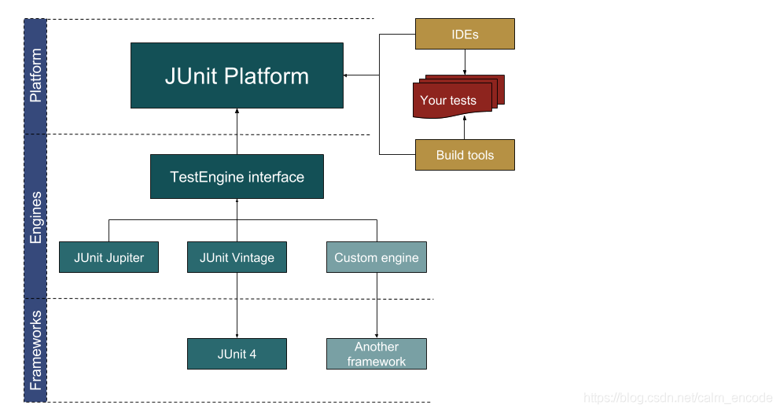
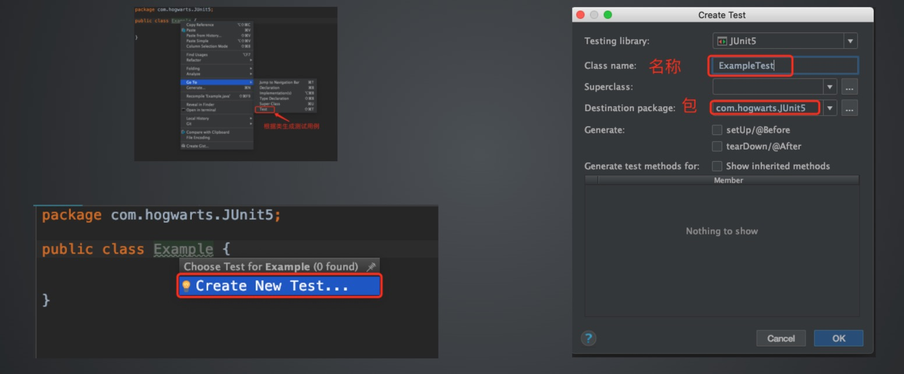
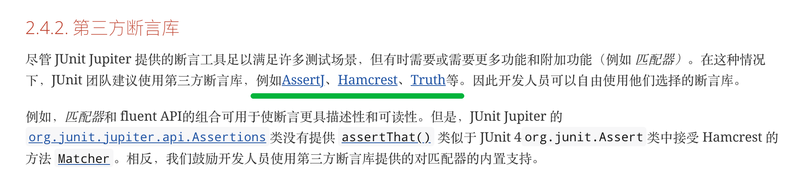
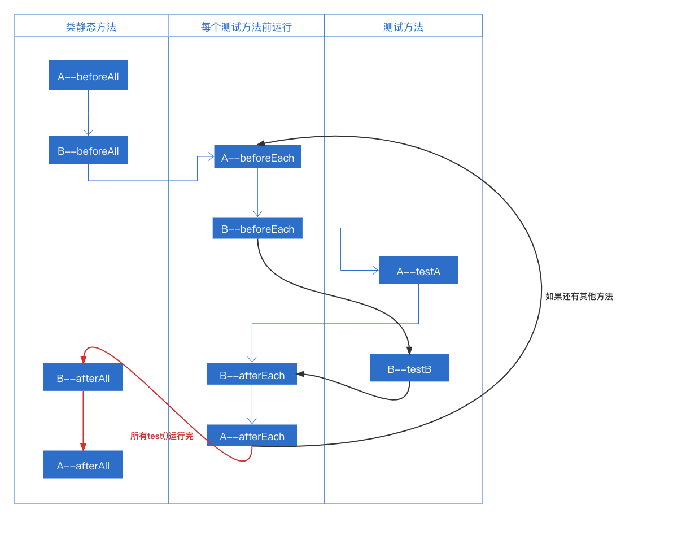
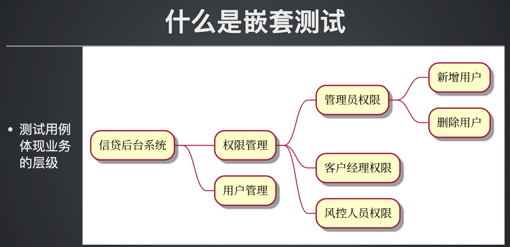
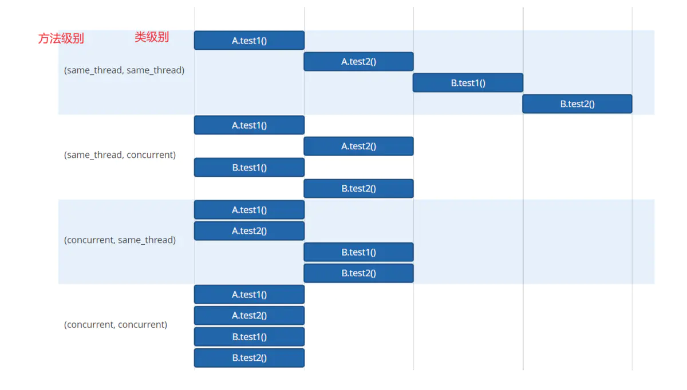
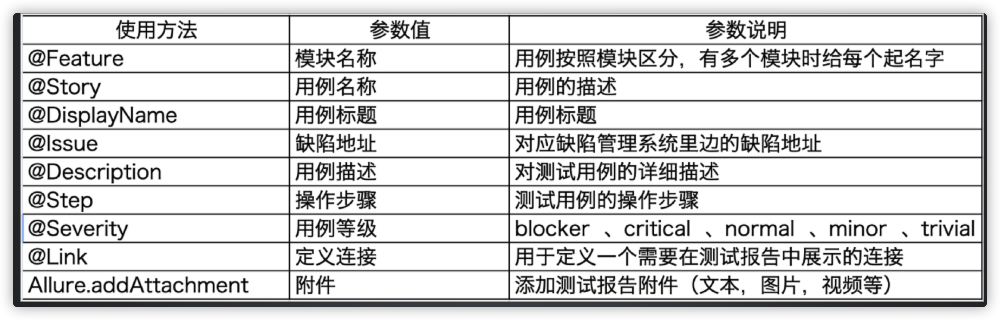

* 疑问
  * @Tag标签 分环境标签
  * junit4 -> testng -> junit5 什么区别 vs testng
    * 用法
    * 拓展性，二次开发
  * 多环境如何执行
  * ~~allure step可以传递参数吗？~~
    * 可以，直接在方法添加注解@Step,pom文件配置argLine：aspectjweaver
  * testinfo
  * 学过的东西容易遗忘
**目录 (Table of Contents)**
[TOCM]
[TOC]
# Junit5
## 架构图

## Junit5-basics
### 1.Junit5 命名规则（mvn test 执行过滤规则）
默认执行包含Test关键字的测试类，自定义需使用configuration->includes->include
```xml
<plugin>
                <artifactId>maven-surefire-plugin</artifactId>
                <version>2.22.2</version>
                <configuration>
                    <includes>
                        <include>**/*Introduction*.java</include>
                        <include>**/*TestCase*.java</include>
                    </includes>
                </configuration>
            </plugin>
```
### 2.通过IDEA生成类的测试用例

### 3.常用注解
```
使用 @Test 注解表示为测试方法

使用 @DisplayName 定义别名

使用 Assertions 类的断言方法
    assertEquals
    assertTrue
    assertNotNull
    assertAll
    assertThrows
    
@BeforeEach/@AfterEach
    在每个用例前/后都会执行

@BeforeAll/@AfterAll
    在所有用例前只执行一次
    被装饰的方法必须加上 static
```
### 4.Junit5 内置断言
#### 1>内置断言
```
必修
    assertEquals
    assertTrue
进阶
    assertAll
选修
    assertNotNull
    assertTimeout
    assertThrows
```
#### 2>第三方断言库

* Hamcrest
* AssertJ
* Truth
### 5.Junit5 测试执行顺序
* 问题
  * 如果是两个 Test 类，A类和B类，其中B类继承A类。两个类都有 beforeall，beforeEach，afterAll，afterEach，那么执行顺序？？？
  
  [代码实例](./junit5-basics/src/test/java/org/study/demo/execorder/Base2Test.java)
### 6、Junit5 参数化
#### 1>pom引入
```xml
<dependency>
    <groupId>org.junit.jupiter</groupId>
    <artifactId>junit-jupiter-params</artifactId>
    <version>5.8.1</version>
    <scope>test</scope>
</dependency>
```
#### 2>单参数@ValueSource
* 参数化用例的时候使用的注解由 @Test 换成 @ParameterizedTest
* 单参数化注解 @ValueSource
* 注意： 如果 @Test 和 @ParameterizedTest 同时使用则会多执行一次
```java
public class ParamDemoTest {
    // @ParameterizedTest 注解指明为参数化测试用例
    @ParameterizedTest
    // @ValueSource 单参数注解，示例中为String类型参数化
    @ValueSource(strings = {"张三", "李四", "王五"})
    void testParam(String name) {
        assertEquals(name.length(),2);
    }

}
```
* 支持数据类型：
  * 参数	参数的类型
  ```
    shorts	short
    bytes	byte
    ints	int
    longs	long
    floats	float
    doubles	double
    chars	char
    booleans	boolean
    strings	java.lang.String
    classes	java.lang.Class
  ```
#### 3>JUnit5 多参数的参数化 @CsvSource
[@CsvSource](./junit5-basics/src/test/java/org/study/demo/param/CsvParamTest.java)
#### 4>JUnit5 多参数的参数化 @CsvFileSource
[@CsvFileSource](./junit5-basics/src/test/java/org/study/demo/param/CsvFileTest.java)
#### 5>JUnit5 参数的参数化 @MethodSource
* 通过@MethodSource注解引用方法作为参数化的数据源信息
* 在 @MethodSource 注解的参数必须是静态的工厂方法，除非测试类被注释为@TestInstance(Lifecycle.PER_CLASS)
  * 静态工厂方法的返回值需要和测试方法的参数对应
    ```
    @ParameterizedTest 方法	工厂方法
    void test(int)	static int[] factory()
    void test(int)	static IntStream factory()
    void test(String)	static String[] factory()
    void test(String)	static List<String> factory()
    void test(String)	static Stream<String> factory()
    void test(String, String)	static String[][] factory()
    void test(String, int)	static Object[][] factory()
    void test(String, int)	static Stream<Object[]> factory()
    void test(String, int)	static Stream<Arguments> factory()
    void test(int[])	static int[][] factory()
    void test(int[])	static Stream<int[]> factory()
    void test(int[][])	static Stream<int[][]> factory()
    void test(Object[][])	static Stream<Object[][]> factory()
    ```
* 如果在 @MethodSource 注解中未指明方法名，会自动调用与测试方法同名的静态方法   
[@MethodSource](./junit5-basics/src/test/java/org/study/demo/param/MethodSourceTest.java)
#### 6>JUnit5 参数的参数化 @EnumSource
* 使用枚举类作为测试数据
* 枚举参数参数化注解 @EnumSource
* 必须与 @ParameterizedTest 结合使用   
  [@EnumSource](./junit5-basics/src/test/java/org/study/demo/param/EnumSourceTest.java)
#### 7>JUnit5 特殊参数化 eg：null、空等
自动化测试过程中，需要验证某些特殊场景时，需要传空或者传null
* null 参数的参数化注解 @NullSource 注解
* 参数为空的参数化注解 @EmptySource 注解
* 需要 null 和空都进行参数化，使用 @NullAndEmptySource 注解
* 还有其他参数可以用@ValueSource继续提供
* 【注】可以多个共用，测试方法执行多次
  [SpecialParamTest](./junit5-basics/src/test/java/org/study/demo/param/SpecialParamTest.java)

### 7.Junit5 执行排序
#### 1>方法排序
* OrderAnnotation（重点）	@Order 注解指定排序
  *   [MethodOrderTest](./junit5-basics/src/test/java/org/study/demo/order/method/MethodOrderTest.java)
* DisplayName	根据显示名称排序
  *   [MethodDisplayNameTest](./junit5-basics/src/test/java/org/study/demo/order/method/MethodDisplayNameTest.java)
* Random	随机排序
  *   [MethodRandomTest](./junit5-basics/src/test/java/org/study/demo/order/method/MethodRandomTest.java)
* MethodName	根据方法名称排序
  *   [MethodTest](./junit5-basics/src/test/java/org/study/demo/order/method/MethodTest.java)
#### 2>类排序
* OrderAnnotation（重点）	@Order 注解指定排序
  *   [ClassOrderTest](./junit5-basics/src/test/java/org/study/demo/order/cls/ClassOrderTest.java)
* DisplayName	根据显示名称排序
  *   [ClassNameTest](./junit5-basics/src/test/java/org/study/demo/order/cls/ClassNameTest.java)
* Random	随机排序
  *   [ClassRandomTest](./junit5-basics/src/test/java/org/study/demo/order/cls/ClassRandomTest.java)
* ClassName	根据类名排序
  *   [ClassDisplayNameTest](./junit5-basics/src/test/java/org/study/demo/order/cls/ClassDisplayNameTest.java)
#### 3>使用默认配置指定顺序
* 新建配置文件(路径：src/main/resources/junit-platform.properties)
  * 优先级：注解>配置文件
```
#默认排序方式为随机排序
junit.jupiter.testmethod.order.default = org.junit.jupiter.api.MethodOrderer$Random
#默认排序方式为通过方法名排序
junit.jupiter.testmethod.order.default = org.junit.jupiter.api.MethodOrderer$MethodName
#默认排序方式为通过Order注解指定
junit.jupiter.testmethod.order.default = org.junit.jupiter.api.MethodOrderer$OrderAnnotation
#默认排序方式为通过DisplayName排序
junit.jupiter.testmethod.order.default = org.junit.jupiter.api.MethodOrderer$DisplayName

#默认排序方式为随机排序
junit.jupiter.testmethod.order.default = org.junit.jupiter.api.MethodOrderer$Random
#默认排序方式为通过方法名排序
junit.jupiter.testmethod.order.default = org.junit.jupiter.api.MethodOrderer$MethodName
#默认排序方式为通过Order注解指定
junit.jupiter.testmethod.order.default = org.junit.jupiter.api.MethodOrderer$OrderAnnotation
#默认排序方式为通过DisplayName排序
junit.jupiter.testmethod.order.default = org.junit.jupiter.api.MethodOrderer$DisplayName
```
### 8.Junit5 重复测试
> 一条用例执行多次
* 使用场景 
  * 接口幂等性测试
* 示例 
  * [RepeatTest](./junit5-basics/src/test/java/org/study/demo/repeat/RepeatTest.java)
### 9.Junit5 标记测试用例
#### 1>使用场景
* 通过 Tag 对用例分组
  * 环境分组： 测试环境、预发布环境
  * 阶段分组： 冒烟用例 
  * 版本分组： V1.1、V1.2
#### 2>tag命名规范
```
不准为空。
标签不得包含空格。
标签不得包含 ISO 控制字符。
标签不得包含以下任何保留字符
  ,
  (、)
  &
  |
  !
```
#### 3>tag 表达式
```
# 规范
Tag 表达式	含义	示例
&	表示 与 关系	test1&test2表示执行既包含test1又包含test2的标签
!	表示 非 关系	!test表示执行没有test1标签的用例
|	表示 或 关系	test1|test2表示执行包含test1或包含test2的标签

# 使用1
<plugin>
    <groupId>org.apache.maven.plugins</groupId>
    <artifactId>maven-surefire-plugin</artifactId>
    <configuration>
        <!-- &amp; 在xml 中表示 & 与的关系 -->
        <groups>test&amp;dev</groups>
        <!-- 不要执行的标签 -->
        <!--<excludedGroups>主流程方法</excludedGroups>-->
    </configuration>
    <version>2.22.2</version>
</plugin>

# 使用2
# 执行 没有test 标签的用例
mvn clean test -Dgroups="!test"
# 执行 dev 或 test 标签的用例
mvn clean test -Dgroups="dev|test"
# 执行既有 dev 也有 test 标签的用例
mvn clean test -Dgroups="dev&test"
```
#### 4>实例
[TagTest](./junit5-basics/src/test/java/org/study/demo/tag/TagTest.java)
* 结合 Maven 执行
```xml
<!-- 
使用命令 mvn clean test 执行用例 
# 执行 test 标签的用例
mvn clean test -Dgroups="test"
# 执行不含test 标签的用例
mvn clean test -DexcludedGroups="test"
注意： 如果使用命令行的同时也配置了 pom 文件， pom 的配置优先级更高

-->
<build>
    <plugins>
        <plugin>
            <groupId>org.apache.maven.plugins</groupId>
            <artifactId>maven-surefire-plugin</artifactId>
            <version>2.22.2</version>
            <configuration>
            <!-- 要执行的标签 -->
                <groups>test</groups>
            <!-- 不要执行的标签 -->
                <excludedGroups>dev</excludedGroups>
            </configuration>
        </plugin>
    </plugins>
</build>
```
* 结合测试套件执行
#### 5>自定义tag标签
[CustomTagTest](./junit5-basics/src/test/java/org/study/demo/tag/custom/CustomTagTest.java)
### 10.JUnit5 设置禁用测试用例
>可以禁用测试类、也可以禁用测试方法
* 使用场景
  * 在bug 未解决之前，对应的测试用例则无需执行。 
  * 版本更新，某些用例暂时不可用。
[DisableTest](./junit5-basics/src/test/java/org/study/demo/disable/DisableTest.java)
### 11.Junit5 嵌套测试

[NestExampleTest](./junit5-basics/src/test/java/org/study/demo/nest/NestExampleTest.java)
### 12.Junit5 测试套件(Include/Exclude)
[SelectClassTest](./junit5-basics/src/test/java/org/study/demo/suite/SelectClassTest.java)   
[SelectPackagesTest](./junit5-basics/src/test/java/org/study/demo/suite/SelectPackagesTest.java)   
[IncludePackagesTest](./junit5-basics/src/test/java/org/study/demo/suite/IncludePackagesTest.java)   
[ExcludePackagesTest](./junit5-basics/src/test/java/org/study/demo/suite/ExcludePackagesTest.java)   
[IncludeClassNamePatternsTest](./junit5-basics/src/test/java/org/study/demo/suite/IncludeClassNamePatternsTest.java)   
[IncludeTagsTest](./junit5-basics/src/test/java/org/study/demo/suite/IncludeTagsTest.java)   
### 13.Junit5动态测试
* @TestFactory实现
* 没有beforeeach/beforeall概念
* 返回DynamicTest集合
[DynamicDemoTest](./junit5-basics/src/test/java/org/study/demo/dynamic/DynamicDemoTest.java)
#### 实例：ShellTest+SumTest
[ShellTest](./junit5-practice/src/test/java/org/study/practice/dynamic/ShellDynamicTest.java)
[SumTest](./junit5-practice/src/test/java/org/study/practice/dynamic/SumDynamicTest.java)

## Junit5-调度执行
### 1.命令行执行
#### 1>执行当前项目下的所有测试
mvn test
#### 2>执行单个测试类
mvn test -Dtest=包名.类名
#### 3>执行单个测试方法
mvn test -Dtest=包名.类名#方法名
#### 4>执行多个测试类
* 执行同一个包下的测试类
  * mvn test -Dtest=包名.类名1,包名.类名2,...
* 执行不同包下的测试类
  * mvn test -Dtest=包名1.类名1,包名2.类名2,...
* 正则匹配模式执行多个测试类
  * mvn test -Dtest="包名.*Test"
* 配置不被执行的测试类
#### 5>执行多个测试方法
mvn test -Dtest=包名.类名#方法名1+方法名2
### 2.配置文件执行
#### 1>执行单个测试类
包名之间用/区分
```
<!-- 可以是类名.java -->
<include>包名/类名.java</include>
<!-- 可以直接是类名 -->
<include>包名/类名</include>
<!-- 可以是类名.class -->
<include>包名/类名.class</include>
```
#### 2>执行多个测试类
* 执行同一个包下的测试类
```
<!-- 可以是类名.java -->
<include>包名1/*.java</include>
 <!-- 可以直接是类名 -->
<include>包名1/*</include>
  <!-- 可以是类名.class -->
<include>包名1/*.class</include>
```
* 执行不同包下的测试类
```
<!-- 可以是类名.java -->
 <include>包名1/类名1.java</include>
 <include>包名2/类名2.java</include>
 ...
  <!-- 可以直接是类名 -->
 <include>包名1/类名1</include>
 <include>包名2/类名2</include>
 ...
 <!-- 可以是类名.class -->
 <include>包名1/类名1.class</include>
 <include>包名2/类名2.class</include>
```
* 正则匹配模式执行多个测试类
```
<include>包名/*Test</include>
<include>包名/*Test.java</include>
<include>包名/*Test.class</include>
```
* 配置不被执行的测试类
```
<exclude>包名/*Test.class</exclude>
<exclude>*Suite*Test</exclude>
```
## Junit5-并行测试
```properties
junit.jupiter.execution.parallel.enabled = true

junit.jupiter.execution.parallel.mode.default = concurrent

junit.jupiter.execution.parallel.mode.classes.default = same_thread

junit.jupiter.execution.parallel.config.strategy=fixed

junit.jupiter.execution.parallel.config.fixed.parallelism=8
```
### 区分dynamic、fixed、custom
```
junit.jupiter.execution.parallel.config.strategy=fixed
1、dynamic：默认选项 在不设置系数的情况下 并行度将等于可用处理器/核的数量
dynamic对应的系数配置项为：junit.jupiter.execution.parallel.config.dynamic.factor
并发线程数为 系数*可用处理器/核的数量

2、fixed：固定线程数设置
搭配为：junit.jupiter.execution.parallel.config.fixed.parallelism
并发线程数为 设置的junit.jupiter.execution.parallel.config.fixed.parallelism的value值

3、custom ：自定义
通过实现接口 ParallelExecutionConfigurationStrategy来配置并行的线程池数量
Allows you to specify a custom ParallelExecutionConfigurationStrategy implementation via the mandatory junit.jupiter.execution.parallel.config.custom.class configuration parameter to determine the desired configuration.
```
### 并行策略

### 并行 vs TestClassOrder
[MethodDisplayNameTest](./junit5-practice/src/test/java/org/study/practice/parallel/MethodDisplayNameTest.java)
```properties
#默认排序方式为通过DisplayName排序--此配置优先级高于并行开关
junit.jupiter.testmethod.order.default = org.junit.jupiter.api.MethodOrderer$DisplayName
```
## Junit5-高级断言
### 1.集中断言
[CalculatorTest](./junit5-basics/src/test/java/org/study/demo/assSuper/CalculatorTest.java)
### 2.hamcrest
#### 1>pom引入
```
<dependency>
    <groupId>org.hamcrest</groupId>
    <artifactId>hamcrest</artifactId>
    <version>2.2</version>
    <scope>test</scope>
</dependency>
```
#### 2>实例
[AssertTest](./hamcrest/src/test/java/org/study/hamcrest/AssertTest.java)
## Junit5-数据驱动
[数据驱动](./junit5-datadriven/src/test/java/org/study/datadriven)
### yaml数据驱动实例：计算器求和
[sumTestByYaml](./junit5-practice/src/test/java/org/study/practice/nums/SumTest.java)

## Junit5-Allure
[allure官网](https://www.allure.com/)
### 1.介绍
* Allure是⼀个轻量级，灵活的，⽀持多语⾔的测试报告⼯具
* 多平台的,奢华的report框架
* 可以为dev/qa提供详尽的的测试报告、测试步骤、log
* 也可以为管理理层提供high level统计报告
* Java语⾔开发的，⽀持python，JaveScript, PHP, ruby 等
* 可以集成到Jenkins
### 2.安装
```
下载地址：https://repo1.maven.org/maven2/io/qameta/allure/allure-commandline/
mac/linux: 下载 tar
windows: 下载 zip
配置环境变量：解压后将 bin 目录加入PATH环境变量
安装贴：https://ceshiren.com/t/topic/3386
```
### 3.Allure 常用命令
命令格式：allure  [option]   [command]   [command options]
```
allure --help 帮助
allure --version 查看版本信息  
allure serve  生成在线版本的测试
allure generate <allure-result中间文件>  -o   输出目录 (默认路径：allure-report)
```
### 4.Allure 基本用法

[@Description](./allure/src/test/java/org/study/demo/AllureDescriptionTest.java)     
[@DisplayName](./allure/src/test/java/org/study/demo/AllureDisplayNameTest.java)     
[@Link](./allure/src/test/java/org/study/demo/AllureLinkTest.java)     
[@Severity](./allure/src/test/java/org/study/demo/AllureSeverityTest.java)     
[@Feature](./allure/src/test/java/org/study/demo/AllureFeatureTest.java)     
[@Step](./allure/src/test/java/org/study/demo/AllureStepTest.java)    
### 5.Allure 报告地址
#### 1>方法一：
allure.properties文件
```properties
allure.results.directory=target/allure-results
```
#### 2>方法二：
pom文件
```xml
<configuration>
  <argLine>
    -javaagent:"${settings.localRepository}/org/aspectj/aspectjweaver/${aspectj.version}/aspectjweaver-${aspectj.version}.jar"
  </argLine>
  <!--生成allure-result的目录-->
  <systemProperties>
    <property>
      <name>allure.results.directory</name>
      <value>./target/allure-results</value>
    </property>
  </systemProperties>
</configuration>
```
### 6.Allure其他
#### 1>添加附件
[AllureAttachmentTest](./allure/src/test/java/org/study/demo/AllureAttachmentTest.java)
#### 2>修改logo
```
进入allure文件目录,通过 where allure或者which allure查看具体路径
where allure
/usr/local/bin/allure
在allure.yml 文件添加 - custom-logo-plugin
文件路径：/usr/local/Cellar/allure/2.13.9/libexec/config
文件原内容为:

plugins:
  - junit-xml-plugin
  - xunit-xml-plugin
  - trx-plugin
  - behaviors-plugin
  - packages-plugin
  - screen-diff-plugin
  - xctest-plugin
  - jira-plugin
  - xray-plugin
更新为:

plugins:
  - junit-xml-plugin
  - xunit-xml-plugin
  - trx-plugin
  - behaviors-plugin
  - packages-plugin
  - screen-diff-plugin
  - xctest-plugin
  - jira-plugin
  - xray-plugin
  - custom-logo-plugin
进入logo配置路径下
/usr/local/Cellar/allure/2.13.9/libexec/plugins/custom-logo-plugin/static
编辑styles.css
custom-logo.svg 为默认logo，自行更新logo即可，有需求的同学也可对css样式进行设置
例如：

.side-nav__brand {
  background: url('logo.png') no-repeat left center !important;
  margin-left: 10px;
  height:40px;
}
.side-nav__brand-text{
  /* 去掉图片后边 allure 文本 */
  display: none; 
}
```
## 实战练习
[practice](./junit5-practice)
## other
git config --global http.proxy "localhost:port"
git config --global --unset http.proxy


