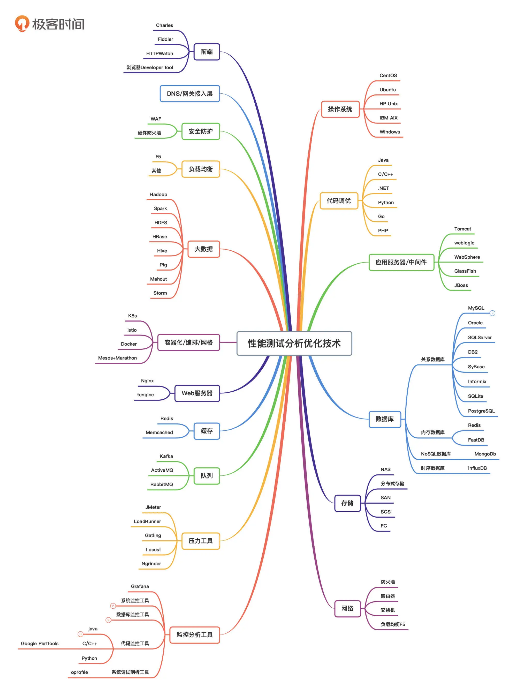

* 性能测试学习路径
  * 霍格沃滋性能课程-进度（80）
    * 搭建性能测试知识体系【90%】
    * 实战+补充笔记【todo】
    * 二轮回顾
  * 性能测试30讲
    * 学习+笔记+实战【doing】
      * 开始第二模块【8/14】
      * 开始第三模块【8/16】
  * 性能测试实战课
    * 第一轮 听【完成】
    * 第二轮 笔记【todo】
    * 第三轮 结合tds项目实战【todo】
    * 第四轮 自己搭建单体springboot进行调优
-----
**目录 (Table of Contents)**
[TOCM]
[TOC]
# 性能测试
## Linux与Bash编程
## 性能测试技术图谱

## 性能测试体系
[跳转](./perf_test_system/README.md)
## 性能测试工具
[跳转](./perf_tool/README.md)
## 性能监控
[跳转](./perf_monitor/README.md)
## 性能瓶颈分析
[跳转](./perf_analysis/README.md)
## 电商系统全链路性能瓶颈分析实战训练营
## 性能测试平台开发
## 用户端性能测试/用户体验测试