todo
* linux watch指令
* https://blog.csdn.net/Hogwartstester/article/details/103391684?ops_request_misc=&request_id=3b193a8867354bab9fcb20ab894262bc&biz_id=&spm=1018.2226.3001.4450
* 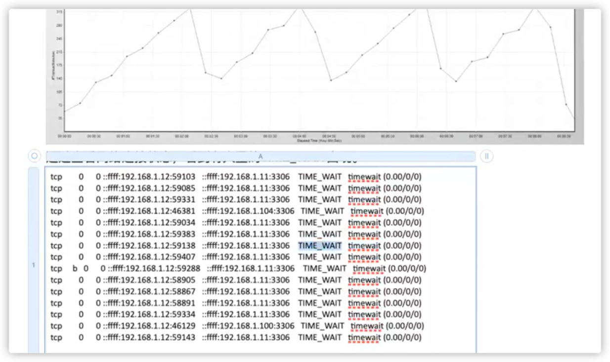
  * 处理time_wait（正常，链接可以复用）
    * 端口不足
    * 内存不足
  * 一个socker用3.2k内存
  * 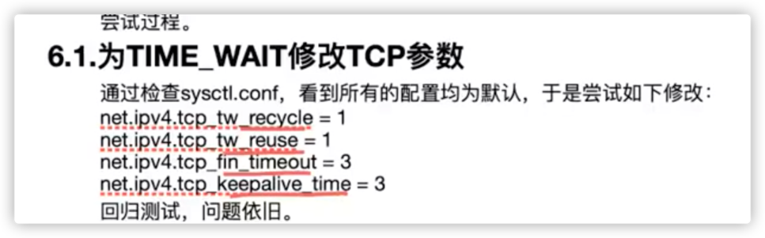
  * 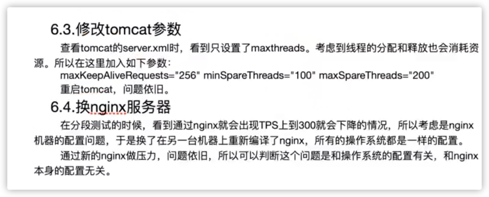
  * 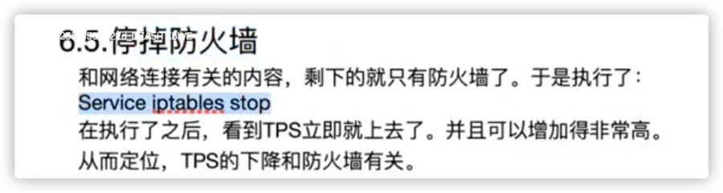
  * 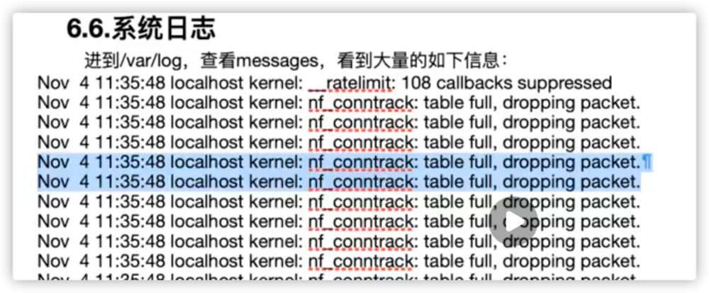
  * 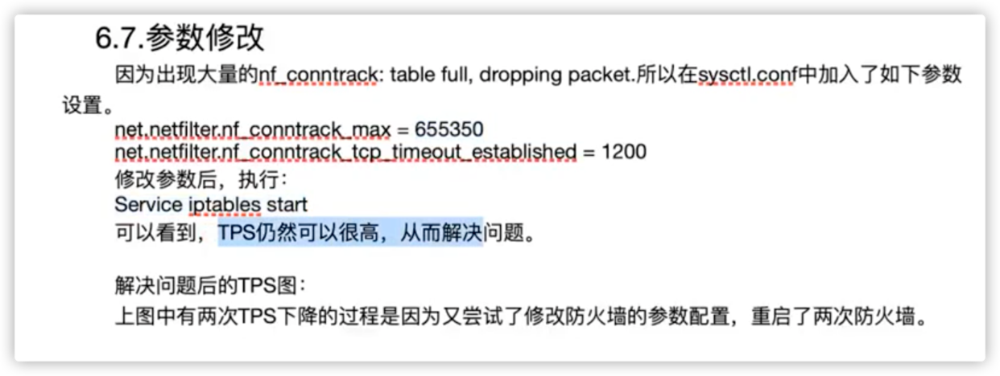
  * 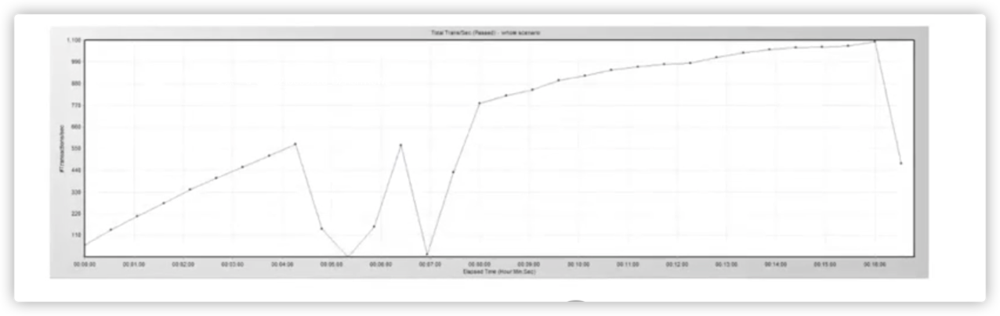
  * 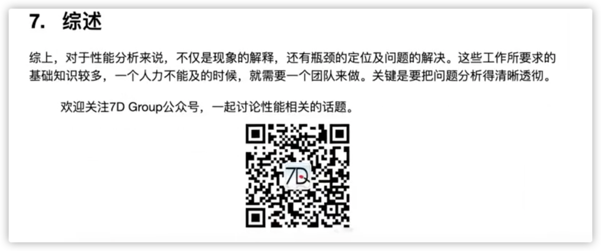
* 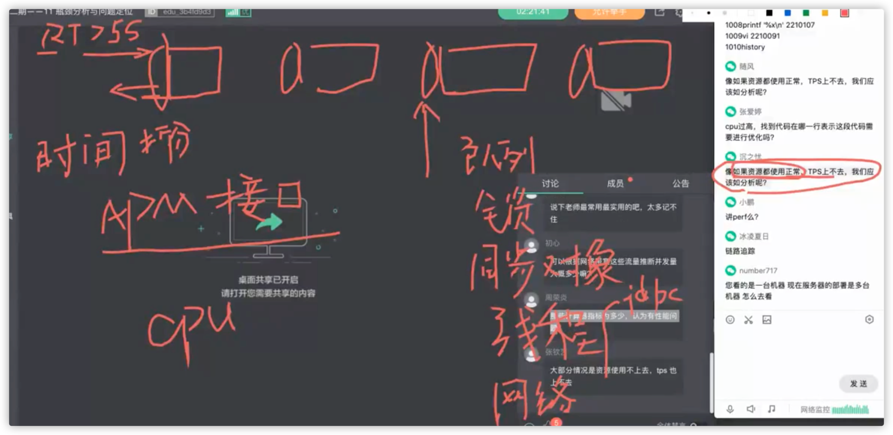
* 监控
  * jmeter结果：grafana
  * 全局监控
    * 操作系统：grafana
    * 全局监控一定要看全（grafana不全）（重要）
      * 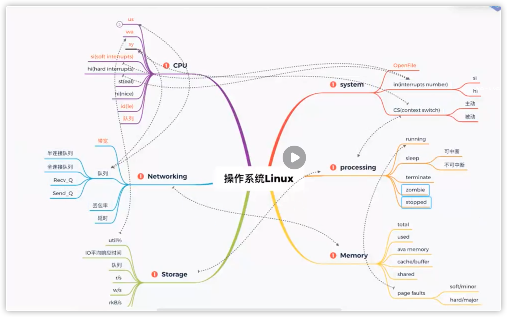
      * 现象1：压力机发送队列长时间有值存在
      * 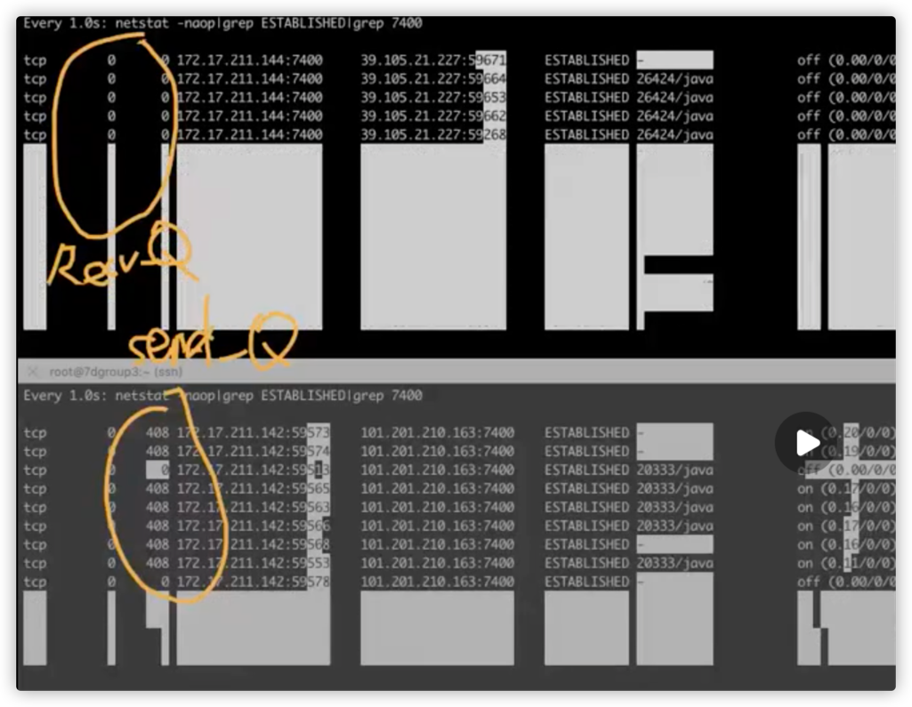
        * 解决方案：jmx的公网ip换成内网ip
      * 现象2：cpu使用高
-------------------------------------
  * 定向监控
    * jvm：grafana（指标力度粗）
    * 代码：jvisualvm，添加jmxremote参数实现远程监控
      * 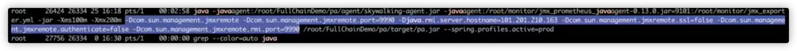
      * 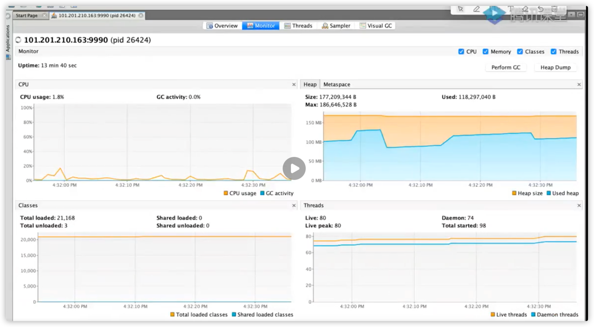
    * 数据库：grafana
* 用户数（不懂 哭哭哭）
  * 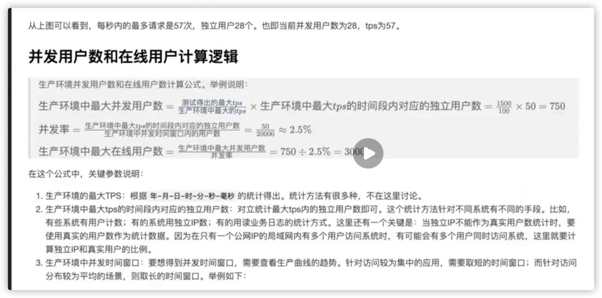
## Linux性能分析
* 发现服务器的性能瓶颈。服务器配置的不同能够承载的最大任务数不同，能够承载的压力也不同
* 测试范围及性能指标
    * cpu：车间工人
    * 内存：车间临时存储货物的仓库
    * 磁盘：车间真正的存储货物仓库
    * 网络：车间与外界的公路
    * 版本：车间装修，机器配置
### 进程和线程
* 定义和区别
* 进程：系统进行资源分配和调度的一个独立单位
* 线程：进程的一个实体，一个线程可以创建和撤销另一个线程
* 区别：
  * 一个线程属于一个进程，一个进程可以拥有多个线程
  * 线程是进程工作的最小单位
  * 一个进程会分配一个地址空间，进程和进程不共享地址空间。即不共享内存
  * 同一个进程下的不同多个线程，共享父进程的地址空间
  * 线程执行中需要协作同步。不同进程的线程见要利用消息通信的办法进行同步
  * 线程作为调度和分配的基本单位。进程作为拥有资源的基本单位
* 优缺点：
  * 进程
  * 每个进程相互独立，不影响主程序的稳定性，子进程崩溃不影响其他进程
    * 增加CPU，扩充性能
    * 尽量减少线程枷锁和解锁的影响，提供性能
    * 逻辑控制复杂/需要和主程序交互
    * 多进程调度开销大
  * 线程
  * 程序逻辑控制方式简单
    * 所有线程共享内存和变量
    * 线程消耗的总资源比进程少
    * 线程和主程序共享地址空间，最大内存地址受限
    * 线程之间同步和枷锁不易控制
    * 一个线程的崩溃影响整个程序的稳定性
## 系统级性能监控分析优化 
* 组件
  * 操作系统、数据库、中间件、java、队列、缓存
* 罗列组件对应的模块
  * 模块的完整性
  * 依赖各个组件的架构图
* 模块-计数器
* linux内核map->分析
  * https://elixir.bootlin.com/linux/latest/ident/kernel_thread
* linux内核漫画
  * https://www.jianshu.com/p/c40dd538067f
* 【要有自己的性能分析角色树】
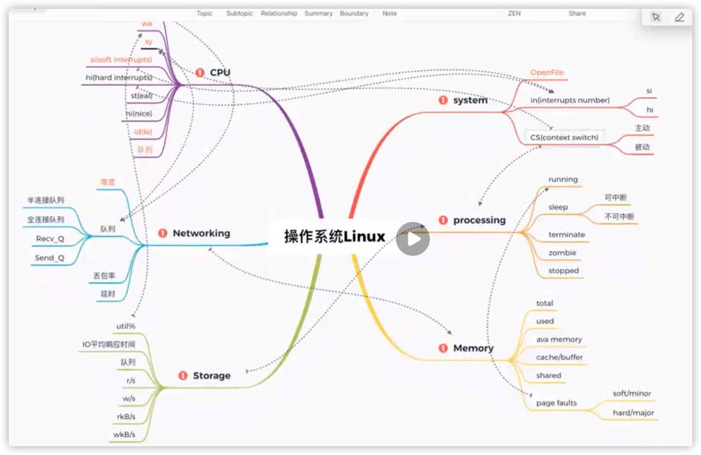
  * 操作系统-linux
    * system（优先级：1）
      * in（interrupts number和cpu的si、hi有关系）、
      * cs（context switch）：主动切换/被动切换，和processing有关，和cpu的sy有关
        * 使用命令：vmstat 1-> --system-- 
      * 文件具柄数 openFile
        * 使用命令：lsof | wc -lc 查看使用数量
        * 使用命令ulimit -a查看配置的open files总数
    * processing（优先级：1）
      * running
      * sleep：可中断睡眠、不可中断睡眠
      * terminate
      * zombie
      * stopped
    * memory（优先级：1）
      * total
      * used
      * ava memory
      * cache/buffer
      * shared
      * **page faults（重要）：页错误**
        * soft/minor
        * hard/major
      * 命令：free -h
    * storage（优先级：1）
      * 使用率util%
      * IO平均响应时间
      * **队列**
      * r/s
      * w/s
      * rkb/s
      * wkb/s
    * networking（优先级：1）
      * 带宽：100M(bit)需要除以8变为byte
      * **队列**
        * 半连接队列
        * 全连接队列
        * Recv_Q
        * Send_Q
      * 丢包率
      * 延时
    * cpu（优先级：1）
      * 计数器：
        * us：说明代码消耗cpu多
        * wa：说明io有问题
        * sy：说明system cor多？
        * si、hi、
        * st：说明被抢掉的资源多
        * ni：做的优先级调整多
        * id：空闲多
        * **队列：cpu等待的进程的个数**
        * 一般而言：
          * us：sy > 5:1比较合理，除非代码会调用sy资源
          * 判断cpu够不够用，不只是us百分比，还有考虑队列
* 指标VS命令（常用加粗）
  * cpu：**top、vmstat**、mpstat、sar
  * storage：**iostat、iotop**、sar、vmstat
  * memroy：**top、vmstat**、free、slabtop、sar
  * networking：**netstat、iftop（重要）**、ss、sar、nethogs、ifstat
  * system：**vmstat、pidstat**
  * processing：**pidstat(重要)**、ps、pstree、top
## 性能瓶颈分析-Nginx/Mysql/Redis/Kafka-L4
todo
* 环境搭建
https://ubnb64jpxq.feishu.cn/docx/Tch8dHh3VorvRtx7cLDcSVmJnQd
* pds->网课
## 性能瓶颈分析-性能剖析与火焰图-L5
todo