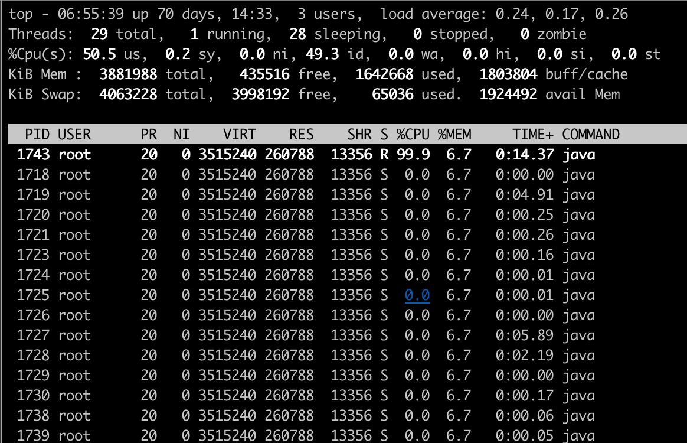
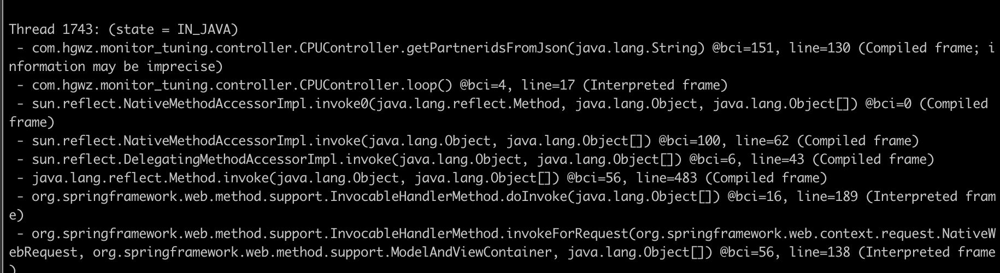
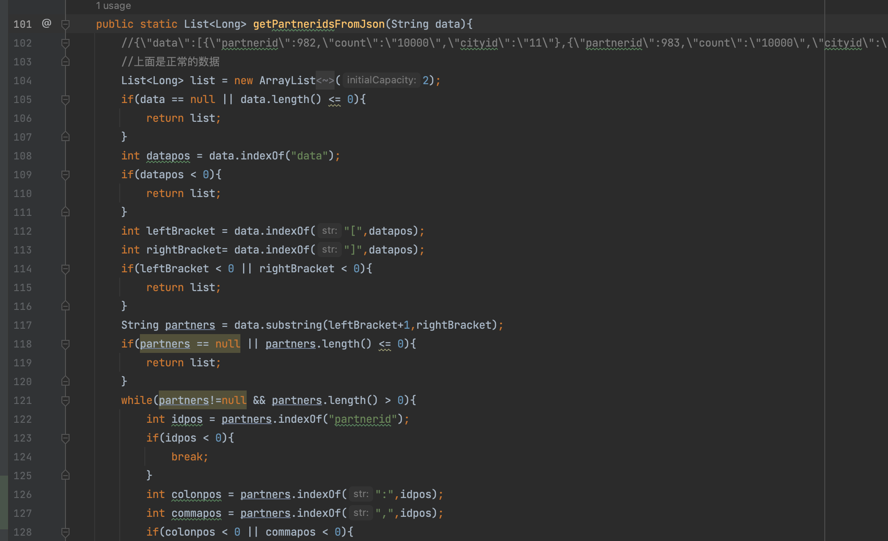
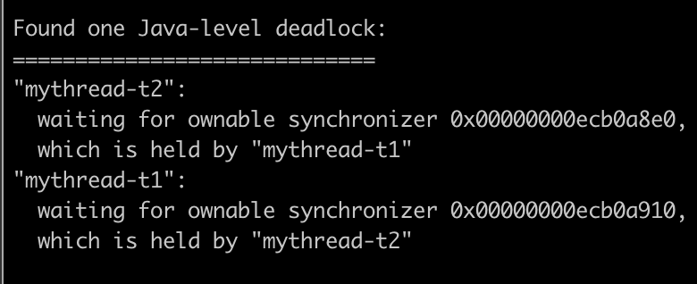
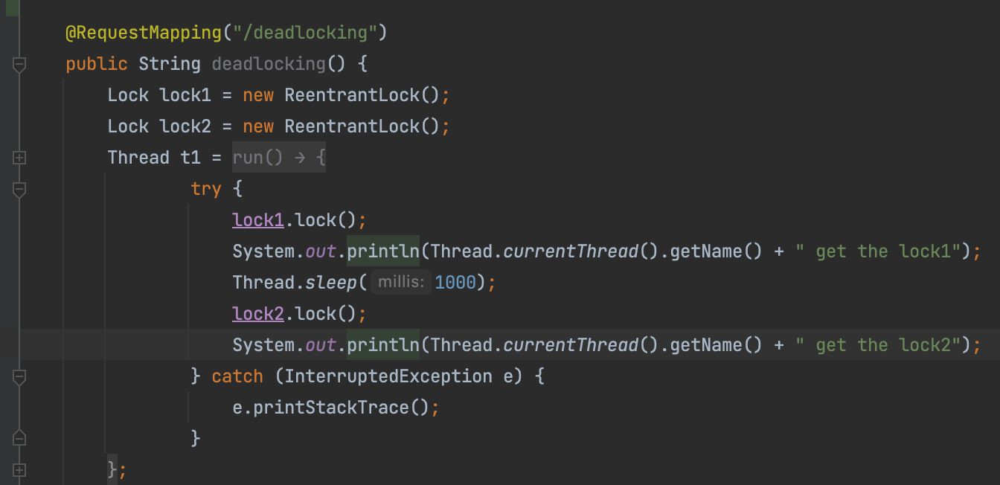
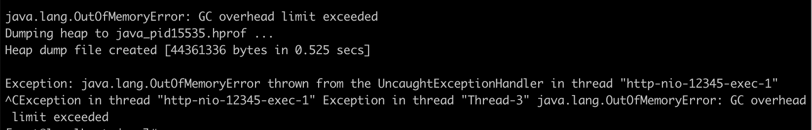
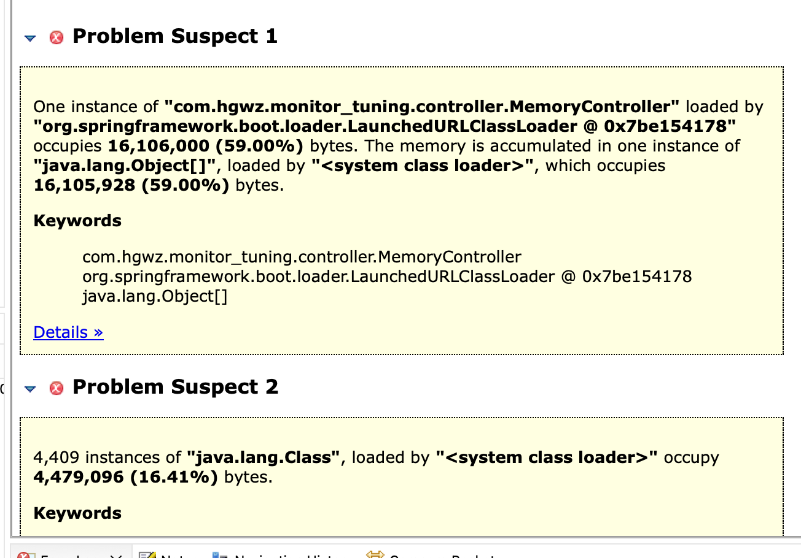
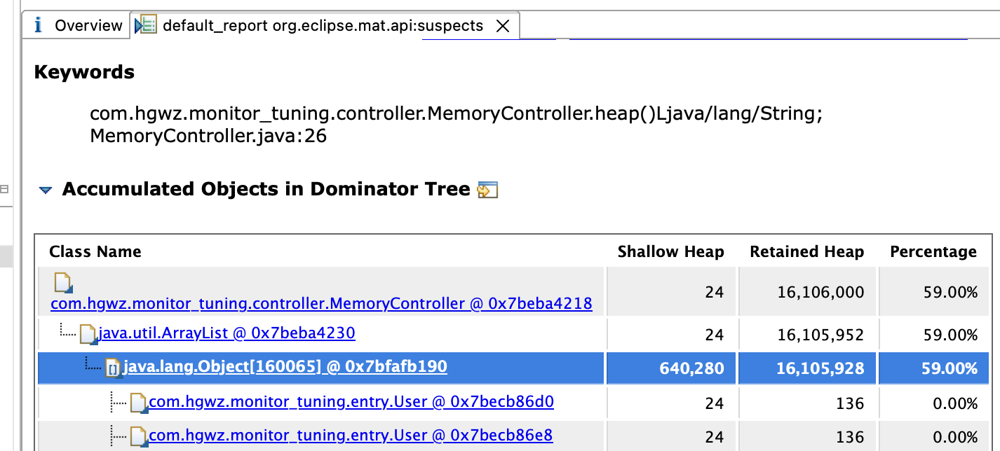
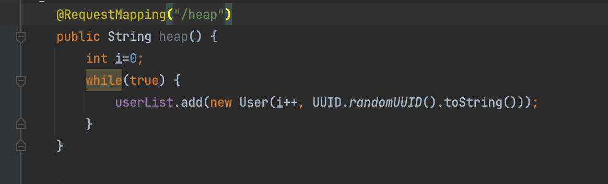

## 如何进行监控设计
[性能监控-监控设计](./性能监控-监控设计.md)
## 性能监控-服务端统计工具-L1
[性能监控-服务端统计工具-L1](./性能监控-服务端统计工具-L1.md)
## 性能监控-Prometheus监控系统-L2
[性能监控-Prometheus监控系统-L2](./性能监控-Prometheus监控系统-L2.md)
## 性能监控-Nginx与数据库-L3
[性能监控-Nginx与数据库-L3](./性能监控-Nginx与数据库-L3.md)
## 性能监控-JVM/队列/缓存-L4
[性能监控-JVM/队列/缓存-L4](./性能监控-JVM_队列_缓存-L4.md)
## 性能监控-分布式性能监控系统SkyWalking-L5
[性能监控-分布式性能监控系统SkyWalking-L5.md](./性能监控-分布式性能监控系统SkyWalking-L5.md)
## 【Restful 服务性能监控实战】
> 需要先安装jdk工具包：yum install java-*-openjdk-devel
### 被监控程序搭建
[跳转](./imonitor/README.md)
### 性能监控实战1：CPU高负载
* 触发负载
  *  curl localhost:12345/loop 也可以保持cpu高负载状态 
* 使用 top -p pid -H 命令列出进程中的线程详情
  * 找出cpu 负载最高的线程，记下该编号
  * 
* 使用jstack -F -l pid > dump.td 命令 dump java进程调用栈
* 查找 dump.td 中高cpu负载线程的代码调用栈信息，定位高cpu代码位置
  * 
  * 后续的代码调优做好前期定位准备
  * 
### 性能监控实战2：Java线程死锁
* 触发死锁
  *  curl localhost:12345/deadlocking 也可以触发模拟死锁程序
* 使用jps命令，定位java进程id
* 使用命令： jstack 进程号 > deadlock.td
  * 查看 deadlock.td 中的信息，定位死锁详情
  * 
* 定位到代码位置
  * 
### 性能监控实战3：内存溢出
* 重启被监控应用
  * 命令： java -Xmx32M -Xms32M -XX:+HeapDumpOnOutOfMemoryError -jar monitor.jar
* 请求restful服务的 heap接口，模拟产生内存溢出
  * curl localhost:12345/heap
* 查看被监控程序日志
  * 有 java.lang.OutOfMemoryError 报错
  * 
* 查看被监控程序日志有 *.hprof 文件生成提示
* 停止内存溢出接口访问，停止被监控程序运行
* 查看java_pid进程号.hprof 文件是否生成
* 使用 Memory Analyzer 工具打开 .hprof 文件
  * Memory Analyzer 工具简介：
  * 简称： MAT Memory Analyzer Tool
  * 基于Eclipse的内存分析工具
  * 可以帮助查找内存泄漏
  * 下载链接：https://www.eclipse.org/mat/downloads.php
  * 查看分析结果
  * 
* 利用 MAT 工具分析代码问题点
  * 
* 对比分析结果查看源码
  * 
## 【电商系统性能监控实战】
### 搭建启用域名支持的电商平台
#### step1:配置域名
* hosts 位置：
  * Linux / mac: /etc/hosts
  * Windows: C:\Windows\System32\Drivers\etc\hosts
```bash
# Host Database
#
# localhost is used to configure the loopback interface
# when the system is booting.  Do not change this entry.
##
127.0.0.1       localhost
192.168.2.171   mallapi.com
192.168.2.171   mall.com
```
#### step2:搭建nginx
```bash
# 在Docker宿主机上创建Nginx 配置文件
# 下载nginx docker 镜像
# 启动nginx docker 容器
docker pull nginx
docker run -d --name mynginx -v /Users/anjie/work/SET/perform-test/perf_tool/newbee-mall-api/newbee-mall-api/nginx_config/nginx.conf:/etc/nginx/nginx.conf -p 80:80 nginx:1.19-alpine

```
#### step3:启动电商后端应用
[跳转](../perf_tool/newbee-mall-api/newbee-mall-api/README.md)
* 配置节点数量：3个
* 节点服务端口： 28019/28018/28017
```
# 【修改ip】->deploy_docker.sh
deploy_docker.sh newbee-mall-api1 28019 8081
deploy_docker.sh newbee-mall-api2 28018 8082
deploy_docker.sh newbee-mall-api3 28017 8083
```
* 访问 http://localhost:28019/检验项目启动结果
#### step4:启动电商前端应用
[跳转](../perf_tool/newbee-mall-api/newbee-mall-vue3-app/README.md)
* 运行命令：
  * 运行之前要确保项目没有任何代码修改
  * 可以使用 git reset --hard 放弃可能存在的代码修改
  * ./docker_deploy.sh mallapi.com 80
  访问 http://localhost:8080/ 检验项目启动结果
  Demo 实战
#### step5:配置nginx
* 打开 nginx.conf
* 1、配置nginx参数，对商城前端应用启用对应域名
```
upstream  mall.com {
   server   ur_ip_addr:8080; # newbee mall front end
} 
server {
    listen       80;
    server_name  mall.com;
    charset utf-8;
    location / {
        root   html;
        proxy_set_header Host $host:$server_port;
        proxy_set_header REMOTE-HOST $remote_addr;
        proxy_set_header X-Forwarded-For $proxy_add_x_forwarded_for;
        proxy_pass http://mall.com;
        proxy_set_header  X-Real-IP  $remote_addr;
        #add_header 'Access-Control-Allow-Origin' '*';
        add_header 'Access-Control-Allow-Headers' 'Content-Type, Authorization, projectid' always;
        add_header 'Access-Control-Allow-Methods' 'POST, GET, DELETE, OPTIONS' always;
        client_max_body_size  100m;
    }
}
```
* 2、配置nginx参数，对商城前端应用启用对应域名
```
# 商城后端配置
upstream  mallapi.com {
   server   ur_ip_addr:28019; # newbee mall back end api
}
server {
    listen       80;
    server_name  mallapi.com;
    charset utf-8;
    location / {
        root   html;
        proxy_set_header Host $host:$server_port;
        proxy_set_header REMOTE-HOST $remote_addr;
        proxy_set_header X-Forwarded-For $proxy_add_x_forwarded_for;
        proxy_pass http://mallapi.com;
        proxy_set_header  X-Real-IP  $remote_addr;
        #add_header 'Access-Control-Allow-Origin' '*';
        add_header 'Access-Control-Allow-Headers' 'Content-Type, Authorization, projectid' always;
        add_header 'Access-Control-Allow-Methods' 'POST, GET, DELETE, OPTIONS' always;
        client_max_body_size  100m;
    }
}
```
### 监控平台实战演练
node exporter
mysql exporter
jvm exporter
jmeter dashboard

并发数： 40 50 80 100 120
持续时间：120 秒
间隔等待时间：20 秒

运行Jenkins任务对电商系统实施压测
查看监控平台，注意系统的性能状态变化，包括：
CPU：系统负载，CPU使用占比，运行时间
内存：使用占比，
磁盘：容量占比，数据读写频率
数据库: 连接数、查询、排序、慢查询
JVM：加载类，线程使用，堆内存，GC
网络：带宽占比，上下行速率
[jmx跳转](../perf_tool/newbee-mall-api/newbee-mall-api/jmx/newbee_stress_complex_domain.jmx)

