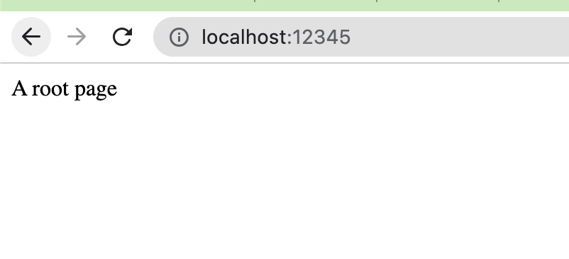

基于Spring boot开发的性能调优程序：包括jstat，jmap+MAt，jstack，JVisualVM，Btrace，Arthas。
>用于性能练习的应用程序
### 编译打包方法
* 命令：mvn clean packages
* 生成目标文件： target/monitor.jar
### 程序运行方法
* 命令：java -jar target/monitor.jar
* 启动后验证
