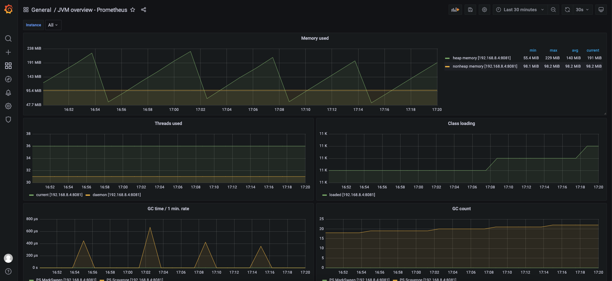

## jvm exporter 监控系统部署
* JVM Exporter: Prometheus 的指标数据收集组件, 采集JVM运行性能数据；
* 采集指标包括： JVM内存使用情况，线程状况，类加载状态，垃圾回收状态等监控指标
### Docker 部署
[跳转](../perf_tool/newbee-mall-api/newbee-mall-api/README.md)
* 更新Dockerfile中电商系统后端启动代码：
* 复制 javaagent.jar
* 复制 config.yaml
* java 启动代码中添加 javaagent 配置
  * -javaagent:jmx_prometheus_javaagent-0.16.1.jar=8081:config.yaml
* 重新启动电商后端
* 节点服务端口： 28019/28018/28017
```
# 【修改ip】->deploy_docker.sh
deploy_docker.sh newbee-mall-api1 28019 8081
deploy_docker.sh newbee-mall-api2 28018 8082
deploy_docker.sh newbee-mall-api3 28017 8083
```
### 配置 prometheus.yml 
* 配置 prometheus.yml , 将 jvm exporter 加入Prometheus
[跳转](./promethes.yml)
```
- job_name: "jvm-exporter"
    static_configs:
    - targets: ["your_ip:8081"]
```
* 重启 prometheus
### grafana添加dashboard
* 导入 dashboard 编号 3066

## redis 监控系统部署
### step1:搭建springboot+mysql+redis服务
[跳转](./jmeter-springboot-server/README.md)
### step2:添加redis-export
docker run -d --name redis_exporter \
-p 9121:9121 oliver006/redis_exporter:v1.45.0 \
--redis.addr redis://10.136.197.32:6379
### step3:配置 prometheus.yml
```
- job_name: "springboot-redis"
  static_configs:
    - targets: [ "10.136.197.32:9121" ]
```
### step4:添加 prometheus dashboard
* 导入 dashboard 编号 4074/2715
  

