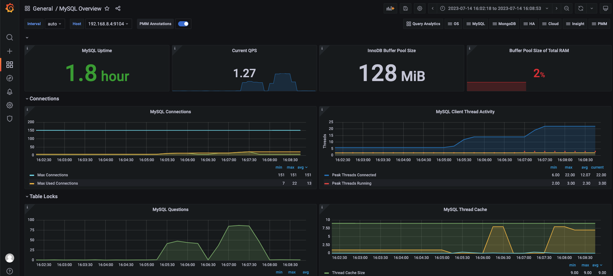

## Nginx性能数据导入
### step1:开启 NGINX stub_status 功能
[跳转](../perf_tool/newbee-mall-api/newbee-mall-api/nginx_config/nginx.conf)
```agsl
location = /metrics {
     stub_status;
}
```
### step2:运行nginx-exporter容器
```
docker run \
  -d -p 9113:9113 \
  --name=nginx-exporter \
  nginx/nginx-prometheus-exporter:0.10.0 \
  -nginx.scrape-uri=http://10.136.197.32:80/metrics \
  -web.telemetry-path=/metrics
```
### step3:验证 exporter
curl http://127.0.0.1:9113/metrics
### step4：配置 prometheus.yml , 将 nginx exporter 加入Prometheus
```
- job_name: ‘nginx exporter’
    scrape_interval: 5s
    static_configs:
      - targets: ['<your machine ip>:9113']
```
### step5:grafana展示
* 导入 dashboard 编号 12708
 
## 部署 mysql exporter
* MySQL Exporter: Prometheus 的指标数据收集组件, 采集MySQL数据库运行性能数据；
* 采集指标包括： MySQL连接数，SQL线程数, 慢查询，QPS 等监控指标
### docker部署
```bash
# 注意： 1、需要事先在环境变量中配置如下参数
#       2、镜像版本问题
#    - mysql_user
#    - mysql_pwd
#    - container_mysql
docker run -d --name mysql_exporter \
-p 9104:9104 \
--link $container_mysql:db \
-e DATA_SOURCE_NAME="$mysql_user:$mysql_pwd@(db:3306)/" \
prom/mysqld-exporter:v0.14.0
```
* eg:
docker run -d -p 9104:9104 \
--name mysqld-exporter \
-e DATA_SOURCE_NAME="root:12345678@(10.136.197.32:3306)/" \
quay.io/prometheus/mysqld-exporter:v0.12.1 
### 验证是否启动成功
curl http://127.0.0.1:9104/metrics
### 配置 prometheus.yml , 将 mysql exporter 加入Prometheus
```
- job_name: "mysql-exporter"
    static_configs:
    - targets: ["your_ip:9104"]
```
### grafana展示
* 配置 mysql exporter dashboard
* 导入 dashboard 编号 7362
