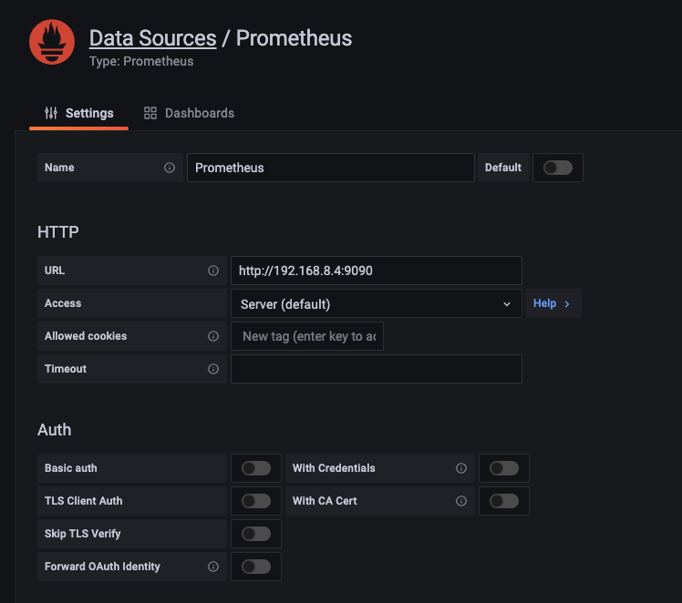
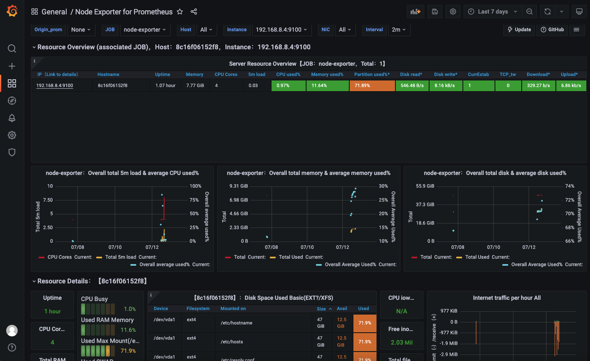

## 性能监控价值
### 性能监控是什么
对应用的多样性性能指标进行持续性收集、存储、分析、可视化
### 性能监控的价值
* 提升性能分析能力
* 快速发现性能瓶颈
* 辅助针对性的解决问题
* 提高实施反馈和响应能力
## 性能监控应用场景
* 时序性性能监控
  * 时序性监控、关联分析、性能测试、性能分析，Prometheus
* 链路监控
  * 链路分析、性能追踪，SkyWalking、Zipkin
## Jmeter压测监控平台
[跳转](../perf_tool/monitor/README.md)
## 性能监控系统搭建
* Prometheus
* node-exporter
* Grafana
### Prometheus
> golang语言开发的开源监控、报警系统
* Prometheus 是一套开源的监控系统，它通过 HTTP 协议周期性抓取被组件的状态，实现对不同种类应用的监控
* Prometheus 强大之处在于任意组件只要提供 HTTP 接口就可以接入监控系统，不需要任何 SDK 或者其他的集成过程
* 学习博客：
  * https://www.prometheus.wang/quickstart/use-node-exporter.html
#### step1:准备promethes.yml文件
[跳转](./promethes.yml)
#### step2:下载docker镜像
docker pull prom/prometheus
#### step3:启动镜像
docker run -d -p 9090:9090 --name=myprometheus -v /Users/anjie/work/SET/perform-test/perf_monitor/promethes.yml:/etc/prometheus/prometheus.yml prom/prometheus
#### step4：访问验证
* http://127.0.0.1:9090/targets
* http://127.0.0.1:9090/metrics
### node-exporter 
>Prometheus 的指标数据收集组件, 采集系统运行性能数据；
* 采集指标包括： cpu、load、filesystem、meminfo、network等基础监控指标
#### step1: Docker 部署
```bash
docker run -d --name node_exporter -p 9100:9100 \
    -v "/proc:/host/proc:ro" \
    -v "/sys:/host/sys:ro" \
    -v "/:/rootfs:ro" \
    quay.io/prometheus/node-exporter
```
#### step2：访问验证
* 访问 http://your_ip:9100/metrics 检验node_exporter是否启动
#### step3: 配置 prometheus.yml , 将node exporter加入Prometheus
```bash
- job_name: "node-exporter"
    static_configs:
    - targets: ["your_ip:9100"]
```
#### step4:重启 prometheus
### Grafana
#### step1:启动 grafana server
[跳转](../perf_tool/monitor/README.md)
#### step2:添加 prometheus 数据源

#### step3:添加 prometheus dashboard
* 导入 dashboard 编号 15054/11074

### jmeter 实时压测结果收集
[跳转](../perf_tool/monitor/README.md)


