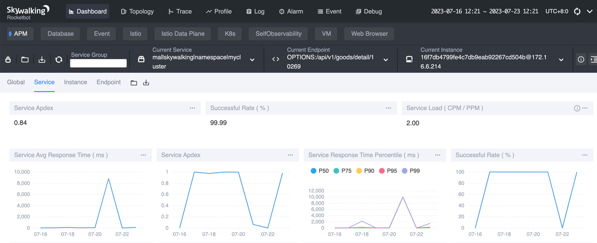
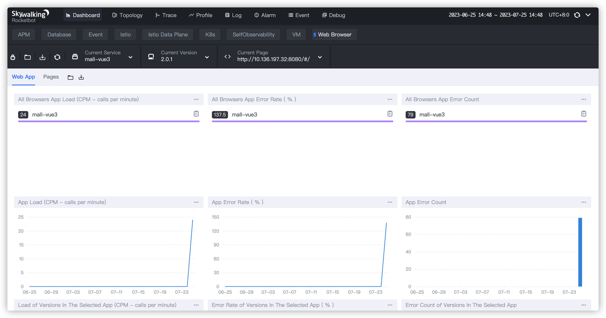
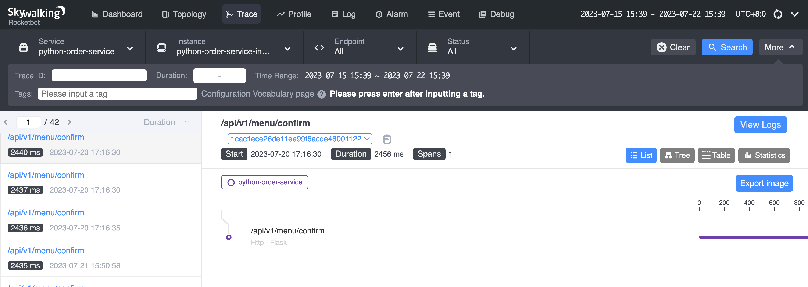

## SkyWalking 简介
> https://skywalking.apache.org/docs/
* 一款开源APM(Application Performance Monitor)工具，对分布式应用程序集群的业务运行情况进行追踪、告警和分析的系统
* 分布式链路追踪, 将请求的调用情况集中展示
* 帮助分析应用服务节点、请求具体耗时，每个服务节点的请求状态等等
* 展示服务应用拓扑图，服务调用链路
* 支持多种程序语言开发的应用
* Apache 开源产品，免费，应用广
## 系统构成

整个架构，分成上、下、左、右四部分：
* 上部分 Agent ：负责从应用中，收集链路信息，发送给 SkyWalking OAP 服务器。目前支持 SkyWalking、Zikpin、Jaeger 等提供的 Tracing 数据信息。而我们目前采用的是，SkyWalking Agent 收集 SkyWalking Tracing 数据，传递给服务器。
* 下部分 SkyWalking OAP ：负责接收 Agent 发送的 Tracing 数据信息，然后进行分析(Analysis Core) ，存储到外部存储器( Storage )，最终提供查询( Query )功能。
* 右部分 Storage ：Tracing 数据存储。目前支持 ES、MySQL、Sharding Sphere、TiDB、H2 多种存储器。而我们目前采用的是 ES ，主要考虑是 SkyWalking 开发团队自己的生产环境采用 ES 为主。
* 左部分 SkyWalking UI ：负责提供控台，查看链路等等。
## 搭建 SkyWalking 单机环境
### 存储系统-Docker 启动 elasticsearch
* 参考文档：https://hub.docker.com/_/elasticsearch
* 建议启动脚本：
```shell
#启动elastic search
docker run -d --name=myes \
-p 9200:9200 -p 9300:9300 \
-e "discovery.type=single-node" \
-v /Users/anjie/.m2/data:/usr/share/elasticsearch/data \
-v /Users/anjie/.m2/logs:/usr/share/elasticsearch/logs \
elasticsearch:7.9.0
```
### OAP 系统-Docker 启动 Skywalking oap server (Observability Analysis Platform)
* 参考文档：https://hub.docker.com/r/apache/skywalking-oap-server
* 建议启动脚本：
```shell
docker run --name skyoap -d \
-e TZ=Asia/Shanghai \
-p 12800:12800 \
-p 11800:11800 \
-e SW_STORAGE_ES_CLUSTER_NODES=10.136.197.32:9200 \
apache/skywalking-oap-server:8.9.1
```
docker cp /Users/anjie/work/SET/perform-test/perf_tool/newbee-mall-api/newbee-mall-api/deploy_skywalking_agent/alarm-settings.yml \
skyoap:/skywalking/config/alarm-settings.yml
### Web UI 系统-Docker 启动 Skywalking UI server 命令：
* 参考文档：https://hub.docker.com/r/apache/skywalking-ui
* 建议启动脚本：
```shell
docker run -d --name skyui \
-e TZ=Asia/Shanghai \
-p 8088:8080 \
-e SW_OAP_ADDRESS=http://10.136.197.32:12800 \
apache/skywalking-ui:8.9.1
```
### 验证 SkyWalking 启动成功
打开浏览器，访问 http://localhost:8088
## Java Agent监控性能追踪实战
* 什么是JavaAgent:
  * 可以动态修改 Java 字节码的技术
  * 无需修改源代码
  * 运行时加载
* JavaAgent应用场景:
  * 应用性能监控
  * 全链路性能跟踪
  * 诊断调优工具
* 下载agent
  * https://archive.apache.org/dist/skywalking/java-agent/8.13.0/apache-skywalking-java-agent-8.13.0.tgz
* 配置jvm参数，启动服务
* 方式一：agent/config/agent.config
  * agent.service_name=${SW_AGENT_NAME:Your_ApplicationName}
  * collector.backend_service=${SW_AGENT_COLLECTOR_BACKEND_SERVICES:127.0.0.1:11800}
* 方式二：jvm启动
  * java -javaagent:<skywalking-agent-path> -Dskywalking.agent.service_name=<ServiceName> -Dskywalking.collector.backend_service=<backend-service-addresses>  -jar yourApp.jar
[跳转](../perf_tool/newbee-mall-api/newbee-mall-api/deploy_skywalking_agent/deploy_docker.sh)
```bash
  * cd <api proj>/deploy_skywalking_agent
    ./deploy_docker.sh
```
### 服务应用性能重要指标Apdex (Application Performance Index)
* 由Apdex联盟开发的用于评估应用性能的工业标准。

```
Apdex值	颜色	说明
0.75 <= Apdex <= 1	绿色	应用响应很快，用户体验较满意
0.3 <= Apdex < 0.75	黄色	应用响应较慢，用户体验较一般
0 <= Apdex < 0.3	红色	应用响应极慢，用户体验较差
```
## NodeJS Agent监控性能追踪实战
* 监控nodejs前端
* 监控前端页面性能数据
* 收集页面访问信息
* 需要添加nodejs agent加载代码
### 应用源码
[跳转](../perf_tool/newbee-mall-api/newbee-mall-vue3-app/README.md)
### 添加前端依赖库
npm install --save skywalking-client-js
### 添加结果上传路由
* 代码文件: vue.config.js
* 数据上传Server: SkyWalking OAP Server
* 添加代码：
```shell
proxy: {
    '/browser': {
        target: 'http://localhost:12800',//这里是路由和报错报告的代理
        changeOrigin: true
    },
    '/v3': {
        target: 'http://localhost:12800',
        changeOrigin: true//这里是追踪报告的代理
    }
}
```
### 添加 nodejs 监控探针
* 配置文件: main.js
* 添加代码：
```shell
import ClientMonitor from 'skywalking-client-js';
import Vue from 'vue'


ClientMonitor.register({
    service: 'mall-vue3',//应用名称	
    serviceVersion: '2.0.1',//应用版本号
    traceSDKInternal: true,//追踪sdk
    pagePath: location.href,//当前路由地址
    useFmp: true,
    app: App,
    vue: Vue, //vue实例
});


router.beforeEach(() => {
    //路由上报到skywalking
    ClientMonitor.setPerformance({
        pagePath: location.href,//当前路由地址。
        useFmp: true,
        app: App,
        vue: Vue,
    });
});

// Vue 报错上报到skywalking。
Vue.config.errorHandler = (error) => {
    console.error(error);
    reportFrameErrors(error);
}

//监听ajax报错
window.addEventListener('error', error => {
    console.log("error--->", error)
    reportFrameErrors(error);
}, true);

//上报错误信息方法
function reportFrameErrors (error) {
    ClientMonitor.reportFrameErrors({
        service: 'mall-vue3',//应用名称  
        serviceVersion: '2.0.1',//应用版本号
        pagePath: location.href,
        vue: Vue,
    }, error);
}
```
### 启动
#### 方法一： 直接启动
* npm install
* npm run serve
#### 方式二：docker启动
* 运行命令: sh docker_deploy.sh 10.136.197.32 28019
### 查看SkyWalking的前端监控数据记录

## Python Agent监控性能追踪实战
### 监控python应用性能
[跳转](../perf_tool/application)
### 需要添加python依赖库
pip install apache-skywalking==1.0.1
### 需要添加python agent加载代码
* 修改  orderservice.py 
```
from skywalking import agent, config

enable_agent = True if os.getenv('enable_agent', 'false') == 'true' else False
if enable_agent:
    print('Start skywalking agent for monitoring.')
    config.init(
        agent_collector_backend_services="localhost:11800",
        agent_name="python-order-service",
        agent_instance_name="python-order-service-instance"
    )
agent.start()
```
* 启动：export enable_agent=true    
* python orderservice.py

### 查看SkyWalking UI，查看Python应用监控数据记录

## SkyWalking告警定制实战
* 不可能实时盯着监控信息
* 定义告警规则
* 服务在出现异常时能够及时的告警
* 通知相关人员进行问题排查
### 告警配置
* 告警规则配置文件 alarm-settings.yml
* 所在位置： OAP Server/config/alarm-settings.yml
* 常用配置参数：
  * 规则名称 (Rule name)
  * 监控度量名 (Metrics name)
  * 阈值 (Threshold)
  * 操作符 (OP)
  * 时间窗口 (Period)
  * 出现次数 (Count)
### 通知方式
* 通知方式
* Webhook
* 钉钉
* 微信
* Slack
* ………
* 官网文档 https://github.com/apache/skywalking/blob/master/docs/en/setup/backend/backend-alarm.md
### 报警通知演练
* 启动WebHook Server 接受告警信息
* 运行命令
  * python3 alarm.py
  * [跳转](./alarm/alarm.py)
* alarm-settings.yml中配置webhook
  * webhooks:http://10.136.197.32:1101/alarm