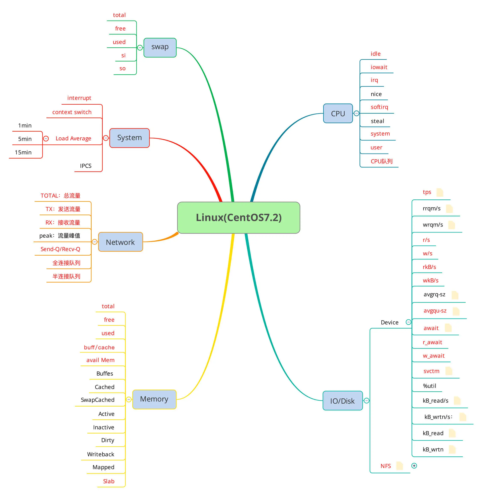

## 如何进行监控设计
现在的流行框架（比如说 Spring Cloud）中的熔断监控、限流服务、服务健康检查／监控、链路监控、服务跟踪、聚合监控等等，都是非常好的监控手段。比如说下面这样的架构图

### 架构图
#### step1：先画一个最简单的架构图

* 看一下架构中各有什么组件，各有什么服务，将这些列下来
  * 操作系统
  * Nginx
  * Tomcat
  * Redis
  * MySQL
* 再找对应的监控手段和方式，看哪种手段和方式在性能测试过程中成本最低，效率最高
#### step2：分层监控设计

* 说明一下
  * 我们要对整个架构做分层。
  * 在每一个层级上列出要监控的计数器。
  * 寻找相应的监控工具，实现对这些计数器的监控。
  * 如果一个工具做不到，在定位过程中考虑补充工具。
  * 要做到对每层都不遗漏。
* 从大的分类上来看，我们识别出每个监控的节点和层级，再对应到架构中，如下图所示：
  * 
* 对于上述的每个组件，我都建议用下面这样的监控思路。敲黑板！下图是重点！
  * **【全局监控】->【定向监控】**
### 全局监控分析
#### OS 层（CentOS 为例）
* 架构图
  * 
  * 从上图中，我们可以看到有这么几类，system、processing、memory、storage、networking 等。
* 这里画出一个思维导图，给出我的经验计数器
  * 
  * 针对 OS，我通常看上图中红色计数器的部分，这是 OS 查看的第一层。有第一层就有第二层，所以才需要定向的监控。后面我们再说定向监控的思路。
#### DB 层（MySQL 为例）
* 架构图
  * 
* 全局监控分类
  *    
### 定向监控分析
* OS 层之定向监控细化 1
* OS 层之定向监控细化 2
* DB 层之定向监控细化 1
* DB 层之定向监控细化 2
>至于定向监控部分，我不建议一开始就列，主要原因有三个:   
>    1.耗费太多时间；   
>    2.列出来也可能半辈子也用不上；   
>    3.照搬列出来的定向监控逻辑，有可能误导你对实时数据的判断   
> **所以**最好的定向监控就是在实际的性能执行过程中，根据实际的场景画出来。这帮助我在工作中无往不利，理清了很多一开始根本想不到的问题。
### 监控工具
有了思路，工具都不是事儿。   
针对上面我们画的架构图，我大概列出相应的监控工具及优缺点。这里列得并不详尽，只供借鉴思路使用。   

