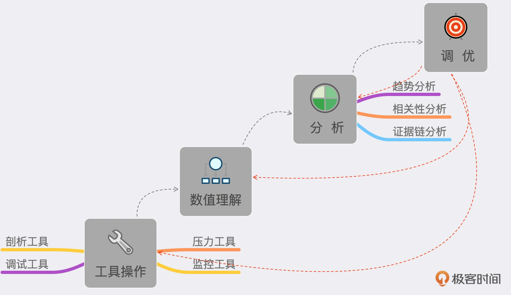
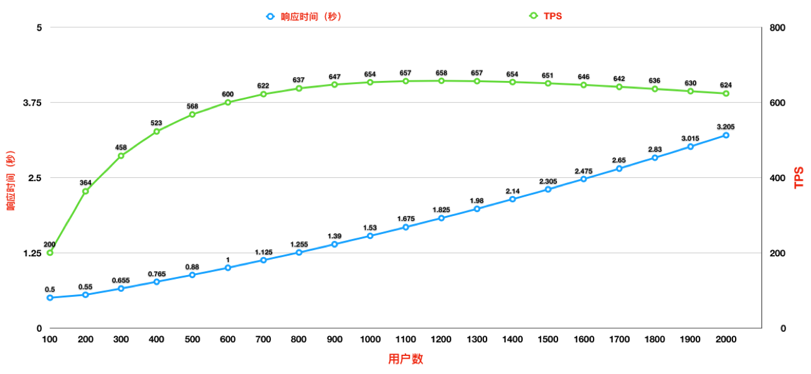
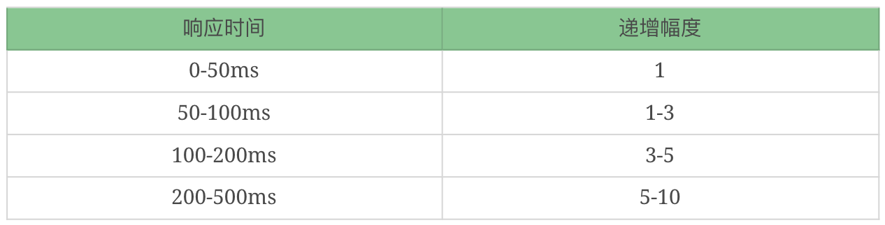
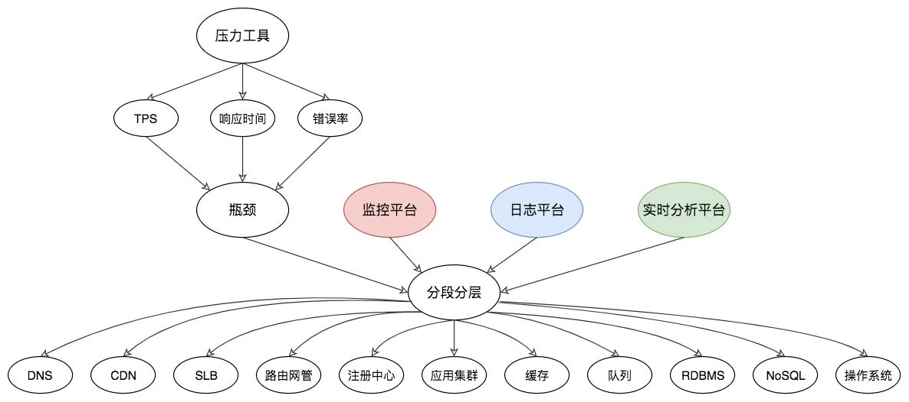

## 性能分析思路
### 性能测试分析的能力阶梯视图

* 工具操作：包括压力工具、监控工具、剖析工具、调试工具。
* 数值理解：包括上面工具中所有输出的数据。
* 趋势分析、相关性分析、证据链分析：就是理解了工具产生的数值之后，还要把它们的逻辑关系想明白。这才是性能测试分析中最重要的一环。
* 最后才是调优：有了第 3 步之后，调优的方案策略就有很多种了，具体选择取决于调优成本和产生的效果。
### 性能分析思路大纲
#### 1.瓶颈的精准判断
##### 1>TPS 曲线

* 由上图可知：
  * 随着用户数的增加，响应时间也在缓慢增加。
  * TPS 前期一直都有增加，但是增加的幅度在变缓，直到变平
* 所以对 TPS 曲线来说，它可以明确告诉我们的就是
  * 有没有瓶颈：其实准确说所有的系统都有性能瓶颈，只看我们在哪个量级在做性能测试了。
  * 瓶颈和压力有没有关系：
    * TPS 随着压力的变化而变化，那就是有关系。
    * 不管压力增不增加，TPS 都会出现曲线趋势问题，那就是无关。
* 为什么不看响应时间就武断地下此结论呢？
  * 其实响应时间是用来判断业务有多快的，而 TPS 才是用来判断容量有多大的
#### 2.线程递增的策略
* 场景中的线程递增一定是连续的，并且在递增的过程中也是有梯度的。
* 场景中的线程递增一定要和 TPS 的递增有比例关系，而不是突然达到最上限。后面在场景的篇幅中我们会再说它们之间的比例关系。
* 上面两点针对的是常规的性能场景。
  * 对于秒杀类的场景，我们前期一定是做好了系统预热的工作的，在预热之后，线程突增产生的压力，也是在可处理范围的。
  * 这时，我们可以设计线程突增的场景来看系统瞬间的处理能力。如果不能模拟出秒杀的陡增，就是不合理的场景。
##### 这里给出我做性能场景递增的经验值：

当然这里也不会是放在哪个系统中都适合的递增幅度，你还是要根据实际的测试过程来做相应的判断。
#### 3.性能衰减的过程
* 为什么要这么细致地描述性能衰减的过程呢？
  * 其实我就是想告诉你，
    * 只要每线程每秒的 TPS 开始变少，就意味着性能瓶颈已经出现了。
    * 但是瓶颈出现之后，并不是说服务器的处理能力（这里我们用 TPS 来描述）会下降，
    * 应该说 TPS 仍然会上升，在性能不断衰减的过程中，TPS 就会达到上限。
  * 这也是前面我说的，性能瓶颈其实在最大 TPS 之前早就已经出现了。
* 那么我们是不是应该在性能衰减到最大 TPS 时就停止场景呢？这个不一定的哦。
  * 因为停不停场景，取决于我们的场景目标，如果我们只是为了得到最大 TPS，那确实可以停止场景了。但是，如果我们要扩大化性能瓶颈，也就是说为了让瓶颈更为明显，就完全不需要停止场景，只要不报错，就接着往上压，一直压到我们要说的下一个话题——响应时间变长，需要拆分。
#### 4.响应时间的拆分
>在性能分析中，响应时间的拆分通常是一个分析起点。因为在性能场景中，不管是什么原因，只要系统达到了瓶颈，再接着增加压力，肯定会导致响应时间的上升，直到超时为止。   
> 那么，当响应时间变长，我们就要知道，它在哪个阶段时间变长了。

当我们拆分到了某个环节之后，就有了下一步的动作：构建分析决策树。
#### 5.构建分析决策树
* 分析决策树，对性能测试分析人员实在是太重要了，是性能分析中不可或缺的一环。
  * 它是对架构的梳理，
  * 是对系统的梳理，
  * 是对问题的梳理，
  * 是对查找证据链过程的梳理，
  * 是对分析思路的梳理。
  * 它起的是纵观全局，高屋建瓴的指导作用。
* 分析决策图

  * 从压力工具中，只需要知道 TPS、响应时间和错误率三条曲线，就可以明确判断瓶颈是否存在。
  * 再通过分段分层策略，结合监控平台、日志平台，或者其他的实时分析平台，知道架构中的哪个环节有问题，
  * 然后再根据更细化的架构图一一拆解下去
#### 6.场景的比对
>其实简单来说，就一句话：当你觉得系统中哪个环节不行的时候， 又没能力分析它，你可以直接做该环节的增加。
