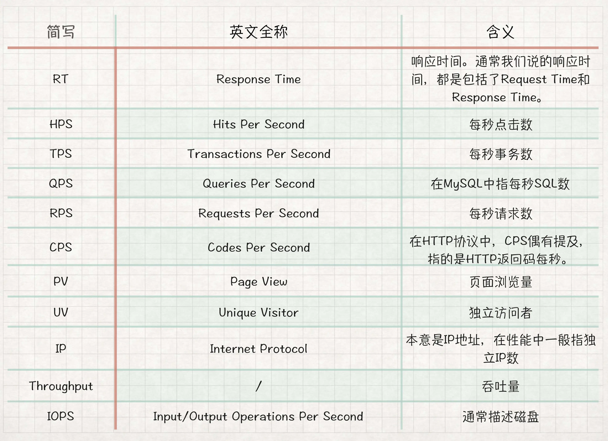

### 性能指标（怎么理解TPS、QPS、RT、吞吐量这些性能指标？）
>通常我们都从两个层面定义性能场景的需求指标：业务指标和技术指标。   
> 这两个层面需要有映射关系，技术指标不能脱离业务指标。一旦脱离，你会发现你能回答“一个系统在多少响应时间之下能支持多少 TPS”这样的问题，但是回答不了“业务状态是什么”的问题。
#### 1.业务指标和性能指标之间的关系

* 所有的技术指标都是在有业务场景的前提下制定的
* 而技术指标和业务指标之间也要有详细的换算过程
* 这样一来,技术指标就**不会是一块飞地**。同时，在回答了技术指标是否满足的同时，也能回答是否可以满足业务指标
#### 2.测试行业常用的性能指标表示法

#### 3.压力工具中的线程数和用户数与 TPS
   
响应时间肯定不会一直都是 100ms 的嘛。所以通常情况下，上面的这个比例都不会固定，而是随着并发线程数的增加，会出现**趋势**上的关系
* 结论：应该用TPS来承载系统的并发这个概念，而不是jmeter中的线程数
### TPS和响应时间的关系
#### 【这图过于理想了】性能测试模型-曲线拐点模型-压力曲线分析图

>做为一个示意图，它真的非常经典，的确描述出了一个基本的状态。但是，示意图也只能用来做示意图，在具体的项目中，我们仍然要有自己明确的判断。   
> 这张图呢，本来只是一个示意，用以说明一些关系。但是后来在性能行业中，有很多没有完全理解此图的人将它做为很有道理的“典范”给一些人讲，从而引起了越来越多的误解。
* 横轴：从左到右表现了Number of Concurrent Users（并发用户数）的不断增长。
* 三条曲线：
    * Utilization（资源的利用情况，包括硬件资源和软件资源）、
    * Throughput（吞吐量，这里是指每秒事务数）
    * Response Time（响应时间）
* 三个区域：
    * Light Load （轻压力区）
    * Heavy Load （重压力区）
    * Buckle Zone（弃忍区）
* 两个点
    * The Optimum Number of Concurrent Users（最佳并发用户数）
        * 在Light Load和Heavy Load两个区域交界处的并发用户数；
    * The Maximum Number of Concurrent Users（最大并发用户数）
        * 在Heavy Load和Buckle Zone两个区域交界处的并发用户数；
* 三个状态描述
    * 资源饱和（Resource Saturated）
    * 吞吐下降（Throughput Falling）
    * 用户受影响（End Users Effected）
#### 【符合实际】TPS和响应时间关系图

* 上图中蓝线表示 TPS，黄色表示响应时间。
* 描述：
    * 在 TPS 增加的过程中，响应时间一开始会处在较低的状态，也就是在 A 点之前。
    * 接着响应时间开始有些增加，直到业务可以承受的时间点 B，这时 TPS 仍然有增长的空间。
    * 再接着增加压力，达到 C 点时，达到最大 TPS。
    * 我们再接着增加压力，响应时间接着增加，但 TPS 会有下降（请注意，这里并不是必然的，有些系统在队列上处理得很好，会保持稳定的 TPS，然后多出来的请求都被友好拒绝）
* 最后，响应时间过长，达到了超时的程度。
* 在我的工作中，这样的逻辑关系更符合真实的场景。我**不希望在这个关系中描述资源的情况，因为会让人感觉太乱了**。
### 【指标关系】你知道并发用户数应该怎么算吗？
* 前端实例：
    * 前端操作总共有 7 步、涉及100个接口、时间窗口总共是 250 秒
        * 打开首页-登录-点击品类-选择商品-点击购买-订单详情-支付成功
* 单个在线用户的 TPS 计算
    * 事务 T 设置为每个请求一个事务：1(用户)×100(请求数)÷250(时间窗口)≈0.4(请求数/秒)
    * 事务定义到每个业务操作的级别：1(用户)×7(单业务操作级事务)÷250(时间窗口)≈0.028(TPS)
    * 事务定义到整个用户级别：1(用户)×1(完整用户级事务)÷250(时间窗口)≈0.004(TPS)
* 多在线用户的 TPS 计算：有 100000 用户都是平均 250 秒完成业务，并且是在一个小时内完成的（这个数据已经非常集中了）
    * 请求级的 TPS：(100000(用户)×100(请求数))÷3600(秒)≈2,777.78(TPS)
    * 单业务操作级 TPS：(100000(用户)×7(业务操作)))÷3600(秒)≈194.44(TPS)
    * 用户级 TPS：(100000(用户)×1(用户级)÷3600(秒)≈27.78(TPS)
* 峰值在线用户的 TPS 计算：生产上统计出来 10 万用户是在 1 小时内完成的。其中，1 万用户在 1 个小时内的某 1 分钟内完成业务。这样的数据其实已经达到**大型电商的秒杀级别**了
    * 请求级的 TPS：(10000(用户)×100(请求数))÷60(秒)≈16,666.67(TPS)
    * 单业务操作级 TPS：(10000(用户)×7(业务操作)))÷60(秒)≈1,166.67(TPS)
    * 用户级 TPS：(10000(用户)×1(用户级)÷60(秒)≈166.67(TPS)
#### 并发用户和 TPS 之间的关系
>JMeter 录制浏览器的行为，我们先把同样的操作步骤变成 JMeter 脚本，然后再回放一下，抓一下日志，看看在没有停顿的时候，一个完整的用户流程需要多长时间
* jmeter执行：共有 100 个请求，总共用了 6 秒（请你注意这个响应时间，为了让你看得更清楚，我只截了一个用户的完整请求。实际上这里应该是用压力场景中的包括这些请求的平均响应时间）
    * 请求级的 TPS：1(用户)×100(请求数)÷6(秒)≈16.67(TPS)
    * 单业务操作级 TPS：1(用户)×7(业务操作)÷6(秒)≈1.17(TPS)
    * 用户级 TPS：1(用户)×1(用户级)÷6(秒)≈0.17(TPS)
#### 一个没有停顿的用户（并发用户）相当于多少个有停顿的用户（在线用户）呢
* 16.67÷0.4=1.17÷0.028=0.17÷0.004≈41.79（倍）
#### 这样，我们就清楚了，并发度就是：
* 1(并发用户)÷41.79(在线用户)≈2.4%(也即是6/250)
#### 而我们一个线程跑出来的请求级的 TPS 是 16.67，要想模拟出 10 万用户的在线，我们需要的压力线程数就是：
2,777.78(10万在线用户时的请求级TPS)÷16.67(一个压力线程的请求级TPS)≈167(压力线程)
#### **讲到这里，我们总结一下前面所讲的公式。**
##### 1>在线用户数和压力线程之间的关系：

##### 2>并发用户数的计算
并发用户数=在线用户数×(无停顿时间的单线程TPS/有停顿时间的单线程TPS)
##### 3>并发度
并发度=(并发用户/在线用户)×100%（取值要在同一时间段）
##### 从以上的计算逻辑中，我们可以看到，这其中有几个关键数据：
* 在线用户数。这个值可以从日志中取到；
* 在线用户数统计的时间段。这个值也可以从日志中取到；
* 用户级操作的完整业务流时间（记得多采样一些数据，计算平均时间）。 这个值也是从日志中取到；
* 无停顿时间的完整业务流时间。 这个值从压力工具中可以取到；
* 单用户完整业务流的请求数。这个值可以从日志中取到。
##### “思考时间”到底怎么用？
* 我都建议他们不要用思考时间了，因为即使用了也并不能说明他们模拟了真实用户的行为

