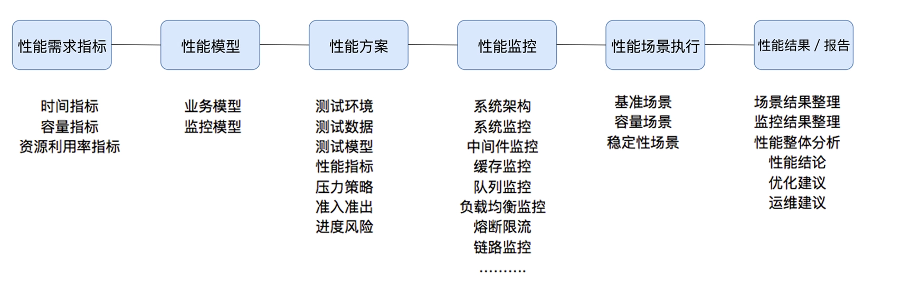
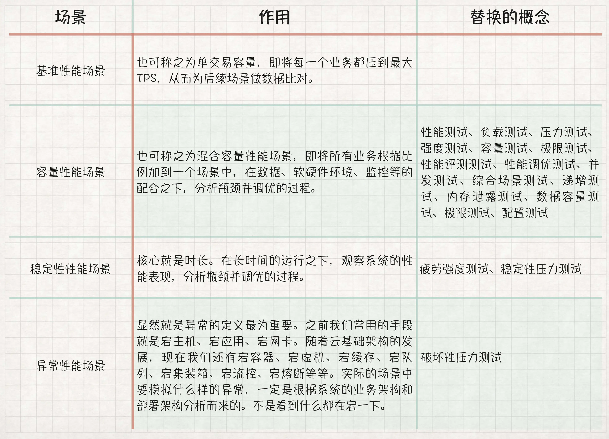
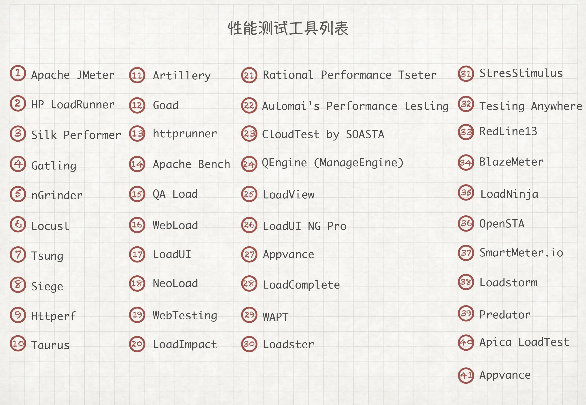
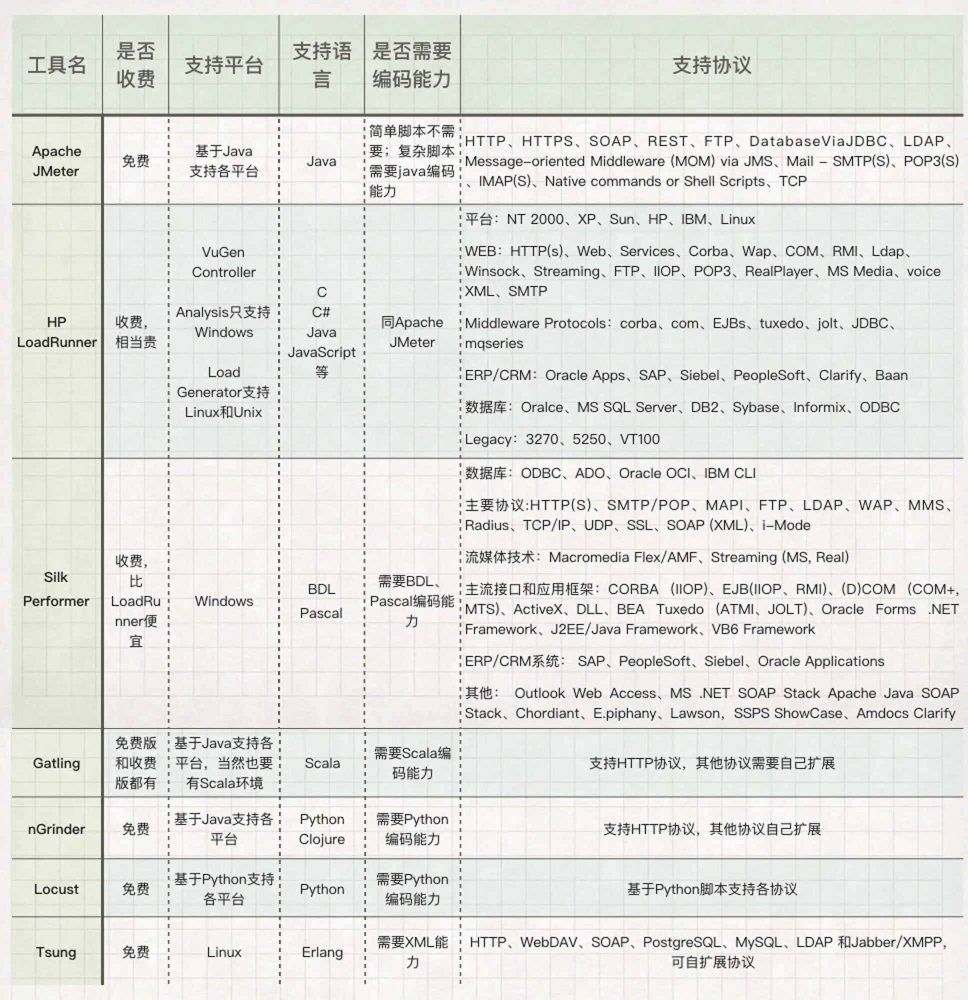

## 性能测试介绍
### 性能测试概念
* step1：【性能指标】性能测试针对系统的性能指标；
    * 时间指标
        * 响应时间的 258 原则合理吗？
            * 距离这个统计结果的出现，已经过去快 40 年了，IT 发展的都能上天了，这个时间现在已经完全不适用了。所以，以后出去别再提 258/2510 响应时间原则这样的话了，太不专业。
        * 那么响应时间如何设计比较合理呢？这里有两种思路推荐给你。
            1. 同行业的对比数据。
            2. 找到使用系统的样本用户（越多越好），对他们做统计，将结果拿出来，就是最有效的响应时间的制定标准
    * 容量指标
    * 资源利用率指标
* step2：【性能模型】建立性能测试模型；
    * 参考资源：https://mp.weixin.qq.com/s/C2xnFhsRpacqDXc0uIX03w
    * 模型是什么？它是真实场景的抽象，可以告诉性能测试人员，业务模型是什么样子
    * 比如说，我们有 100 种业务，但不是每个业务都需要有并发量，可能只有 50 个业务有，那就要把这些有并发的业务统计出来，哪个业务并发多，哪个业务并发少，做压力时就要控制好这样的比例。
    * 业务模型的 28 原则是个什么鬼？--【这种方式不靠谱】
        * 如果一天有 1000 万的用户在使用，系统如果开 10 个小时的话，在计算并发用户数的时候，就用 2 小时来计算，即 1000 万用户在 2 小时内完成业务
    * 模型来源：
        * 来源1：生产环境中的数据中统计来
            * 根据生产环境的统计信息做业务比例的统计，然后设定到压力工具中。有很多不能在线上直接做压力测试的系统，都通过这种方式获取业务模型。
        * 来源2：线上导流
            * 直接在生产环境中做流量复制的方式或压力工具直接对生产环境发起压力的方式做压力测试。这种方式被很多人称为全链路压测。其实在生产中做压力测试的方式，最重要的工作不是技术，而是组织协调能力。相信参与过的人都能体会这句话的重量
* step3：【性能场景】制定性能测试方案；
    * 关键点分别是：测试环境、测试数据、测试模型、性能指标、压力策略、准入准出和进度风险
    * 怎么没有测试计划？我的建议是，用项目管理工具单独画测试计划，比如用 Project 或 OmniPlan 之类的工具
      >这是因为在方案中，写测试计划，基本上只能写一个里程碑，再细化一点，就是在里面再加几个大阶段的条目。但是用项目管理工具做计划就不同了，它不仅可以细分条目，还能跟踪各个工作的动态进度，可以设置前后依赖关系，填入资源和成本以便计算项目偏差。
* step4：【性能监控】制定监控策略；
    * 监控，要有分层、分段的能力，要有全局监控、定向监控的能力
* step5：【性能实施】在场景条件之下执行性能场景；
    1. 基准性能场景：这里要做的是单交易的容量，为混合容量做准备（不要跟我说上几个线程跑三五遍脚本叫基准测试，在我看来，那只是场景执行之前的预执行，用来确定有没有基本的脚本和场景设计问题，不能称之为一个分类）。
    2. 容量性能场景：这一环节必然是最核心的性能执行部分。根据业务复杂度的不同，这部分的场景会设计出很多个，在概念部分就不细展开了
    3. 稳定性性能场景：稳定性测试必然是性能场景的一个分类。只是现在在实际的项目中，稳定性测试基本没和生产一致过。在稳定性测试中，显然最核心的元素是时间（业务模型已经在容量场景中确定了），而时间的设置应该来自于运维周期，而不是来自于老板、产品和架构等这些人的心理安全感。
    4. 异常性能场景：要做异常性能场景，前提就是要有压力。在压力流量之下，模拟异常。这个异常的定义是很宽泛的
* step6：【性能调优】分析判断性能瓶颈并调优；
* step7：【性能报告】最终得出性能结果来评估系统的性能指标是否满足既定值。
  
### 场景的定义来替换这些混乱的性能概念

#### 为什么我要如此划分？
* 在具体场景的操作层面，只有场景中的配置才是具体可操作的。
    * 而通常大家认为的性能测试、负载测试、压力测试在操作的层面，只有压力工具中线程数的区别，
    * 其他的都在资源分析的层面，而分析在很多人的眼中，都不算测试。
### 性能项目分类
#### 新系统性能测试类：
这样的项目一般都会要求测试出系统的最大容量，不然上线心里没底。
#### 旧系统新版本性能测试类：
这样的项目一般都是和旧版本对比，只要性能不下降就可以根据历史数据推算容量，对调优要求一般都不大。
#### 新系统性能测试优化类：
这类的系统不仅要测试出最大容量，还要求调优到最好
### 性能团队的职责
>性能只测不调，那就是性能验证的工作，称不上是完整的性能项目   
> 那为啥好多项目不进行调优呢？
> 1. 性能测试团队的人能力有限做不到
> 2. 性能调优代价高，耗时长，不值得做
1. 性能验证：针对给定的指标，只做性能验证。第三方测试机构基本上都是这样做的。
2. 性能测试：针对给定的系统，做全面的性能测试，可以得到系统最大容量，但不涉及到调优。
3. 性能测试 + 分析调优：针对给定的系统，做全面的性能测试，同时将系统调优到最优状态。
### 优势
* 为企业降本增效
    * 良好的容量规划能⼒ + 性能调优能⼒ = 为⽼板省钱
* 性能测试能⼒是测开⼯程师精华加分项
## 行业流行性能压测工具介绍
### 工具分类

>你是不是有一种生无可恋的感觉？一个性能测试而已，有必要搞出这么多工具吗？
>然而，你要记住，这些都是压力发起工具。
* Apache AB = Apache HTTP server benchmarking tool
    * 小快灵
    * https://httpd.apache.org/docs/2.4/programs/ab.html
* Jmeter
    * https://jmeter.apache.org/
    * 压测场景支撑：逻辑控制器
    * 压力需求：分布式
    * CI支持：Jmx文件、数据驱动、场景可视化
    * 二次开发：多协议支持
    * 问题支持：开源社区
* nGrinder
    * https://github.com/naver/ngrinder
* Locust
    * https://github.com/locustio/locust
### 工具对比

#### Jmeter vs Locust
https://www.blazemeter.com/blog/how-to-test-concurrent-users-using-jmeter
### 使用性能测试工具的**误区**在哪里？
> 所以工具应该如何用，完全取决于用的人，而不是工具本身。
* 压测工具也好，压测平台也好，都没有一个工具可以直接告诉你瓶颈在哪里，
* 能告诉你的只是数据是什么。
* 分析只有靠自己，在这个过程中，我们也会用到很多的分析剖析工具，用这些工具的人也都会知道，
* 工具也只提供数据，不会告诉你瓶颈点在哪里。
>有经验的性能测试人员，都会更关心服务端能处理的请求数即 TPS，而不是压力工具中的线程数。
