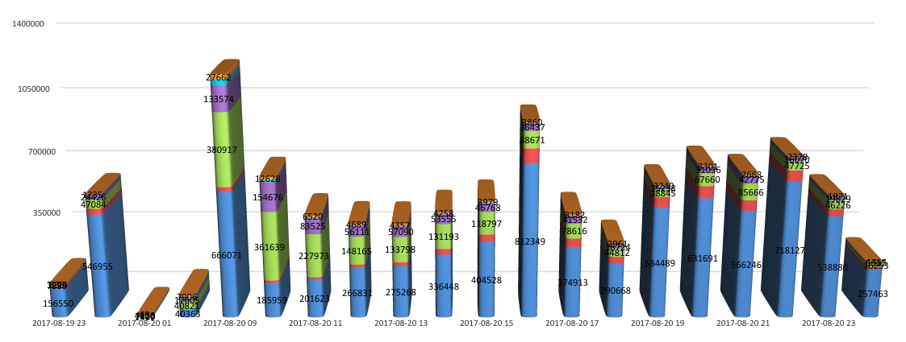
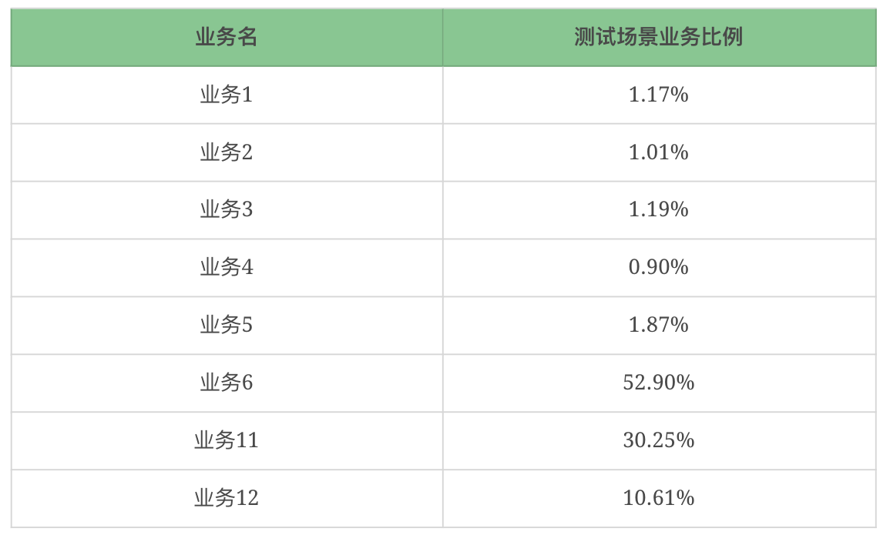

## 业务模型
>业务模型跟线上的业务模型不一样的情况实在是太多了。原因可能多种多样，这些原因大大降低了性能测试的价值
### 查看趋势图
原系统的量级如下图所示（这里我将降低 10 倍处理）：

### 生产数据统计
#### step1：业务量级-选天
业务量级按天统计的生成图如下：

* 从这样的数据中取出业务量最高的一天，最大的业务量是 2000 万左右。
#### step2：业务量级-选小时

#### step3：业务模型计算过程
>针对这一天中的数据，我们将做出以下三个业务模型。
* 通用业务场景模型。就是将这一天的所有业务数加在一起，再将各业务整天的交易量加在一起，计算各业务量的比例。
  * 基础的业务比例，这个可以覆盖大部分的业务时间了
  * 
  * TPS1=20000000/(24∗3600)=231 也就是说通用场景中，TPS 不能低于 231
* 9 点钟的业务模型。将 9 点钟的业务比例直接拿出来用。
  * 小时图中看到，9 点的业务量总和有 120 万左右。为了方便，这里我拿 120 万来计算。
  * 
  * TPS2=1,200,000 / 3600 = 333 也就是说这个模型下，TPS 不能低于 333
* 16 点的业务模型。将 16 点钟的业务比例直接拿出来用。
  * 从小时图中，我们可以看到，16 点的业务量总和有 100 万左右。
  * 
  * TPS3=1,000,000 / 3600 = 277 也就是说这个模型下，TPS 不能低于 277

