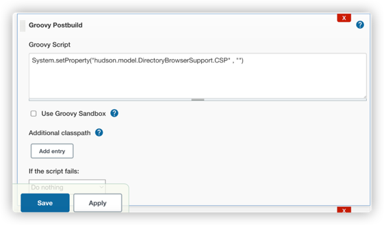
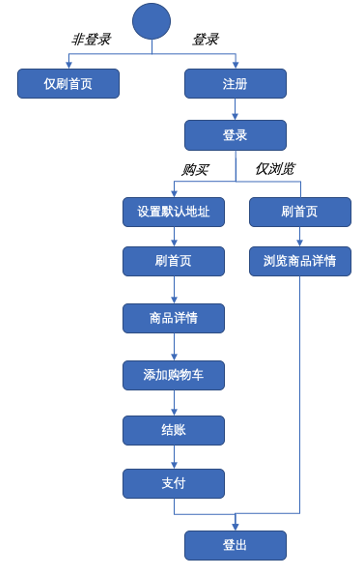
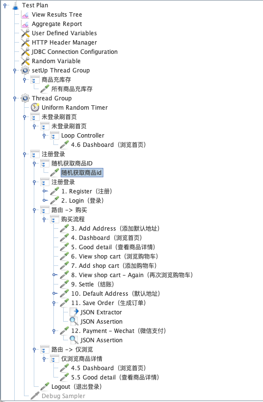

需要重新梳理课程所讲的内容，融合，不要照搬照抄
## 性能测试工具-Jmeter
### 性能测试工具-Jmeter-L1
* 简介
* 组件基本使用
[性能测试工具-Jmeter-L1](./性能测试工具-Jmeter-L1.md)
### 【单接口负载测试实战】
#### step1:启动被测服务
python3 ./application/orderservice.py
#### step2:编写shell，分组并发压测实战
[auto_stress_test.sh](./automation/auto_stress_test.sh)
### 性能测试工具-Jmeter参数化、函数和并发-L2
[性能测试工具-Jmeter参数化和并发-L2](./性能测试工具-Jmeter参数化和并发-L2.md)
### 【Restful接口压力测试实战】
#### 1.HTTPS请求使用实战
* 网站使用机构可信证书：直接选择https协议即可
* 网站使用自建证书： 将网站证书导入ssl manager 或 添加到系统的信任列表中 即可使用https协议

* http 与 https速度对比
  * 实测耗时接近的原因：两种协议的速度差异主要体现在传输层，然而相对与应用层业务逻辑的耗时来说传输层的差异可以忽略不计
#### 2.JMeter压测监控平台搭建
> JMeterbackendlistener + Grafana安装配置 + InfluxDB安装配置
[跳转](./monitor/README.md)   
todo：大数据问题，使用kabuka
#### 3.JavaRequest压测实战
[跳转](./java_request/README.md)
#### 4.RestfulAPI自动化压测持续集成实战
#### step1:启动被测服务
python3 ./application/orderservice.py
#### step2:编写shell，分组并发压测实战（生成的测试报告使用汇总页面）
[auto_stress_test_jenkins.sh](./automation/auto_stress_test_jenkins.sh)
#### step3:Jenkins配置执行
* 参数化导入并发数 数组：thread_number_list=10 20 30
* Jenkins job 中展示压测报告汇总页面，然后再由汇总页面展示具体压测报告
* 解除js代码展示限制

### 性能测试工具-Jmeter分布式与BeanShell-L3
[性能测试工具-Jmeter分布式与BeanShell-L3](./性能测试工具-Jmeter分布式与BeanShell-L3.md)
### 【电商系统压测实战】
#### step1：电商应用压测演练环境的搭建
[跳转](./newbee-mall-api/README.md)
#### step2：JMeter实现典型电商业务操作
* 压测场景
  * 登录 -> 浏览首页 -> 浏览购物车 -> 浏览商品 -> 加入购物车 -> 结算 -> 生成订单 -> 支付 -> 退出登录
* 压测场景分流实现方式：
  * 随机变量+if控制器
* 压测场景API交互“翻译” 成JMeter脚本
  * [newbee_stress.jmx](./newbee-mall-api/newbee-mall-api/jmx/newbee_stress.jmx)
#### step3：电商系统多场景多策略压测实战
* 复杂压测业务流程设计
  * 覆盖场景按比例分配
  * 分配依据： 
    * 运营数据 
    * 或者 竞品分析 
    * 或者 经验估计
  * 
* 复杂业务流程压测脚本编写
  * 改造已有脚本
  * 添加路由控制节点
  * 添加用户注册步骤
  * 控制商品ID随机选取
  * 
  * [newbee_stress_complex.jmx](./newbee-mall-api/newbee-mall-api/jmx/newbee_stress_complex.jmx)
* jenkins集成
  * [newbee_streess_auto_jenkins](./newbee-mall-api/newbee-mall-api/automation/newbee_streess_auto_jenkins.sh)
##### 场景1： 秒杀抢购场景压测实战
* 性能影响：高并发，短时长，服务变得缓慢，报错率变高
* 测试策略：浪涌、并发
* 测试目的：验证高并发下系统处理能力
```
任务配置：
并发数： 40 50 80 100 120
持续时间：60 秒
远程节点数：2
间隔等待时间：20 秒
```
##### 场景2： 系统稳定性验证场景压测实战
* 测试系统提供长时间服务时的性能稳定性
* 观察系统在长时间运行过程中可能出现的问题
* 测试策略：负载、并发
* 测试目的：验证小并发长时间系统的运行稳定性
```
任务配置：
并发数： 10 15 20 25 30
持续时间：120 秒
远程节点数：2
间隔等待时间：20 秒
```
##### 场景3： 容灾恢复场景实战
* 系统在出现异常的状态下是否能够自动或者在人工干预的条件下恢复正常
* 测试策略：并发，浪涌
* 测试目的：验证系统的恢复能力和异常情况下的存活时间
```
任务配置：
并发数： 10 100 30 20
持续时间：60 秒
远程节点数：2
间隔等待时间：20 秒
```
### 性能测试工具-Jmeter微服务压测-L4
[性能测试工具-Jmeter微服务压测-L4](./性能测试工具-Jmeter微服务压测-L4.md)
### 性能测试工具-Jmeter二次开发-L5
[性能测试工具-Jmeter二次开发-L5.md](./性能测试工具-Jmeter二次开发-L5.md)


