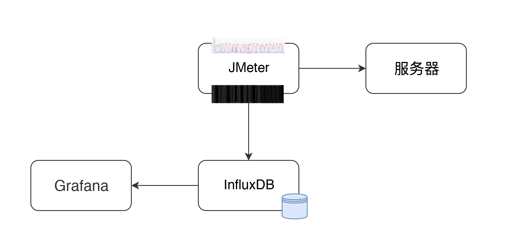
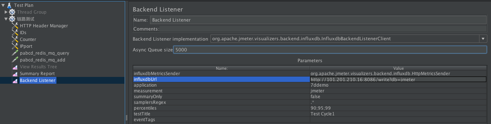

## 性能监控平台好处
### 1.JMeter原生测试测试报告带来的“痛苦”
* 不具备实时性
* 报告中的数据是测试时间段内的平均值
* 长相问题(原生报告较丑)
### 2.性能监控平台的优势
* 实时展示JMeter压测数据
* 数据范围可选
* 界面更友好
### 3.JMeter性能监控平台组成

* JMeter：压测工具，产生压测数据
  * JMeter 发送压力到服务器的同时，统计下 TPS、响应时间、线程数、错误率等信息。
  * 默认每 30 秒在控制台输出一次结果（在 jmeter.properties 中有一个参数 #summariser.interval=30 可以控制）。
  * 配置了 Backend Listener 之后，将统计出的结果异步发送到 InfluxDB 中。最后在 Grafana 中配置 InfluxDB 数据源和 JMeter 显示模板。
* InfluxDB: 开源时序数据库，特别适合用于处理和分析资源监控数据，用于存储压测数据
* Grafana：度量分析与可视化图标展示工具，可以支持不用种类的数据源，用于将存储于InfluxDB中的数据以图表的形式展示出来
### 4.搭建
#### InfluxDB安装配置
```bash
# InfluxDB安装
#启动命令 -d(后台运行)
docker run -d -p 8086:8086 -p 8083:8083 --name=<your influx db name> influxdb:1.8
#进入Docker container
docker exec –it <your influx db name> bash 
#命令进入命令台
influx
#创建jmeter数据库：
create database jmeter;
show databases;
> use jmeter
Using database jmeter
>
> show MEASUREMENTS
name: measurements
name
----
events
jmeter
> select * from events where application='7ddemo'
name: events
time                application text                title
----                ----------- ----                -----
1575255462806000000 7ddemo      Test Cycle1 started ApacheJMeter
1575256463820000000 7ddemo      Test Cycle1 ended   ApacheJMeter
..............
n> select * from jmeter where application='7ddemo' limit 10
name: jmeter
time                application avg                count countError endedT hit max maxAT meanAT min minAT pct90.0            pct95.0           pct99.0 rb responseCode responseMessage sb startedT statut transaction
----                ----------- ---                ----- ---------- ------ --- --- ----- ------ --- ----- -------            -------           ------- -- ------------ --------------- -- -------- ------ -----------
1575255462821000000 7ddemo                                          0              0     0          0                                                                                     0               internal
1575255467818000000 7ddemo      232.82352941176472 17    0                 17  849              122       384.9999999999996  849               849     0                               0           all    all
1575255467824000000 7ddemo      232.82352941176472 17                          849              122       384.9999999999996  849               849     0                               0           all    0_openIndexPage
1575255467826000000 7ddemo      232.82352941176472 17                          849              122       384.9999999999996  849               849                                                 ok     0_openIndexPage
1575255467829000000 7ddemo                                          0              1     1          1                                                                                     1               internal
1575255472811000000 7ddemo      205.4418604651163  26    0                 26  849              122       252.6              271.4             849     0                               0           all    all
1575255472812000000 7ddemo                                          0              1     1          1                                                                                     1               internal
1575255472812000000 7ddemo      205.4418604651163  26                          849              122       252.6              271.4             849                                                 ok     0_openIndexPage
1575255472812000000 7ddemo      205.4418604651163  26                          849              122       252.6              271.4             849     0                               0           all    0_openIndexPage
1575255477811000000 7ddemo      198.2142857142857  27    0                 27  849              117       263.79999999999995 292.3500000000001 849     0                               0           all    all

```
#### JMeter 中 Backend Listener 的配置
* 配置好 influxdb Url、application 等信息，application 这个配置可以看成是场景名

* 那么 JMeter 如何将数据发给 InfluxDB 呢？请看源码中的关键代码，如下所示：
```java
    private void addMetrics(String transaction, SamplerMetric metric) {
        // FOR ALL STATUS
        addMetric(transaction, metric.getTotal(), metric.getSentBytes(), metric.getReceivedBytes(), TAG_ALL, metric.getAllMean(), metric.getAllMinTime(),
                metric.getAllMaxTime(), allPercentiles.values(), metric::getAllPercentile);
        // FOR OK STATUS
        addMetric(transaction, metric.getSuccesses(), null, null, TAG_OK, metric.getOkMean(), metric.getOkMinTime(),
                metric.getOkMaxTime(), okPercentiles.values(), metric::getOkPercentile);
        // FOR KO STATUS
        addMetric(transaction, metric.getFailures(), null, null, TAG_KO, metric.getKoMean(), metric.getKoMinTime(),
                metric.getKoMaxTime(), koPercentiles.values(), metric::getKoPercentile);
​
​
        metric.getErrors().forEach((error, count) -> addErrorMetric(transaction, error.getResponseCode(),
                    error.getResponseMessage(), count));
    }
```
* 在源码中，还有更多的添加 metric 的步骤，你有兴趣的话，也可以看一下 JMeter 源码中的InfluxdbBackendListenerClient.java。
* 保存了 metric 之后，再使用 InfluxdbMetricsSender 发送到 Influxdb 中去。发送关键代码如下：
```java
   @Override
    public void writeAndSendMetrics() {
 ........
        if (!copyMetrics.isEmpty()) {
            try {
                if(httpRequest == null) {
                    httpRequest = createRequest(url);
                }
                StringBuilder sb = new StringBuilder(copyMetrics.size()*35);
                for (MetricTuple metric : copyMetrics) {
                    // Add TimeStamp in nanosecond from epoch ( default in InfluxDB )
                    sb.append(metric.measurement)
                        .append(metric.tag)
                        .append(" ") //$NON-NLS-1$
                        .append(metric.field)
                        .append(" ")
                        .append(metric.timestamp+"000000") 
                        .append("\n"); //$NON-NLS-1$
                }


                StringEntity entity = new StringEntity(sb.toString(), StandardCharsets.UTF_8);
                
                httpRequest.setEntity(entity);
                lastRequest = httpClient.execute(httpRequest, new FutureCallback<HttpResponse>() {
                    @Override
                    public void completed(final HttpResponse response) {
                        int code = response.getStatusLine().getStatusCode();
                        /*
                         * HTTP response summary 2xx: If your write request received
                         * HTTP 204 No Content, it was a success! 4xx: InfluxDB
                         * could not understand the request. 5xx: The system is
                         * overloaded or significantly impaired.
                         */
                        if (MetricUtils.isSuccessCode(code)) {
                            if(log.isDebugEnabled()) {
                                log.debug("Success, number of metrics written: {}", copyMetrics.size());
                            } 
                        } else {
                            log.error("Error writing metrics to influxDB Url: {}, responseCode: {}, responseBody: {}", url, code, getBody(response));
                        }
                    }
                    @Override
                    public void failed(final Exception ex) {
                        log.error("failed to send data to influxDB server : {}", ex.getMessage());
                    }
                    @Override
                    public void cancelled() {
                        log.warn("Request to influxDB server was cancelled");
                    }
                });               
 ........
            }
        }
    }
```

#### Jmeter配置
* 添加JMeter backend listener
  * [order_auto_jenkins.jmx](../automation/order_auto_jenkins.jmx)
* 配置 localhost:8086
  * python3 ./application/orderservice.py
  * [orderservice.py](../application/orderservice.py)
* application name: order service
* 运行JMeter压测
  * [order_auto_jenkins.jmx](../automation/order_auto_jenkins.jmx)
* 检验 influx db中是否有数据
#### Grafana安装配置
* 启动docker container
  * docker run -d -p 3000:3000 --name=<your grafana container name> grafana/grafana 
* 登录grafana：http://localhost:3000/
  * 默认用户名 / 密码： admin / admin
* 配置数据源 - influx db
  * URL: http://localhost:8086【注意】本地localhost与代理冲突
  * Access: Browser
  * Database: jmeter
* 添加 Dashboard 模版 
  * 点击【+】；导入json文件
  * [jmeter_dashboard.json](../shell/jmeter_dashboard.json)
* 运行看效果

