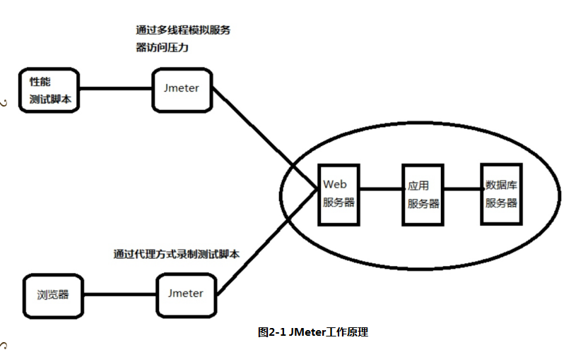
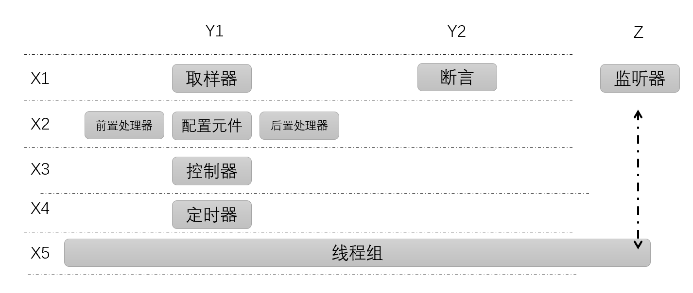
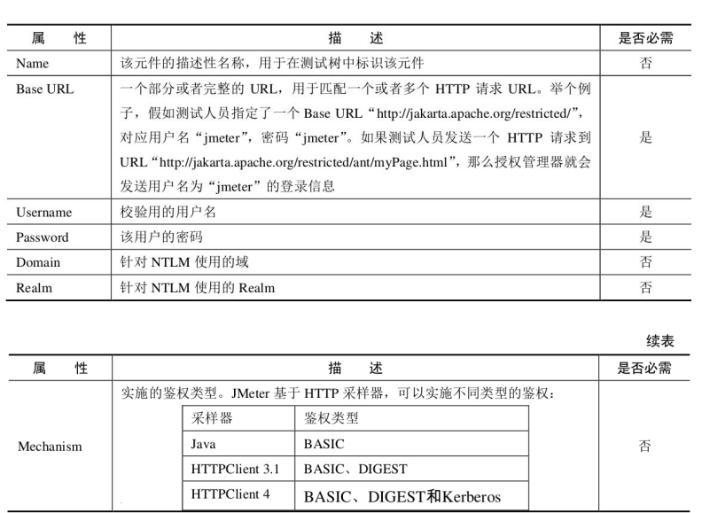
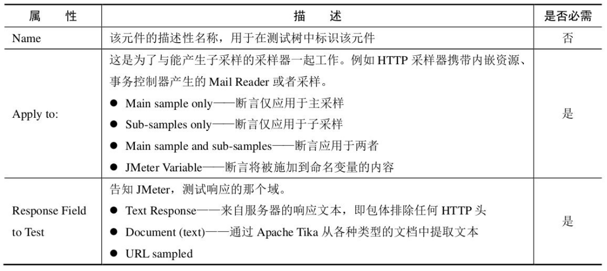
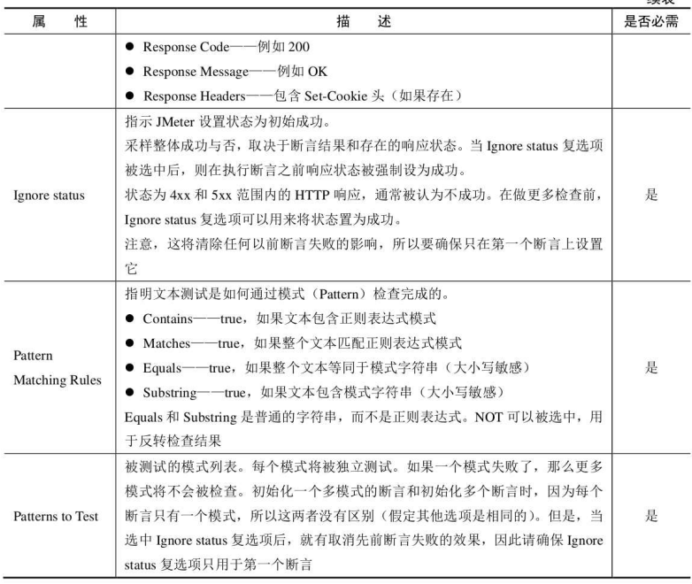
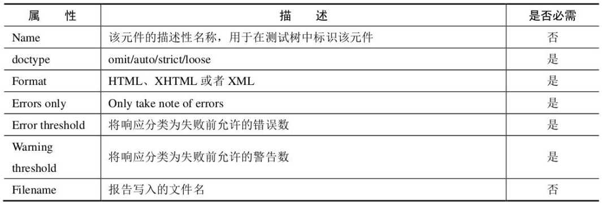

## Jmeter基础知识
>为什么 JMeter 这样的功能单一，性能又不好的性能测试工具能这么快的占领市场呢？  
> 答：在我看来，工具能不能用取决于它能不能满足需要。在很多的性能测试场景中，JMeter 已经够用了。因为性能压力工具只需要两条曲线：TPS 和响应时间（如果出错最多就再看一下错误率曲线）。这些功能，JMeter 都可以提供。
## Jmeter简介
### Jmeter主要特点
* 支持多种协议进行测试
* 支持录制回放获取脚本
* 高可移植性，100%java应用
* 采用多线程框架
* 精心设计GUI,支持高速用户操作、基准记时
* 支持缓存离线方式回放、分析测试结果
* 高扩展性
### Jmeter常用术语
* 采样器（sampler）
    * jemter测试脚本基础单元，向服务器发送指定请求，超时前获取响应
* 逻辑控制器（logic Controller）
    * 控制Jmeter测试脚本的执行顺序，以便按照用户期望的顺序和逻辑执行
* 监听器（Listener）
    * 收集测试结果信息，以用户指定格式呈现
* 配置元件（Configuration Element）
    * 设置Jmeter测试脚本公用的信息
* 断言（Assertion）
    * 验证服务器返回信息与用户期望结果是否匹配
* 定时器（Timer）
    * 用来保存与时间相关的信息，eg：思考时间
* 前置处理器（Pre-Processor）
    * 前置处理器作用范围内，任何采样器执行前，都要经过前置处理器
* 后置处理器（Post-Processor）
    * 后置处理器作用范围内，任何采样器执行后，都要经过后置处理器
* 测试计划（Test Plan）
    * JMeter测试脚本的根节点，测试脚本的一些基础设置，可以在测试计划中制定，eg:用户定义变量
* 线程组（Thread Group）
    * 定义虚拟用户池，每个虚拟用户都使用相同的测试脚本
### Jmeter测试结果字段的意义
* Lable:定义http请求名称
* Sampler：这次测试中一共发送的请求数
* Average: 平均响应时长--单个请求的平均响应时长
* Median:中位数，也就是50%用户的响应时长
* 90%Line:百分之90的用户的响应时长
* Min:访问页面最小响应时长
* Max:服务页面最大响应时长
* Error%:错误请求数/总请求数
* Throughput：每秒完成的请求数
* KB/Sec:每秒从服务器接收到的数据量
### Jmeter工作原理

## Jmeter脚本开发
### 1.执行顺序
配置元件-前置处理器-定时器-采样器-后置处理器-断言-监听器
### 2.作业域
* 分层规则：监听器、配置元件、前置后置处理器、断言、定时器
* 顺序规则：逻辑控制器、采样器
### 3.Jmeter属性和变量（大小写敏感）
* 属性：在配置文件jmeter.properties中
* 变量：线程不安全
#### Jmeter中用户参数和用户定义变量区别
* 用户定义变量
    * Jmeter跨线程组使用
    * 用户定义变量不会在运行中动态获取值：在启动运行时，获取一次值，在运行过程中，不会动态获取值，在运行过程中，值一直都不变
* 用户参数
    * 用户参数无法跨线程组使用
    * 用户参数在执行 过程中可以动态获取值
* vars VS Props
    * vars 只能在当前线程组内使用，props 可以跨线程组使用
    * vars 只能保持String 或者Object， props 是 Hashtable 对象
### 4.Jmeter结构图

X、Y、Z形成了一个三维立体空间。   
X1~X5表示的是：5个模拟过程。
Y1表示的是：用户请求。   
Y2表示的是：结果验证。    
Z表示的是：结果收集。
## Jmeter测试元件
### 监听器（Listener）
* 不同的监听器以不同的方式展示服务器响应信息。共通点是都将原始数据记录到某个输入文件中。
* Configure按钮配置输出文件的结果域，以及输出文件的格式（xml、csv(占用空间小)）
#### 监听器资源占用
* 减少内存占用使用Simple data writer,并使用csv文件输出
### 逻辑控制器
决定采样器的执行顺序
#### SimpleController
* 用途：组合采样器以及其他逻辑控制器
* 不会提供除存储设备之外的其他功能
#### LoopController
* 可以设置采样器循环次数
#### OnceOnlyController
* 只在父循环控制器的第一次执行（线程组、循环控制器）
#### InterleaveController(交替控制器)
* 将采样器或逻辑控制器放置在交替控制器下，每一次循环会jmeter会交替执行该控制器下的测试元件
* 属性：Ignore sub-controller blocks---选中该复选框，交替控制器会将其下的子控制器当做交替控制器处理
#### RandomContrller
* 类似于交替控制器，不同在于旗下的子测试元件执行是无序的
#### 随机顺序控制器（random order controller）
* 子测试元件最多执行一次，且无序
#### Throughput Controller
* Exceution Style :percent exceution(执行固定比例的循环次数)/total exceutions(执行固定次数的循环)
* Per User:总执行次数是否按照人数*循环次数来计算
#### Runtime Controller
* 控制子测试元件允许运行的时长，超过配置时间不继续执行该控制器子元件
#### Recording Controller
* 指明了代理服务器录制的采样的存放位置，运行期间等同于simple controller
#### Critical（关键的） Section(部门) Controller：临界区控制器
* 确保子元件只会被一个线程执行（线程安全）
* 【注意】此控制器只在一个JVM内部上锁，如果分布式测试，确保测试不依赖于所有JVM的所有线程
#### If Controller
* 控制子元件是否执行，默认使用javascript的语法进行判断
* Interpret Condition as Variable Expression?：选中这一项时表示：判断变量值是否等于字符串true（不区分大小写）
* Evaluate for all children：如果选中这一项，在每个子结点执行前都会计算表达式
#### While Controller
* 一直运行子测试元件，知道条件变为false
* 属性
    * Blank:循环中有采样失败了退出循环
    * LAST: 循环中有采样失败了退出循环,如果循环前最近的采样失败了，不进入循环
    * Otherwise：当条件等同于false是退出循环（javascript/Beanshell/属性/变量）
#### Switch Controller
* Switch Controller的作用类似于Interleave Controller ，因为它在每次迭代时运行一个从属元素，但不是按顺序运行它们，控制器运行由switch值定义的元素
* 开关值也可以是名称。
* 如果开关值超出范围，它将运行第0个元素，因此它将作为数字大小写的默认值。如果值为空字符串，它还会运行第零个元素。
* 如果该值为非数字（且非空），则Switch Controller将查找具有相同名称的元素（大小写很重要）。如果没有名称匹配，则选择名为“ default ”（不重要）的元素。如果没有默认值，则不选择任何元素，并且控制器不会运行任何操作。
#### ForEach Controller
* 实例：
    * 1.可以根据用户的多个变量依次被循环调用，直到最后一个变量被调用即结束循环。
    * 2.用户变量的要求是前缀有一定规律，需要循环的多个变量前缀要求一致。如图：
      
    * 3.配置ForEach controller，将“用户定义的变量名" 的前缀添加好，并设置【输出变量名称】
      
    * 4.应用到具体的脚本中，并添加察看结果树，查看结果
      

#### Module Controller
* 引用指定的测试模块
* eg：
```
涉及到JMeter提供的两个元素：
Module Controller【右键 Thread Group - Add - Logic Controller - Module Controller】
Test Fragment 【右键 Test Plan - Add - Test Fragment - Test Fragment】
一般，将Test Fragment放在线程组的外面，然后在线程组中新建Module Controller，在Module To Run下面选择需要的Test Fragment 即可。这样，在执行线程组中的Module Controller即相当于执行了Test Fragment。
```
#### Include Controller
* 包含控制器用于使用外部的Jmx文件。
* 条件：为了演示使用它，可以添加一个simple controller,然后在其中添加一个采样器(sample),比如一个http请求。然后把这个simple controller保存为一个jmx文件。这样在include controller中设置该jmx文件就可以在测试计划中使用了。*值得注意的是，包含测试的测试计划中不能有线程组，仅仅只能有simple controller，然后其下可以添加任何采样器，控制器。*
* 【注意】如果用户需要使用cookie manage或者 用户自定义变量，都应该在顶层的测试计划中设置，不应该包含在外部文件中，否则不会它们不会起作用。
#### Transaction Controller
* 作用：事务控制器会生产一个额外的采样器，用来统计该控制器子结点的所有时间。
* 参数：
    * Generate parent sample：(选中这个参数结果展示如下图红框，否则显示为下图蓝框)
    * Include duration of timer and pre-post processors in generated sample：选中这一项会统计定时器(timer)的时间，否则只统计采样器(sample)的时间
      
### Jmeter配置元件
* 初始化（采样器之前初始化）默认值和变量，以便后续采样器使用。
#### CSV Data Set Config
* 作用：从文件中读取数据行，*拆分*存储到指定变量中
* 优点：从文件中读取数据行，要比每次运行生成数据省CPU和内存
* 【注】:此配置的变量不可再JDBC Config等元件中引用，因为JDBC中参数的使用是在初始化阶段，此时CSV参数还没有初始化完成
* 参数讲解
    * Filename:文件名，指保存信息的文件目录，可以相对或者绝对路径(比如：D:\ceshi.Txt)
    * File encoding:csv文件编码，可以不填
    * Variable Names:变量名，多个变量用“,”分开。变量使用格式${OA_VendingMachineNum}和${Name}
        * jmeter2.3.4之后支持CSV文件第一行为列名，此时Variable Names需为空
    * Delimiter:csv文件中的分隔符（用”\t”代替tab键）（一般情况下，分隔符为英文逗号）
    * Allow quoted data：是否允许引用数据【即：双引号限定文本[提取出来的是双引号内部的数据，不会将双引号提取出来]；】
    * Recycle on EOF ：到了文件尾处，是否循环读取参数，选项：true和false。因为CSV Data Set Config一次读入一行，分割后存入若干变量交给一个线程，如果线程数超过文本的记录行数，那么可以选择从头再次读入
    * Stop thread on EOF：到了文件尾处，是否停止线程，选项：true和false
        * 当Recycle on EOF 选择true时，Stop thread on EOF选择true和false无任何意义，通俗的讲，在前面控制了不停的循环读取，后面再来让stop或run没有任何意义
        * 当Recycle on EOF 选择flase时，Stop thread on EOF选择true，线程4个，参数3个，那么只会请求3次
        * 当Recycle on EOF 选择flase时，Stop thread on EOF选择flase，线程4个，参数3个，那么会请求4次，但第4次没有参数可取，不让循环，所以第4次请求错误
    * Sharing Mode: 设置是否线程共享
        * 如果您希望每个线程都有自己的一组值，那么您将需要创建一组文件，每个线程一个。例如test1.csv，test2.csv，...，test n .csv。使用文件名 test {$ __ threadNum} .csv并将“ 共享模式 ”设置为“ 当前线程 ”。
#### FTP Request Defaults
#### DNS Cache Manager
#### HTTP Authorization Manager（HTTP授权管理器）
* 【注】：一个采样器的作用域内存在多个授权管理器，采样器无法确定采用哪个授权管理器
* 用途：针对web页面服务端校验限制进行*认证*
* 参数如下：
  
#### HTTP Cache Manager（HTTP缓存管理器）
* 参数讲解：
    * clear cache each iteration?（每次迭代清空缓存）:如果选择该项，则该属性管理器下的所有Sampler每次执行时都会清除缓存；
    * Use Cache-Control/Expires header when processing GET requests:在处理GET请求时使用缓存/过期信息头；
    * Max Number of elements in cache（缓存中的最大元素数）:默认数值为5000，当然可以根据需要自行修改；
```
PS：如果Test Plan中某个Sampler请求的元素是被缓存的元素，则Test Plan在运行过程中会直接从Cache中读取元素，这样得到的返回值就会是空。
在这种情况下，如果为该Sampler设置了断言检查响应体中的指定内容是否存在，该断言就会失败！
为test plan增加该属性管理器后，test plan运行过程中会使用Last-Modified、ETag和Expired等决定是否从Cache中获取对应元素。
Cache：一般指的是浏览器的缓存
Last-Modified：文件在服务端最后被修改的时间
ETag：在HTTP协议规格说明中定义为：被请求变量的实体标记
Expired：给出的日期/时间之后；一般结合Last-Modified一起使用，用于控制请求文件的有效时间
PS：上面提到的几个字段，都是HTTP协议里面的报文首部的字段，感兴趣的请自行查阅相关内容，或可参考这篇博客：https://blog.csdn.net/eroswang/article/details/8302191
浏览器缓存详解
```
#### HTTP Cookie Manager（HTTP Cookie管理器）
* 【注】cookie不会在配置元件中展示，只会在结果树中展示
*  可以手动添加cookie，此时cookie会被所有线程共享
* 参数讲解：
    * Clear cookie each iteration?（每次迭代时清除自己会话区域的所有cookie）；
    * Implementation：实现方式；
    * Cookie Policy：cookie的管理策略，建议选择compatibility,兼容性强；
* 对于JMeter来说，一个test plan只能有一个cookie管理器。因为当多个magager存在时，JMeter没有方法来指定使用那个manager；
  同时，一个cookie manager中的存储的cookie也不能被其他cookie manager所引用，所以同一个计划中不建议使用多个cookie manager；
  如果你想让JMeter的cookie manager支持跨域，  修改JMeter.property :CookieManager.check.cookies=false；
#### HTTP Header Manager（HTTP头信息管理器）
[博客链接](https://www.cnblogs.com/gezirui/p/9328276.html)
### JMeter断言
* 作用：对采样进行额外的检查
* 作用域：对相同作用域的每个采样进行检查，为确保断言针对指定采样器，将其设置为采样器的子项
####  响应断言（Response Assertion）
* 通过断言控制面板，可以添加模式字符串与*响应的各个域*进行比较
    * 模式字符串：Contains,Matches---per5风格的正则表达式
      Equals,Substring---纯文本，区分大小写
* 参数：
  
  
#### Duration Assertion
* 测试：是否给定时间内接受响应
#### Size Assertion
* 测试每个响应是否包含正确的字节数
#### Xml Assertion
* 测试每个响应是否包含正确XML文档，不验证DTD或Schema
#### BeanShell Assertion
* 可以使用BeanShell Script来检查断言
  [博客链接](https://www.cnblogs.com/fengpingfan/p/4762068.html)
#### MD5Hex Assertion
* 检查响应的MD5 hash
#### HTML Assertion
* 使用JTidy检查响应数据的HTML语法
  
#### XPath Assertion
#### XML Schema Assertion
#### BSF Assertion
#### JSR223 Assertion
#### Compare Assertion
* 压测不使用，功能测试才使用
#### SMIME Assertion
### Jmeter定时器
* 定时器仅与采样器关联（如果定时器作用域内没有采样器，定时器失效）
* 定时器先于采样器执行（如果定时器作用域有多个定时器，那么所有定时器会在*每个*采样器前执行）
* 用法：
    * 单独作用某个采样器，定时器作为采样器的子测试元素
    * 定时器在采样器之后执行，将定时器添加到下一个采样器之下；或者添加为Test action 采样器的子测试元件
#### 固定采样器（Constant Timer）
请求之间固定相同时长，单位毫秒
#### 高斯随机定时器（Gaussion Random Timer）

如需要每个线程在请求前按随机时间停顿，那么使用这个定时器，上图表示暂停时间会分布在100到400之间，计算公式参考：Math.abs((this.random.nextGaussian() * 300) + 100)
#### 均匀随机定时器（Uniform Random Timer）
* 和高斯随机定时器的作用差异不大，区别在于延时时间在指定范围内且每个时间的取值概率相同，每个时间间隔都有相同的概率发生，总的延迟时间就是随机值和偏移值之和。   
  （1）Random Delay Maximum(in milliseconds):随机延迟时间的最大毫秒数   
  （2）Constant Delay Offset(in milliseconds):暂停的毫秒数减去随机延迟的毫秒数
#### 固定吞吐量定时器（Constant Throughput Timer）

* 可以让JMeter以指定数字的吞吐量（即指定TPS，只是这里要求指定每分钟的执行数，而不是每秒）执行。
* 吞吐量计算的范围可以为指定为当前线程、当前线程组、所有线程组等范围，并且计算吞吐量的依据可以是最近一次线程的执行时延。这种定时器在特定的场景下，还是很有用的。
#### 同步定时器（Synchronizing Timer）
* 这个定时器和loadrunner当中的集合点（rendezvous point）作用相似，其作用是：阻塞线程，直到指定的线程数量到达后，再一起释放，可以瞬间产生很大的压力（人多力量大- -哈哈！）   
  （1）Number of Simulated Users to Group by:模拟用户的数量，即指定同时释放的线程数数量   
  （2）Timeout in milliseconds:超时时间，即超时多少毫秒后同时释放指定的线程数
#### BeanShell定时器（BeanShell Timer）

* 这个定时器，一般情况下用不到，但它可以说是最强大的，因为可以自己变成实现想要做的任何事情，例如：希望在每个线程执行完等待一下，或者希望在某个变量达到指定值的时候等待一下。
##### BeanShell是一种松散类型的脚本语言（这点和JS类似），一种完全符合java语法的java脚本语言，并且又拥有自己的一些语法和方法。
传送门（另外一位博客园作者的博客）：http://www.cnblogs.com/jssy/archive/2006/10/23/537101.html
#### 泊松随机定时器（Poisson Random Timer）
这个定时器在每个线程请求之前按随机的时间停顿，大部分的时间间隔出现在一个特定的值，总的延迟就是泊松分布值和偏移值之和。
#### JSR223定时器（JSR223 Timer）
在jemter最新的版本中，新增了这个定时器，可以这么理解，这个定时器相当于BeanShell定时器的“父集”，它可以使用java、JavaScript、beanshell等多种语言去实现你希望完成的事情；   
传送门（关于JSR223）：http://wenku.baidu.com/link?url=GUFnww9nb_1D6MlFd1YksYrNVk1NXF74ov8kJL06MmqVdmH_Q9v4YnWK-_gZ-04zL4QEqD9VN48OrXi4JyXpxosNZd8LBfIWhyhhxgUbrAC
#### BSF定时器（BSF Timer）
BSF Timer，也是jmeter新的版本中新增的定时器，其使用方法和JSR223 Timer很相似，只需要在jmeter的lib文件夹导入其jar包，就可以支持脚本语言直接访问Java对象和方法的一定时器。   
传送门（BSF）：http://baike.baidu.com/link?url=0RRkO1WqT1SdaXIzohqnEU8lcilpc_Sqwy7HtfpzCdCX1kyyLC5qttpF8jayTWFZi_tCbFbzMEw8FxHFYnIGYK
### Jmeter前置处理器
修改作用域范围内的采样器
#### HTML链路解析器（HTML Link Parser）?
* 此处理器为HTML链接解析器，用于从前一个sampler返回的html页面中按照规则解析链接和表单，再根据此处理器所在的sampler中的规则（Perl型正则表达式）进行匹配修改，而后该sampler会执行；
#### HTTP URL重写修饰符
* HTTP URL重写修改器，此处理器与HTTP Link Parser类似，但专用于使用url重写来存储sessionId而非cookie的http request，在线程组级别添加此修改器则应用于所有sample，若为单个sample添加则只适用该sample；
* 用途：使用URL重写来代替cookie的web系统
* 参数配置：     
  Session Argument Name：会话参数名称，用于搜索sessionId，其他sample也可通过此参数来 调用其获取的sessionId；    
  Path Extension：路径扩展，如url添加了分号作为分割，则勾选此项；    
  Do not use equals in path extension：用于url不用等号来分割key和value的类型；    
  Do not use questionmark in path extension：用于不带？的类型；    
  Cache Session Id?：勾选此项则会存储在其挂载的sample上获取到的sessionId供后边的其他sample使用；     
  URL Encode：是否使用url编码；
#### User Parameters
* 用户参数，用于做几组参数给线程组的各个线程使用，如果线程数多于用户参数组数，则多出来的线程则从第一组用户参数开始依次调用参数组；
* 参数配置：    
  Name：此前置处理器的名称；    
  Update Once Per Iteration：标识是否每轮迭代更新一次元素；
#### JDBC PreProcessor
* 数据库预处理器，用于在sample开始前查询数据库并获取一些值；
#### RegEx User Parameters
* 正则表达式，使用正则表达式为从另一个HTTP请求中提取的HTTP参数指定动态值
* 参数配置：    
  name：此前置处理器名称；      
  Regular Expression Reference Name：调用的正则表达式提取器中的引用名称；    
  Parameter names regexp group number：用于提取参数名称的正则表达式的组编号；    
  Parameter values regex group number：用于提取参数值的正则表达式的组编号；
####  Sample Timeout
* 超时器，用于设定sample的超时时间，如果完成时间过长，此预处理器会调度计时器任务以中断样本；
#### JSR223 PreProcessor
JSR223预处理器，用于调用脚本；
#### BeanShell PreProcessor
### Jmeter后置处理器
#### 正则表达式提取器(regular expression extractor)
* 使用正则表达式提取请求中的内容。
#### CSS/Jquery Extractor
#### XPath Extractor
* 可以从结构化响应中提取值
#### Result Status Action Handler
* 采样失败时执行操作，停止线程或整个测试
#### BeanShellPostProcessor
* 采样后执行代码
#### BSF PostProcessor
* 采样后执行BSF脚本
#### JSR223 PostProcessor
* 采样后执行JSR223脚本
#### JDBC PostProcessor
* 向数据库发送JDBC请求
### Jmeter采样器
#### FTP Request
* 和ftp服务器进行文件传输
#### HTTP Request
#### JDBC Request
#### JAVA Request
#### SOAP/xml-rpc 请求
#### web service(soap) 请求
#### LDAP 扩展请求
#### BeanShell采样器
>BeanShell是一个小型嵌入式Java源代码*解释器*，具有对象脚本语言特性，能够动态地执行标准JAVA语法，并利用在JavaScript和Perl中常见的的松散类型、命令、闭包等通用脚本来对其进行拓展。BeanShell不仅仅可以通过运行其内部的脚本来处理Java应用程序，还可以在运行过程中动态执行你java应用程序执行java代码。因为BeanShell是用java写的，运行在同一个虚拟机的应用程序，因此可以自由地引用对象脚本并返回结果。
* BeanShell特点
    * 完整的java语法的动态执行，java代码片段，以及松散类型的java和其他脚本
    * 透明地访问所有java对象和API
    * 运行在四种模式：命令行，控制台，小程序，远程会话服务器。
    * 可以在安全约束的环境中工作
    * 编译器是一个小于150K的jar文件
* Jmeter的应用
    * Jmeter中的BeanShell主要有：定时器BeanShell Timer、前置处理器BeanShell PreProcessor、采样器BeanShell Sampler、、后置处理器BeanShell PostProcessor、断言BeanShell、断言监听器BeanShell Listener。
* eg:[采样器实例](https://www.cnblogs.com/wangxiaoqun/p/6737395.html)
* Jmeter中使用场景
    * 1>自定义函数   
      在BeanShell中编写自定义函数，直接利用脚本编译器编译
    * 2>调用外部java文件
      如果我们已经有现成的java源文件，可以在BeanShell中直接编写和java引用外部文件时一样的语句来调用java外部文件。      
      
    * 3>导入外部jar包
        * 从上面两个场景可以知道，在BeanShell中引用外部文件和java是一样一样的，因此此处就不进行过多的描述，步骤为：
        * 在eclipse写好代码，然后把该类打成jar包（在类上点击右键->Export->jar file）
        * 把jar包放到jmeter目录\apache-jmeter-2.13\lib\ext下
        * 打开jmeter,添加一个http sampler，在sampler下添加一个BeanShell Sampler
        * 在BeanShell中的头文件中导入该jar包，例import testmail.src.hyq.utils.*
#### BSF采样器
#### JSR223采样器
#### TCP采样器
#### JMS publisher
#### JMS subscriber
#### JMS point-to-point
#### Junit 请求
#### Mail Read sampler
#### Test Action
#### SMTP Sampler
#### 操作系统集成采样器
#### MongoDBScript
### Jmeter其他测试元件
#### Test Plan
#### 线程组
* 第一部分：在请求取样器执行错误时需要执行的下一步动作
  * Continue：继续执行接下来的操作
  * Start Next Thread Loop：忽略错误，执行下一个循环
  * Stop Thread：退出该线程（不再进行此线程的任何操作）
  * Stop Test：等待当前执行的采样器结束后，结束整个测试
  * Stop Test Now：直接停止整个测试
* 第二部分：线程属性
  * Number of Thread (users)：线程数，模拟的用户数量
  * Ramp-up Period（in seconds）：达到指定线程数所需要的时间。举例：线程数设置为50，此处设置为5，那么每秒启动的线程数 => 线程数50/5 = 10
  * Same user on each iteration：每个循环使用相同的用户
  * Delay Thread creation until needed：当线程需要执行的时候，才会被创建。如果不选择这个选项，那么，在计划开始的时候，所有需要的线程就都被创建好了
  * Specify Thread lifetime: 定义线程运行时间
  * Duration (seconds)： 持续时间（秒）, 在此选项填入N，说明这个计划，从某个开始时间算起，执行N秒后结束。（会忽略 结束时间 的选项）
  * Startup delay (seconds)： 启动延迟（秒），在此选项填入N，手动点击开始执行计划，然后延迟N秒后，计划才真正开始执行。（会忽略 启动时间 的选项
#### SSL管理器
#### Property Display
* 展示修改系统或jmeter属性值
#### Debug Sampler
* 产生包含Jmeter属性和变量的采样，在监听器中展示
#### setUp Thread Group
* 在常规线程组执行之前执行
#### tearDown Thread Group
* 在常规线程组执行之后执行