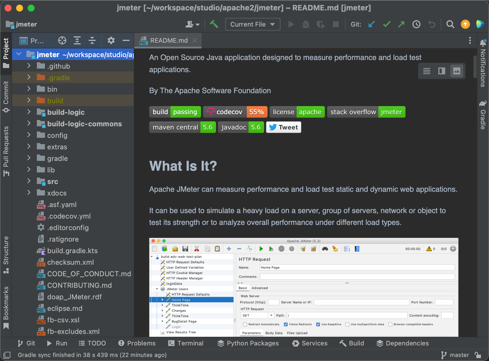
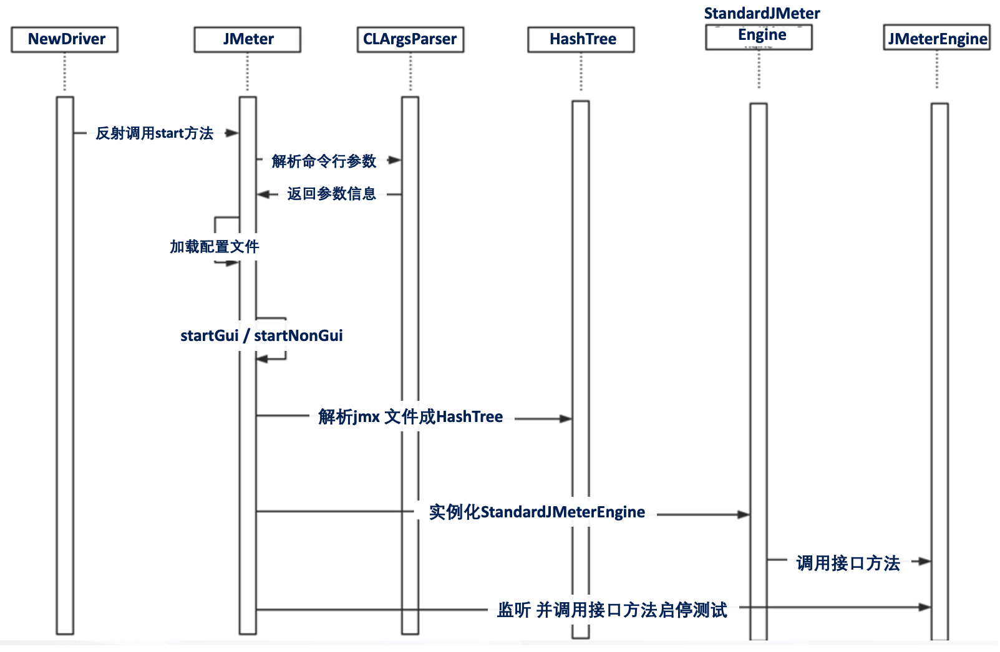
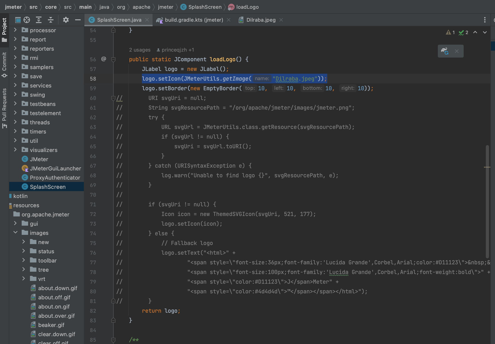
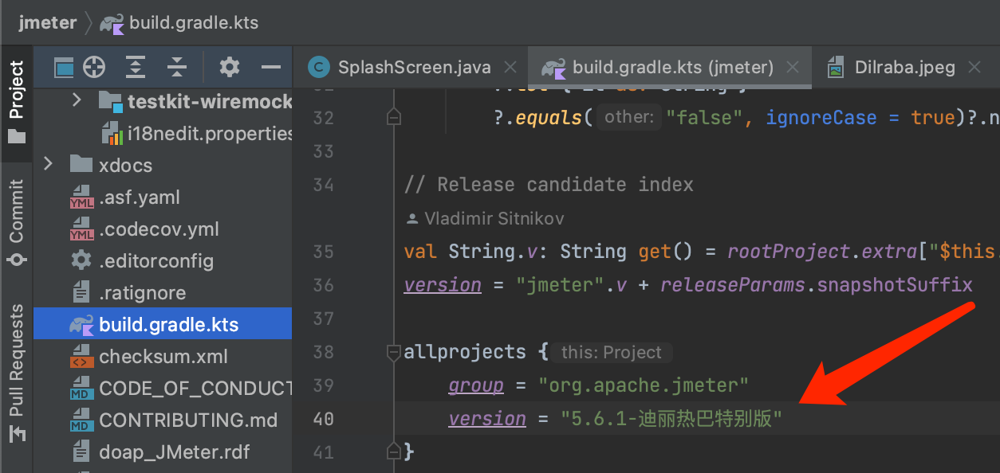
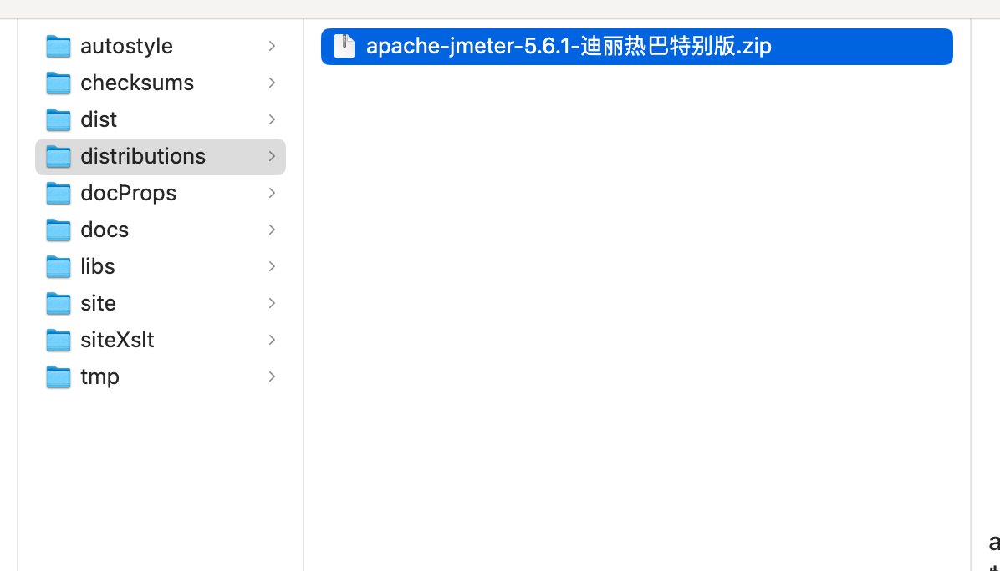

## Jmeter插件
## Jmeter源码分析
### 依赖环境
* 源码位置： https://github.com/apache/jmeter
* JDK: 1.8
* 开发工具：IntelliJ Idea
* 编译打包工具： gradle
### 环境搭建
* JMeter开发环境搭建
* 下载源码：
  * git clone git@github.com:apache/jmeter.git
* 使用IntelliJ Idea 打开源码工程
  * 等待系统完成下载依赖库
  * 需要搭梯子

### 源码解读
#### JMeter代码运行时序图

#### JMeter源码个性化定制实战
* step1:复制启动图片
  * 
  * 目标路径位置：/jmeter project path/src/core/src/main/resources/org/apache/jmeter/images/Dilraba.jpeg
* step2:修改图片展示代码
  * 
  * 代码位置：/jmeter project path/src/core/src/main/java/org/apache/jmeter/SplashScreen.java
* step3:修改版本信息
  * 
  * 代码位置：/jmeter project path/build.gradle.kts
* step4:运行调试
  * ./gradlew runGui
* step5:打包输出
  * ./gradlew distZip
  * 
  * 输出位置： /jmeter_project_path/src/dist/build/distributions/

