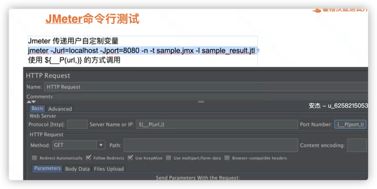
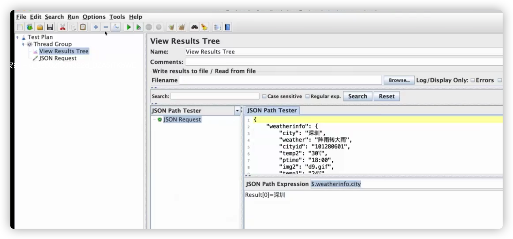

## 参数化
### Jmeter命令行参数传递给Jmx脚本

### 用户定义变量
### Jmeter参数Csv
* 参数驱动
[order_auto.jmx](./automation/order_auto.jmx)
### Jmeter参数Xml
* 参数传递
  * 方法：使用jmeter的
    * 正则表达式提取器 eg:<filed name ="orderId" value="(.+?)"
    * Xpath提取器
### Jmeter参数Json
* 参数传递
  * Json提取器
  
### Jmeter参数Yaml
* 参数传递
  * 安装插件：Json/Yaml Path Extractor
### Jmeter参数Redis
* 参数传递/驱动
  * 安装插件：Redis Data Set
### Jmeter参数Mysql
* 参数传递
## 并发
### JMeter 并发策略
* 同时在线-日常场景
* 同时刷单-秒杀场景
* 区别：是否使用【jmeter同步定时器】
### web service 加压实战
## 函数
### Jmeter函数
* JMeter函数是特殊值，可以填充测试树中任何Sampler或其他元素的字段
  * 注：如果函数参数包含逗号，那么请务必使用“ \ ” 进行转义，否则JMeter会将其视为参数分隔符
  * Jmeter属性VS变量
    * jmeter属性定义在jmeter.properties 文件中
    * 属性是全局的，常用来定义一些jmeter使用的默认设置,例如：remote_hosts 定义jmeter远程运行的服务器
    * 属性可以在测试计划中引用说明： Functions - read a property - 但是不能用于线程特定值
    * 属性和变量：都是大小写敏感的
* 常用Jmeter函数
  * __regexFunction：函数用于使用任何正则表达式(由用户提供)解析以前的响应(或变量的值)。函数返回带有变量值的模板字符串。
    * 参数讲解：
      *
      | Attribute | Description | Required |
                  |-----|-----|-----|
      |第1个参数|第1个参数是用于解析服务器响应数据的正则表达式。它会找到所有匹配项。如果希望将表达式中的某部分应用在模板字符串中，一定记得为其加上圆括号。例如，<a href="(.*)">。这样就会将链接的值存放到第一个匹配组合中（这里只有一个匹配组合）。又如，。在这个例子中，链接的name作为第一个匹配组合，链接的value会作为第二个匹配组合。这些组合可以用在的模板字符串中|是|
      |第2个参数|这是一个模板字符串，函数会动态填写字符串的部分内容。要在字符串中引用正则表达式捕获的匹配组合，请使用语法：$[group_number]$。例如$1$或者 $2$。的模板可以是任何字符串	|是|
      |第3个参数|第3个参数告诉JMeter使用第几次匹配。正则表达式可能会找到多个匹配项。对此，有4种选择：1）整数，直接告诉JMeter使用第几个匹配项。”1”对应第一个匹配，”2”对应第二个匹配，以此类推2）RAND，告诉JMeter随机选择一个匹配项3）ALL，告诉JMeter使用所有匹配项，为每一个匹配项创建一个模板字符串，并将它们连接在一起4）浮点值0到1之间，根据公式（找到的总匹配数目*指定浮点值）计算使用第几个匹配项，计算值向最近的整数取整|否，默认值为1|
      |第4个参数|如果在上一个参数中选择了”ALL”，那么这第4个参数会被插入到重复的模板值之间,就是说有多个地方匹配模版，这多个匹配之间用该参数的值进行分割	|否|
      |第5个参数|如果没有找到匹配项返回的默认值	|否|
      |第6个参数|重用函数解析值的引用名。存储${refName}和${refName_g#} “#”是正则表达式匹配到组的数量(“0”可以使用，是全部匹配)	|否|
      |第7个参数|输入变量名称。如果指定了这一参数，那么该变量的值就会作为函数的输入，而不再使用前面的采样结果作为搜索对象	|否|
    * __regexFunction还可以存储起来，以便供后续使用。在第六个参数中，可以指定一个引用名称。在执行该函数之后，可以在稍后使用用户定义值的语法检索相同的值。
    * 例如，如果您输入”refName”作为第六个参数，您将能够使用:   
      ${refName}来引用第2个参数（替换字符串模板）的计算结果，这依赖于函数的解析结果。    
      ${refName_g0}来引用函数解析后发现的所有匹配结果。    
      ${refName_g1}来引用函数解析后发现的第一个匹配组合。   
      ${refName_g#}来引用函数解析后发现的第n个匹配组合。    
      ${refName_matchNr}来引用函数总共发现的匹配组合数目
  * __counter
    * 一个计数器，用于统计函数的使用次数
      * 针对每个虚拟用户是独立的:通常被用于记录测试计划运行了多少遍
      * 配置成所有虚拟用户公用的:全局计数器通常被用于记录发送了多少次请求
      * 允许的最大值为2,147,483,647
  * __threadNum
    * 函数__threadNum只是简单地返回当前线程的编号；该函数没有参数
    * 返回一个1到线程组中配置的运行线程的最大数之间的一个数字
  * __intSum
    * 可用来进行任意个整型数据的加法运算
    * 最后一个参数	函数计算值的引用名
  * __longSum
    * __longSum与__intSum函数分别用来进行长整型和整型数据的加法运算，几乎一样
  * __StringFromFile
    * 被用来从文本文件中读取字符串
    * 使用配置元件CSV Data Set Config ，也能达到相同的目的，而且方法更简单。但是该配置元件目前不支持多输入文件。
    * 每次调用函数，都会从文件中读取下一行。当到达文件末尾时，函数又会从文件开始处重新读取，直到最大循环次数
  * __machineName
    * 函数__machineName返回本机的主机名
  * __machineIp
    * 函数__machineIP返回本机的主机IP
  * __javaScript
    * 函数__javaScript可以用来执行JavaScript代码片段（非Java），并返回结果值   
      ${__javaScript(new Date())}:返回一个日期    
      ${__javaScript(new Date(),MYDATE)}:返回当前日期并存储在变量MYDATE中    
      ${__javaScript(Math.floor(Math.random()*(${maxRandom}+1)),MYRESULT)}:使用变量maxRandom，返回0-maxRandom之间的一个随机数并存储在MYRESULT中    
      ${__javaScript(${minRandom}+Math.floor(Math.random()*(${maxRandom}-${minRandom}+1)),MYRESULT)}:使用maxRandom和minRandom变量，返回一个minRandom~maxRandom之间的一个随机数并存储在MYRESULT中    
      ${__javaScript(“${VAR}”==”abcd”,MYRESULT)}:比较VAR变量值是否等于”abcd”的值,返回boolean值并存储在MYRESULT中
  * __Random
    * 函数__Random会返回指定最大值和最小值之间的随机数
  * __RandomString
    * 返回一个固定长度的随机字符串，在缺省第二个参数时，即使指定了jmeter的字符编码也可能会出现乱码。
  * __RandomFromMultipleVars
  * __UUID
    * 用来生成一个附机字符串，格式类似8e9464d2-4561-453e-8005-ad0a44507640
  * __CSVRead
    * 函数__CSVRead会从CSV文件读取一个字符串（请注意与StringFromFile 的区别）。
  * __property
    * 函数__property会返回一个JMeter属性的值。如果函数找不到属性值，而又没有提供默认值，则它会返回属性的名称。
    * 例如：     
      ${__property(user.dir)}：返回属性user.dir的值。     
      ${__property(user.dir,UDIR)}：返回属性user.dir的值，并保存在变量UDIR中。     
      ${__property(abcd,ABCD,atod)}：返回属性abcd的值 （如果属性没有定义，返回”atod”），并保存在变量ABCD 中。     
      ${__property(abcd,,atod)}：返回属性abcd 的值（如果属性没有定义，返回”atod”），但是并不保存函数的返回值。
  * __P
    * 类似__property,处理命令行中属性，和__property不同，__P不会保存属性值，如果没有指定默认值就假定为1
  * __log
    * 记录一个日志并返回输入的字符串
  * __BeanShell
    * 需要注意，测试脚本中每一个独立出现的函数调用，都会使用不同的解释器，但是后续对函数调用的援引会使用相同的解释器。这就意味着变量会持续存在，并跨越函数调用。
  * __groovy
    * 与beanshell类似，只是它执行的是apache groovy脚本，并返回结果。
  * __split
    * 函数__split会通过分隔符来拆分传递给它的字符串，并返回原始的字符串
  * __Xpath
    * 函数__XPath读取XML文件，并在文件中寻找与指定XPath相匹配的地方。每调用函数一次，就会返回下一个匹配项。到达文件末尾后，会从头开始。如果没有匹配的节点，那么函数会返回空字符串，另外，还会向JMeter日志文件写一条警告信息。
    * 整个节点列表都会被保存在内存之中。
    * eg:   
      ${__XPath(/path/to/build.xml, //target/@name)}   
      这会找到build.xml文件中的所有target节点，并返回下一个name属性的内容。
  * __setProperty
    * 函数__setProperty用于设置JMeter属性的值。函数的默认返回值是空字符串，因此该函数可以被用在任何地方，只要对函数本身调用是正确的。
    * 通过将函数可选的第3个参数设置为”true”，函数就会返回属性的原始值。
    * 属性对于JMeter是全局的，因此可以被用来在线程和线程组之间通信。
  * __time
    * 使用指定的变量格式返回当前时间
  * __jexl
    * 函数_jexl可以用于执行通用JEXL表达式，并返回执行结果。感兴趣的读者可以从下面这两个网页链接获取更多关于JEXL的信息。
    * http://commons.apache.org/jexl/reference/examples.html#Example_Expressions
    * http://commons.apache.org/jexl/reference/syntax.html%E3%80%82
  * __V
    * 函数__V可以用于执行变量名表达式，并返回执行结果。它可以被用于执行嵌套函数引用
      ```text
            例如，如果存在变量A1、A2和N=1，则： 
            ${A1}：能正常工作。 
            ${A${N}}：无法正常工作（嵌套变量引用）。 
            ${__V(A${N})}：可以正常工作。A${N}变为A1，函数 __V返回变量值A1
      ```
  * __eval
    * 函数__eval可以用来执行一个字符串表达式，并返回执行结果。
  * __evalVar
    * 函数__evalVar可以用来执行保存在变量中的表达式，并返回执行结果。
  * __char
    * 函数__char会将一串数字翻译成Unicode字符，另外还请参考下面__unescape()函数。
  * __unescape
    * 函数__unescape用于反转义Java-escaped字符串，另外还请参考上面的__char函数。
  * __unescapeHtml
  * __escapeHtml
  * __urldecode
    * url解码,使用java类URLDncoder
  * __urlencode
    * url编码,使用java类 URLEncoder
  * __Filetostring
    * 函数__FileToString可以被用来读取整个文件。每次对该函数的调用，都会读取整个文件。
  * __sampleName
    * 返回当前取样器的名称(label).测试元素若没有关联的取样器，函数不会起作用
  * __TestplanName
    * 返回当前测试计划的名称
  * ____escapeOroRegexpChars
    * 转义ORO正则表达式中使用的元字符,等价在java正则表达式引擎中使用\Q \E，例如[^”].+? 转变成 \ [\^ \]\.\+\?
### Jmeter正则表达式
#### 提取单个字符串
```text
        假设想要从web页面的以下部分进行匹配: 
        name=”file” value=”readme.txt”> 
        从中提取”readme.txt” 
        一个适当的表达式是： 
        name=”file” value=”(.+?)”>
        
        上面特殊的字符是： 
        （和）：闭合的括号将匹配的部分当成一个整体返回 
        . :匹配任何字符 
        + :匹配一次或者多次（至少一次） 
        ？ :非贪婪的，匹配到一个就终止匹配（即匹配0次或者1次）
        【注意】
        注意：如果没有 ？ ，.+将会跳过第一个>直到最后一个>,这可能不是我们想要的 
        注意：尽管上面的表达式取到了我们想要的结果，使用下面的表达式更有效率 
        name=”file” value=”([^”]+)”> 
        [^”] 意味着除了不匹配”之外，匹配任何组合 
        在这种情况下，匹配引擎在匹配到第一个”就停止搜索 
        在这种情况下，匹配引擎可以在找到第一个”就停止查找，而在前面的例子中，引擎必须检查它找到的是 ”>而不是” >
```
#### 抽取多个字符串

#### 行模式
模式匹配的行为方式略有不同，这取决于多行和单行修饰符的设置。注意，单行和多行操作符之间没有任何关系;它们可以独立地指定。
* 单行模式
  * 单行模式只会影响元字符”.”的解释方式。默认情况下”.”匹配任何字符，除了换行符。 在单行的模式中”.”也能匹配换行符。
* 多行模式
  * 多行模式只会影响元字符^和$被解释的方式。默认行为是^和$仅在字符串的开头和结尾匹配。当使用多行模式时，元字符^在每一行的开头都匹配，元字符$在每一行末尾匹配。
### Jmeter最佳实践
### Jmeter技巧
* 线程间传递变量
  * 数据少：使用Jmeter属性
  * 数据多：使用文件存取
* 启用Debug日志
  * what's this node? --查看GUI和测试元件的类名
* jmeter解决乱码问题
  * 采样器中设置
  * jmeter.properties配置文件中设置
  * 添加后置beanshell处理器：prev.setDataEncoding("utf-8")
* 通过CSV Data Set Config或者_StringFromFile函数来参数化你的请求，需要特别注意当参数为纯数字时，jmeter会默认将其识别成int型数据，说明jmeter并不是默认以String类型对数据进行读取的:范围-2147483648到2147483647,如果超出这个范围（例如2147483648这个数字）：jmeter控制台则会抛出如下异常：jmeter.util.BeanShellInterpreter: Error invoking bsh method: eval    Parse error at line 14, column 181 : Error or number too big for integer type: 2147483648,如果要解决此问题，可在超出范围-2147483648到2147483647的数据前加上字母,或者使用beenshell进行参数化。
  * 注意：1、在BeenShell中引用外部参数需要以String类型的方式引用：例如："${user}"（ps需要加上双引号）
### Jmeter扩展组件实现方式
## Jmeter进阶知识
### Jmeter函数和变量
* JMeter函数是特殊值，可以填充测试树中任何Sampler或其他元素的字段
  * 注：如果函数参数包含逗号，那么请务必使用“ \ ” 进行转义，否则JMeter会将其视为参数分隔符
  * Jmeter属性VS变量
    * jmeter属性定义在jmeter.properties 文件中
    * 属性是全局的，常用来定义一些jmeter使用的默认设置,例如：remote_hosts 定义jmeter远程运行的服务器
    * 属性可以在测试计划中引用说明： Functions - read a property - 但是不能用于线程特定值
    * 属性和变量：都是大小写敏感的
* 常用Jmeter函数
  * __regexFunction：函数用于使用任何正则表达式(由用户提供)解析以前的响应(或变量的值)。函数返回带有变量值的模板字符串。
    * 参数讲解：
      *
      | Attribute | Description | Required |
                  |-----|-----|-----|
      |第1个参数|第1个参数是用于解析服务器响应数据的正则表达式。它会找到所有匹配项。如果希望将表达式中的某部分应用在模板字符串中，一定记得为其加上圆括号。例如，<a href="(.*)">。这样就会将链接的值存放到第一个匹配组合中（这里只有一个匹配组合）。又如，。在这个例子中，链接的name作为第一个匹配组合，链接的value会作为第二个匹配组合。这些组合可以用在的模板字符串中|是|
      |第2个参数|这是一个模板字符串，函数会动态填写字符串的部分内容。要在字符串中引用正则表达式捕获的匹配组合，请使用语法：$[group_number]$。例如$1$或者 $2$。的模板可以是任何字符串	|是|
      |第3个参数|第3个参数告诉JMeter使用第几次匹配。正则表达式可能会找到多个匹配项。对此，有4种选择：1）整数，直接告诉JMeter使用第几个匹配项。”1”对应第一个匹配，”2”对应第二个匹配，以此类推2）RAND，告诉JMeter随机选择一个匹配项3）ALL，告诉JMeter使用所有匹配项，为每一个匹配项创建一个模板字符串，并将它们连接在一起4）浮点值0到1之间，根据公式（找到的总匹配数目*指定浮点值）计算使用第几个匹配项，计算值向最近的整数取整|否，默认值为1|
      |第4个参数|如果在上一个参数中选择了”ALL”，那么这第4个参数会被插入到重复的模板值之间,就是说有多个地方匹配模版，这多个匹配之间用该参数的值进行分割	|否|
      |第5个参数|如果没有找到匹配项返回的默认值	|否|
      |第6个参数|重用函数解析值的引用名。存储${refName}和${refName_g#} “#”是正则表达式匹配到组的数量(“0”可以使用，是全部匹配)	|否|
      |第7个参数|输入变量名称。如果指定了这一参数，那么该变量的值就会作为函数的输入，而不再使用前面的采样结果作为搜索对象	|否|
    * __regexFunction还可以存储起来，以便供后续使用。在第六个参数中，可以指定一个引用名称。在执行该函数之后，可以在稍后使用用户定义值的语法检索相同的值。
    * 例如，如果您输入”refName”作为第六个参数，您将能够使用:   
      ${refName}来引用第2个参数（替换字符串模板）的计算结果，这依赖于函数的解析结果。    
      ${refName_g0}来引用函数解析后发现的所有匹配结果。    
      ${refName_g1}来引用函数解析后发现的第一个匹配组合。   
      ${refName_g#}来引用函数解析后发现的第n个匹配组合。    
      ${refName_matchNr}来引用函数总共发现的匹配组合数目
  * __counter
    * 一个计数器，用于统计函数的使用次数
      * 针对每个虚拟用户是独立的:通常被用于记录测试计划运行了多少遍
      * 配置成所有虚拟用户公用的:全局计数器通常被用于记录发送了多少次请求
      * 允许的最大值为2,147,483,647
  * __threadNum
    * 函数__threadNum只是简单地返回当前线程的编号；该函数没有参数
    * 返回一个1到线程组中配置的运行线程的最大数之间的一个数字
  * __intSum
    * 可用来进行任意个整型数据的加法运算
    * 最后一个参数	函数计算值的引用名
  * __longSum
    * __longSum与__intSum函数分别用来进行长整型和整型数据的加法运算，几乎一样
  * __StringFromFile
    * 被用来从文本文件中读取字符串
    * 使用配置元件CSV Data Set Config ，也能达到相同的目的，而且方法更简单。但是该配置元件目前不支持多输入文件。
    * 每次调用函数，都会从文件中读取下一行。当到达文件末尾时，函数又会从文件开始处重新读取，直到最大循环次数
  * __machineName
    * 函数__machineName返回本机的主机名
  * __machineIp
    * 函数__machineIP返回本机的主机IP
  * __javaScript
    * 函数__javaScript可以用来执行JavaScript代码片段（非Java），并返回结果值   
      ${__javaScript(new Date())}:返回一个日期    
      ${__javaScript(new Date(),MYDATE)}:返回当前日期并存储在变量MYDATE中    
      ${__javaScript(Math.floor(Math.random()*(${maxRandom}+1)),MYRESULT)}:使用变量maxRandom，返回0-maxRandom之间的一个随机数并存储在MYRESULT中    
      ${__javaScript(${minRandom}+Math.floor(Math.random()*(${maxRandom}-${minRandom}+1)),MYRESULT)}:使用maxRandom和minRandom变量，返回一个minRandom~maxRandom之间的一个随机数并存储在MYRESULT中    
      ${__javaScript(“${VAR}”==”abcd”,MYRESULT)}:比较VAR变量值是否等于”abcd”的值,返回boolean值并存储在MYRESULT中
  * __Random
    * 函数__Random会返回指定最大值和最小值之间的随机数
  * __RandomString
    * 返回一个固定长度的随机字符串，在缺省第二个参数时，即使指定了jmeter的字符编码也可能会出现乱码。
  * __RandomFromMultipleVars
  * __UUID
    * 用来生成一个附机字符串，格式类似8e9464d2-4561-453e-8005-ad0a44507640
  * __CSVRead
    * 函数__CSVRead会从CSV文件读取一个字符串（请注意与StringFromFile 的区别）。
  * __property
    * 函数__property会返回一个JMeter属性的值。如果函数找不到属性值，而又没有提供默认值，则它会返回属性的名称。
    * 例如：     
      ${__property(user.dir)}：返回属性user.dir的值。     
      ${__property(user.dir,UDIR)}：返回属性user.dir的值，并保存在变量UDIR中。     
      ${__property(abcd,ABCD,atod)}：返回属性abcd的值 （如果属性没有定义，返回”atod”），并保存在变量ABCD 中。     
      ${__property(abcd,,atod)}：返回属性abcd 的值（如果属性没有定义，返回”atod”），但是并不保存函数的返回值。
  * __P
    * 类似__property,处理命令行中属性，和__property不同，__P不会保存属性值，如果没有指定默认值就假定为1
  * __log
    * 记录一个日志并返回输入的字符串
  * __BeanShell
    * 需要注意，测试脚本中每一个独立出现的函数调用，都会使用不同的解释器，但是后续对函数调用的援引会使用相同的解释器。这就意味着变量会持续存在，并跨越函数调用。
  * __groovy
    * 与beanshell类似，只是它执行的是apache groovy脚本，并返回结果。
  * __split
    * 函数__split会通过分隔符来拆分传递给它的字符串，并返回原始的字符串
  * __Xpath
    * 函数__XPath读取XML文件，并在文件中寻找与指定XPath相匹配的地方。每调用函数一次，就会返回下一个匹配项。到达文件末尾后，会从头开始。如果没有匹配的节点，那么函数会返回空字符串，另外，还会向JMeter日志文件写一条警告信息。
    * 整个节点列表都会被保存在内存之中。
    * eg:   
      ${__XPath(/path/to/build.xml, //target/@name)}   
      这会找到build.xml文件中的所有target节点，并返回下一个name属性的内容。
  * __setProperty
    * 函数__setProperty用于设置JMeter属性的值。函数的默认返回值是空字符串，因此该函数可以被用在任何地方，只要对函数本身调用是正确的。
    * 通过将函数可选的第3个参数设置为”true”，函数就会返回属性的原始值。
    * 属性对于JMeter是全局的，因此可以被用来在线程和线程组之间通信。
  * __time
    * 使用指定的变量格式返回当前时间
  * __jexl
    * 函数_jexl可以用于执行通用JEXL表达式，并返回执行结果。感兴趣的读者可以从下面这两个网页链接获取更多关于JEXL的信息。
    * http://commons.apache.org/jexl/reference/examples.html#Example_Expressions
    * http://commons.apache.org/jexl/reference/syntax.html%E3%80%82
  * __V
    * 函数__V可以用于执行变量名表达式，并返回执行结果。它可以被用于执行嵌套函数引用
      ```text
            例如，如果存在变量A1、A2和N=1，则： 
            ${A1}：能正常工作。 
            ${A${N}}：无法正常工作（嵌套变量引用）。 
            ${__V(A${N})}：可以正常工作。A${N}变为A1，函数 __V返回变量值A1
      ```
  * __eval
    * 函数__eval可以用来执行一个字符串表达式，并返回执行结果。
  * __evalVar
    * 函数__evalVar可以用来执行保存在变量中的表达式，并返回执行结果。
  * __char
    * 函数__char会将一串数字翻译成Unicode字符，另外还请参考下面__unescape()函数。
  * __unescape
    * 函数__unescape用于反转义Java-escaped字符串，另外还请参考上面的__char函数。
  * __unescapeHtml
  * __escapeHtml
  * __urldecode
    * url解码,使用java类URLDncoder
  * __urlencode
    * url编码,使用java类 URLEncoder
  * __Filetostring
    * 函数__FileToString可以被用来读取整个文件。每次对该函数的调用，都会读取整个文件。
  * __sampleName
    * 返回当前取样器的名称(label).测试元素若没有关联的取样器，函数不会起作用
  * __TestplanName
    * 返回当前测试计划的名称
  * ____escapeOroRegexpChars
    * 转义ORO正则表达式中使用的元字符,等价在java正则表达式引擎中使用\Q \E，例如[^”].+? 转变成 \ [\^ \]\.\+\?
### Jmeter正则表达式
#### 提取单个字符串
```text
        假设想要从web页面的以下部分进行匹配: 
        name=”file” value=”readme.txt”> 
        从中提取”readme.txt” 
        一个适当的表达式是： 
        name=”file” value=”(.+?)”>
        
        上面特殊的字符是： 
        （和）：闭合的括号将匹配的部分当成一个整体返回 
        . :匹配任何字符 
        + :匹配一次或者多次（至少一次） 
        ？ :非贪婪的，匹配到一个就终止匹配（即匹配0次或者1次）
        【注意】
        注意：如果没有 ？ ，.+将会跳过第一个>直到最后一个>,这可能不是我们想要的 
        注意：尽管上面的表达式取到了我们想要的结果，使用下面的表达式更有效率 
        name=”file” value=”([^”]+)”> 
        [^”] 意味着除了不匹配”之外，匹配任何组合 
        在这种情况下，匹配引擎在匹配到第一个”就停止搜索 
        在这种情况下，匹配引擎可以在找到第一个”就停止查找，而在前面的例子中，引擎必须检查它找到的是 ”>而不是” >
```
#### 抽取多个字符串

#### 行模式
模式匹配的行为方式略有不同，这取决于多行和单行修饰符的设置。注意，单行和多行操作符之间没有任何关系;它们可以独立地指定。
* 单行模式
  * 单行模式只会影响元字符”.”的解释方式。默认情况下”.”匹配任何字符，除了换行符。 在单行的模式中”.”也能匹配换行符。
* 多行模式
  * 多行模式只会影响元字符^和$被解释的方式。默认行为是^和$仅在字符串的开头和结尾匹配。当使用多行模式时，元字符^在每一行的开头都匹配，元字符$在每一行末尾匹配。
### Jmeter最佳实践
### Jmeter技巧
* 线程间传递变量
  * 数据少：使用Jmeter属性
  * 数据多：使用文件存取
* 启用Debug日志
  * what's this node? --查看GUI和测试元件的类名
* jmeter解决乱码问题
  * 采样器中设置
  * jmeter.properties配置文件中设置
  * 添加后置beanshell处理器：prev.setDataEncoding("utf-8")
* 通过CSV Data Set Config或者_StringFromFile函数来参数化你的请求，需要特别注意当参数为纯数字时，jmeter会默认将其识别成int型数据，说明jmeter并不是默认以String类型对数据进行读取的:范围-2147483648到2147483647,如果超出这个范围（例如2147483648这个数字）：jmeter控制台则会抛出如下异常：jmeter.util.BeanShellInterpreter: Error invoking bsh method: eval    Parse error at line 14, column 181 : Error or number too big for integer type: 2147483648,如果要解决此问题，可在超出范围-2147483648到2147483647的数据前加上字母,或者使用beenshell进行参数化。
  * 注意：1、在BeenShell中引用外部参数需要以String类型的方式引用：例如："${user}"（ps需要加上双引号）
### Jmeter扩展组件实现方式
## Jmeter进阶知识
### Jmeter函数和变量
* JMeter函数是特殊值，可以填充测试树中任何Sampler或其他元素的字段
  * 注：如果函数参数包含逗号，那么请务必使用“ \ ” 进行转义，否则JMeter会将其视为参数分隔符
  * Jmeter属性VS变量
    * jmeter属性定义在jmeter.properties 文件中
    * 属性是全局的，常用来定义一些jmeter使用的默认设置,例如：remote_hosts 定义jmeter远程运行的服务器
    * 属性可以在测试计划中引用说明： Functions - read a property - 但是不能用于线程特定值
    * 属性和变量：都是大小写敏感的
* 常用Jmeter函数
  * __regexFunction：函数用于使用任何正则表达式(由用户提供)解析以前的响应(或变量的值)。函数返回带有变量值的模板字符串。
    * 参数讲解：
      *
      | Attribute | Description | Required |
                  |-----|-----|-----|
      |第1个参数|第1个参数是用于解析服务器响应数据的正则表达式。它会找到所有匹配项。如果希望将表达式中的某部分应用在模板字符串中，一定记得为其加上圆括号。例如，<a href="(.*)">。这样就会将链接的值存放到第一个匹配组合中（这里只有一个匹配组合）。又如，。在这个例子中，链接的name作为第一个匹配组合，链接的value会作为第二个匹配组合。这些组合可以用在的模板字符串中|是|
      |第2个参数|这是一个模板字符串，函数会动态填写字符串的部分内容。要在字符串中引用正则表达式捕获的匹配组合，请使用语法：$[group_number]$。例如$1$或者 $2$。的模板可以是任何字符串	|是|
      |第3个参数|第3个参数告诉JMeter使用第几次匹配。正则表达式可能会找到多个匹配项。对此，有4种选择：1）整数，直接告诉JMeter使用第几个匹配项。”1”对应第一个匹配，”2”对应第二个匹配，以此类推2）RAND，告诉JMeter随机选择一个匹配项3）ALL，告诉JMeter使用所有匹配项，为每一个匹配项创建一个模板字符串，并将它们连接在一起4）浮点值0到1之间，根据公式（找到的总匹配数目*指定浮点值）计算使用第几个匹配项，计算值向最近的整数取整|否，默认值为1|
      |第4个参数|如果在上一个参数中选择了”ALL”，那么这第4个参数会被插入到重复的模板值之间,就是说有多个地方匹配模版，这多个匹配之间用该参数的值进行分割	|否|
      |第5个参数|如果没有找到匹配项返回的默认值	|否|
      |第6个参数|重用函数解析值的引用名。存储${refName}和${refName_g#} “#”是正则表达式匹配到组的数量(“0”可以使用，是全部匹配)	|否|
      |第7个参数|输入变量名称。如果指定了这一参数，那么该变量的值就会作为函数的输入，而不再使用前面的采样结果作为搜索对象	|否|
    * __regexFunction还可以存储起来，以便供后续使用。在第六个参数中，可以指定一个引用名称。在执行该函数之后，可以在稍后使用用户定义值的语法检索相同的值。
    * 例如，如果您输入”refName”作为第六个参数，您将能够使用:   
      ${refName}来引用第2个参数（替换字符串模板）的计算结果，这依赖于函数的解析结果。    
      ${refName_g0}来引用函数解析后发现的所有匹配结果。    
      ${refName_g1}来引用函数解析后发现的第一个匹配组合。   
      ${refName_g#}来引用函数解析后发现的第n个匹配组合。    
      ${refName_matchNr}来引用函数总共发现的匹配组合数目
  * __counter
    * 一个计数器，用于统计函数的使用次数
      * 针对每个虚拟用户是独立的:通常被用于记录测试计划运行了多少遍
      * 配置成所有虚拟用户公用的:全局计数器通常被用于记录发送了多少次请求
      * 允许的最大值为2,147,483,647
  * __threadNum
    * 函数__threadNum只是简单地返回当前线程的编号；该函数没有参数
    * 返回一个1到线程组中配置的运行线程的最大数之间的一个数字
  * __intSum
    * 可用来进行任意个整型数据的加法运算
    * 最后一个参数	函数计算值的引用名
  * __longSum
    * __longSum与__intSum函数分别用来进行长整型和整型数据的加法运算，几乎一样
  * __StringFromFile
    * 被用来从文本文件中读取字符串
    * 使用配置元件CSV Data Set Config ，也能达到相同的目的，而且方法更简单。但是该配置元件目前不支持多输入文件。
    * 每次调用函数，都会从文件中读取下一行。当到达文件末尾时，函数又会从文件开始处重新读取，直到最大循环次数
  * __machineName
    * 函数__machineName返回本机的主机名
  * __machineIp
    * 函数__machineIP返回本机的主机IP
  * __javaScript
    * 函数__javaScript可以用来执行JavaScript代码片段（非Java），并返回结果值   
      ${__javaScript(new Date())}:返回一个日期    
      ${__javaScript(new Date(),MYDATE)}:返回当前日期并存储在变量MYDATE中    
      ${__javaScript(Math.floor(Math.random()*(${maxRandom}+1)),MYRESULT)}:使用变量maxRandom，返回0-maxRandom之间的一个随机数并存储在MYRESULT中    
      ${__javaScript(${minRandom}+Math.floor(Math.random()*(${maxRandom}-${minRandom}+1)),MYRESULT)}:使用maxRandom和minRandom变量，返回一个minRandom~maxRandom之间的一个随机数并存储在MYRESULT中    
      ${__javaScript(“${VAR}”==”abcd”,MYRESULT)}:比较VAR变量值是否等于”abcd”的值,返回boolean值并存储在MYRESULT中
  * __Random
    * 函数__Random会返回指定最大值和最小值之间的随机数
  * __RandomString
    * 返回一个固定长度的随机字符串，在缺省第二个参数时，即使指定了jmeter的字符编码也可能会出现乱码。
  * __RandomFromMultipleVars
  * __UUID
    * 用来生成一个附机字符串，格式类似8e9464d2-4561-453e-8005-ad0a44507640
  * __CSVRead
    * 函数__CSVRead会从CSV文件读取一个字符串（请注意与StringFromFile 的区别）。
  * __property
    * 函数__property会返回一个JMeter属性的值。如果函数找不到属性值，而又没有提供默认值，则它会返回属性的名称。
    * 例如：     
      ${__property(user.dir)}：返回属性user.dir的值。     
      ${__property(user.dir,UDIR)}：返回属性user.dir的值，并保存在变量UDIR中。     
      ${__property(abcd,ABCD,atod)}：返回属性abcd的值 （如果属性没有定义，返回”atod”），并保存在变量ABCD 中。     
      ${__property(abcd,,atod)}：返回属性abcd 的值（如果属性没有定义，返回”atod”），但是并不保存函数的返回值。
  * __P
    * 类似__property,处理命令行中属性，和__property不同，__P不会保存属性值，如果没有指定默认值就假定为1
  * __log
    * 记录一个日志并返回输入的字符串
  * __BeanShell
    * 需要注意，测试脚本中每一个独立出现的函数调用，都会使用不同的解释器，但是后续对函数调用的援引会使用相同的解释器。这就意味着变量会持续存在，并跨越函数调用。
  * __groovy
    * 与beanshell类似，只是它执行的是apache groovy脚本，并返回结果。
  * __split
    * 函数__split会通过分隔符来拆分传递给它的字符串，并返回原始的字符串
  * __Xpath
    * 函数__XPath读取XML文件，并在文件中寻找与指定XPath相匹配的地方。每调用函数一次，就会返回下一个匹配项。到达文件末尾后，会从头开始。如果没有匹配的节点，那么函数会返回空字符串，另外，还会向JMeter日志文件写一条警告信息。
    * 整个节点列表都会被保存在内存之中。
    * eg:   
      ${__XPath(/path/to/build.xml, //target/@name)}   
      这会找到build.xml文件中的所有target节点，并返回下一个name属性的内容。
  * __setProperty
    * 函数__setProperty用于设置JMeter属性的值。函数的默认返回值是空字符串，因此该函数可以被用在任何地方，只要对函数本身调用是正确的。
    * 通过将函数可选的第3个参数设置为”true”，函数就会返回属性的原始值。
    * 属性对于JMeter是全局的，因此可以被用来在线程和线程组之间通信。
  * __time
    * 使用指定的变量格式返回当前时间
  * __jexl
    * 函数_jexl可以用于执行通用JEXL表达式，并返回执行结果。感兴趣的读者可以从下面这两个网页链接获取更多关于JEXL的信息。
    * http://commons.apache.org/jexl/reference/examples.html#Example_Expressions
    * http://commons.apache.org/jexl/reference/syntax.html%E3%80%82
  * __V
    * 函数__V可以用于执行变量名表达式，并返回执行结果。它可以被用于执行嵌套函数引用
      ```text
            例如，如果存在变量A1、A2和N=1，则： 
            ${A1}：能正常工作。 
            ${A${N}}：无法正常工作（嵌套变量引用）。 
            ${__V(A${N})}：可以正常工作。A${N}变为A1，函数 __V返回变量值A1
      ```
  * __eval
    * 函数__eval可以用来执行一个字符串表达式，并返回执行结果。
  * __evalVar
    * 函数__evalVar可以用来执行保存在变量中的表达式，并返回执行结果。
  * __char
    * 函数__char会将一串数字翻译成Unicode字符，另外还请参考下面__unescape()函数。
  * __unescape
    * 函数__unescape用于反转义Java-escaped字符串，另外还请参考上面的__char函数。
  * __unescapeHtml
  * __escapeHtml
  * __urldecode
    * url解码,使用java类URLDncoder
  * __urlencode
    * url编码,使用java类 URLEncoder
  * __Filetostring
    * 函数__FileToString可以被用来读取整个文件。每次对该函数的调用，都会读取整个文件。
  * __sampleName
    * 返回当前取样器的名称(label).测试元素若没有关联的取样器，函数不会起作用
  * __TestplanName
    * 返回当前测试计划的名称
  * ____escapeOroRegexpChars
    * 转义ORO正则表达式中使用的元字符,等价在java正则表达式引擎中使用\Q \E，例如[^”].+? 转变成 \ [\^ \]\.\+\?
### Jmeter正则表达式
#### 提取单个字符串
```text
        假设想要从web页面的以下部分进行匹配: 
        name=”file” value=”readme.txt”> 
        从中提取”readme.txt” 
        一个适当的表达式是： 
        name=”file” value=”(.+?)”>
        
        上面特殊的字符是： 
        （和）：闭合的括号将匹配的部分当成一个整体返回 
        . :匹配任何字符 
        + :匹配一次或者多次（至少一次） 
        ？ :非贪婪的，匹配到一个就终止匹配（即匹配0次或者1次）
        【注意】
        注意：如果没有 ？ ，.+将会跳过第一个>直到最后一个>,这可能不是我们想要的 
        注意：尽管上面的表达式取到了我们想要的结果，使用下面的表达式更有效率 
        name=”file” value=”([^”]+)”> 
        [^”] 意味着除了不匹配”之外，匹配任何组合 
        在这种情况下，匹配引擎在匹配到第一个”就停止搜索 
        在这种情况下，匹配引擎可以在找到第一个”就停止查找，而在前面的例子中，引擎必须检查它找到的是 ”>而不是” >
```
#### 抽取多个字符串

#### 行模式
模式匹配的行为方式略有不同，这取决于多行和单行修饰符的设置。注意，单行和多行操作符之间没有任何关系;它们可以独立地指定。
* 单行模式
  * 单行模式只会影响元字符”.”的解释方式。默认情况下”.”匹配任何字符，除了换行符。 在单行的模式中”.”也能匹配换行符。
* 多行模式
  * 多行模式只会影响元字符^和$被解释的方式。默认行为是^和$仅在字符串的开头和结尾匹配。当使用多行模式时，元字符^在每一行的开头都匹配，元字符$在每一行末尾匹配。
### Jmeter最佳实践
### Jmeter技巧
* 线程间传递变量
  * 数据少：使用Jmeter属性
  * 数据多：使用文件存取
* 启用Debug日志
  * what's this node? --查看GUI和测试元件的类名
* jmeter解决乱码问题
  * 采样器中设置
  * jmeter.properties配置文件中设置
  * 添加后置beanshell处理器：prev.setDataEncoding("utf-8")
* 通过CSV Data Set Config或者_StringFromFile函数来参数化你的请求，需要特别注意当参数为纯数字时，jmeter会默认将其识别成int型数据，说明jmeter并不是默认以String类型对数据进行读取的:范围-2147483648到2147483647,如果超出这个范围（例如2147483648这个数字）：jmeter控制台则会抛出如下异常：jmeter.util.BeanShellInterpreter: Error invoking bsh method: eval    Parse error at line 14, column 181 : Error or number too big for integer type: 2147483648,如果要解决此问题，可在超出范围-2147483648到2147483647的数据前加上字母,或者使用beenshell进行参数化。
  * 注意：1、在BeenShell中引用外部参数需要以String类型的方式引用：例如："${user}"（ps需要加上双引号）
### Jmeter扩展组件实现方式
### Jmeter函数和变量
* JMeter函数是特殊值，可以填充测试树中任何Sampler或其他元素的字段
  * 注：如果函数参数包含逗号，那么请务必使用“ \ ” 进行转义，否则JMeter会将其视为参数分隔符
  * Jmeter属性VS变量
    * jmeter属性定义在jmeter.properties 文件中
    * 属性是全局的，常用来定义一些jmeter使用的默认设置,例如：remote_hosts 定义jmeter远程运行的服务器
    * 属性可以在测试计划中引用说明： Functions - read a property - 但是不能用于线程特定值
    * 属性和变量：都是大小写敏感的
* 常用Jmeter函数
  * __regexFunction：函数用于使用任何正则表达式(由用户提供)解析以前的响应(或变量的值)。函数返回带有变量值的模板字符串。
    * 参数讲解：
      *
      | Attribute | Description | Required |
                  |-----|-----|-----|
      |第1个参数|第1个参数是用于解析服务器响应数据的正则表达式。它会找到所有匹配项。如果希望将表达式中的某部分应用在模板字符串中，一定记得为其加上圆括号。例如，<a href="(.*)">。这样就会将链接的值存放到第一个匹配组合中（这里只有一个匹配组合）。又如，。在这个例子中，链接的name作为第一个匹配组合，链接的value会作为第二个匹配组合。这些组合可以用在的模板字符串中|是|
      |第2个参数|这是一个模板字符串，函数会动态填写字符串的部分内容。要在字符串中引用正则表达式捕获的匹配组合，请使用语法：$[group_number]$。例如$1$或者 $2$。的模板可以是任何字符串	|是|
      |第3个参数|第3个参数告诉JMeter使用第几次匹配。正则表达式可能会找到多个匹配项。对此，有4种选择：1）整数，直接告诉JMeter使用第几个匹配项。”1”对应第一个匹配，”2”对应第二个匹配，以此类推2）RAND，告诉JMeter随机选择一个匹配项3）ALL，告诉JMeter使用所有匹配项，为每一个匹配项创建一个模板字符串，并将它们连接在一起4）浮点值0到1之间，根据公式（找到的总匹配数目*指定浮点值）计算使用第几个匹配项，计算值向最近的整数取整|否，默认值为1|
      |第4个参数|如果在上一个参数中选择了”ALL”，那么这第4个参数会被插入到重复的模板值之间,就是说有多个地方匹配模版，这多个匹配之间用该参数的值进行分割	|否|
      |第5个参数|如果没有找到匹配项返回的默认值	|否|
      |第6个参数|重用函数解析值的引用名。存储${refName}和${refName_g#} “#”是正则表达式匹配到组的数量(“0”可以使用，是全部匹配)	|否|
      |第7个参数|输入变量名称。如果指定了这一参数，那么该变量的值就会作为函数的输入，而不再使用前面的采样结果作为搜索对象	|否|
    * __regexFunction还可以存储起来，以便供后续使用。在第六个参数中，可以指定一个引用名称。在执行该函数之后，可以在稍后使用用户定义值的语法检索相同的值。
    * 例如，如果您输入”refName”作为第六个参数，您将能够使用:   
      ${refName}来引用第2个参数（替换字符串模板）的计算结果，这依赖于函数的解析结果。    
      ${refName_g0}来引用函数解析后发现的所有匹配结果。    
      ${refName_g1}来引用函数解析后发现的第一个匹配组合。   
      ${refName_g#}来引用函数解析后发现的第n个匹配组合。    
      ${refName_matchNr}来引用函数总共发现的匹配组合数目
  * __counter
    * 一个计数器，用于统计函数的使用次数
      * 针对每个虚拟用户是独立的:通常被用于记录测试计划运行了多少遍
      * 配置成所有虚拟用户公用的:全局计数器通常被用于记录发送了多少次请求
      * 允许的最大值为2,147,483,647
  * __threadNum
    * 函数__threadNum只是简单地返回当前线程的编号；该函数没有参数
    * 返回一个1到线程组中配置的运行线程的最大数之间的一个数字
  * __intSum
    * 可用来进行任意个整型数据的加法运算
    * 最后一个参数	函数计算值的引用名
  * __longSum
    * __longSum与__intSum函数分别用来进行长整型和整型数据的加法运算，几乎一样
  * __StringFromFile
    * 被用来从文本文件中读取字符串
    * 使用配置元件CSV Data Set Config ，也能达到相同的目的，而且方法更简单。但是该配置元件目前不支持多输入文件。
    * 每次调用函数，都会从文件中读取下一行。当到达文件末尾时，函数又会从文件开始处重新读取，直到最大循环次数
  * __machineName
    * 函数__machineName返回本机的主机名
  * __machineIp
    * 函数__machineIP返回本机的主机IP
  * __javaScript
    * 函数__javaScript可以用来执行JavaScript代码片段（非Java），并返回结果值   
      ${__javaScript(new Date())}:返回一个日期    
      ${__javaScript(new Date(),MYDATE)}:返回当前日期并存储在变量MYDATE中    
      ${__javaScript(Math.floor(Math.random()*(${maxRandom}+1)),MYRESULT)}:使用变量maxRandom，返回0-maxRandom之间的一个随机数并存储在MYRESULT中    
      ${__javaScript(${minRandom}+Math.floor(Math.random()*(${maxRandom}-${minRandom}+1)),MYRESULT)}:使用maxRandom和minRandom变量，返回一个minRandom~maxRandom之间的一个随机数并存储在MYRESULT中    
      ${__javaScript(“${VAR}”==”abcd”,MYRESULT)}:比较VAR变量值是否等于”abcd”的值,返回boolean值并存储在MYRESULT中
  * __Random
    * 函数__Random会返回指定最大值和最小值之间的随机数
  * __RandomString
    * 返回一个固定长度的随机字符串，在缺省第二个参数时，即使指定了jmeter的字符编码也可能会出现乱码。
  * __RandomFromMultipleVars
  * __UUID
    * 用来生成一个附机字符串，格式类似8e9464d2-4561-453e-8005-ad0a44507640
  * __CSVRead
    * 函数__CSVRead会从CSV文件读取一个字符串（请注意与StringFromFile 的区别）。
  * __property
    * 函数__property会返回一个JMeter属性的值。如果函数找不到属性值，而又没有提供默认值，则它会返回属性的名称。
    * 例如：     
      ${__property(user.dir)}：返回属性user.dir的值。     
      ${__property(user.dir,UDIR)}：返回属性user.dir的值，并保存在变量UDIR中。     
      ${__property(abcd,ABCD,atod)}：返回属性abcd的值 （如果属性没有定义，返回”atod”），并保存在变量ABCD 中。     
      ${__property(abcd,,atod)}：返回属性abcd 的值（如果属性没有定义，返回”atod”），但是并不保存函数的返回值。
  * __P
    * 类似__property,处理命令行中属性，和__property不同，__P不会保存属性值，如果没有指定默认值就假定为1
  * __log
    * 记录一个日志并返回输入的字符串
  * __BeanShell
    * 需要注意，测试脚本中每一个独立出现的函数调用，都会使用不同的解释器，但是后续对函数调用的援引会使用相同的解释器。这就意味着变量会持续存在，并跨越函数调用。
  * __groovy
    * 与beanshell类似，只是它执行的是apache groovy脚本，并返回结果。
  * __split
    * 函数__split会通过分隔符来拆分传递给它的字符串，并返回原始的字符串
  * __Xpath
    * 函数__XPath读取XML文件，并在文件中寻找与指定XPath相匹配的地方。每调用函数一次，就会返回下一个匹配项。到达文件末尾后，会从头开始。如果没有匹配的节点，那么函数会返回空字符串，另外，还会向JMeter日志文件写一条警告信息。
    * 整个节点列表都会被保存在内存之中。
    * eg:   
      ${__XPath(/path/to/build.xml, //target/@name)}   
      这会找到build.xml文件中的所有target节点，并返回下一个name属性的内容。
  * __setProperty
    * 函数__setProperty用于设置JMeter属性的值。函数的默认返回值是空字符串，因此该函数可以被用在任何地方，只要对函数本身调用是正确的。
    * 通过将函数可选的第3个参数设置为”true”，函数就会返回属性的原始值。
    * 属性对于JMeter是全局的，因此可以被用来在线程和线程组之间通信。
  * __time
    * 使用指定的变量格式返回当前时间
  * __jexl
    * 函数_jexl可以用于执行通用JEXL表达式，并返回执行结果。感兴趣的读者可以从下面这两个网页链接获取更多关于JEXL的信息。
    * http://commons.apache.org/jexl/reference/examples.html#Example_Expressions
    * http://commons.apache.org/jexl/reference/syntax.html%E3%80%82
  * __V
    * 函数__V可以用于执行变量名表达式，并返回执行结果。它可以被用于执行嵌套函数引用
      ```text
            例如，如果存在变量A1、A2和N=1，则： 
            ${A1}：能正常工作。 
            ${A${N}}：无法正常工作（嵌套变量引用）。 
            ${__V(A${N})}：可以正常工作。A${N}变为A1，函数 __V返回变量值A1
      ```
  * __eval
    * 函数__eval可以用来执行一个字符串表达式，并返回执行结果。
  * __evalVar
    * 函数__evalVar可以用来执行保存在变量中的表达式，并返回执行结果。
  * __char
    * 函数__char会将一串数字翻译成Unicode字符，另外还请参考下面__unescape()函数。
  * __unescape
    * 函数__unescape用于反转义Java-escaped字符串，另外还请参考上面的__char函数。
  * __unescapeHtml
  * __escapeHtml
  * __urldecode
    * url解码,使用java类URLDncoder
  * __urlencode
    * url编码,使用java类 URLEncoder
  * __Filetostring
    * 函数__FileToString可以被用来读取整个文件。每次对该函数的调用，都会读取整个文件。
  * __sampleName
    * 返回当前取样器的名称(label).测试元素若没有关联的取样器，函数不会起作用
  * __TestplanName
    * 返回当前测试计划的名称
  * ____escapeOroRegexpChars
    * 转义ORO正则表达式中使用的元字符,等价在java正则表达式引擎中使用\Q \E，例如[^”].+? 转变成 \ [\^ \]\.\+\?
### Jmeter正则表达式
#### 提取单个字符串
```text
        假设想要从web页面的以下部分进行匹配: 
        name=”file” value=”readme.txt”> 
        从中提取”readme.txt” 
        一个适当的表达式是： 
        name=”file” value=”(.+?)”>
        
        上面特殊的字符是： 
        （和）：闭合的括号将匹配的部分当成一个整体返回 
        . :匹配任何字符 
        + :匹配一次或者多次（至少一次） 
        ？ :非贪婪的，匹配到一个就终止匹配（即匹配0次或者1次）
        【注意】
        注意：如果没有 ？ ，.+将会跳过第一个>直到最后一个>,这可能不是我们想要的 
        注意：尽管上面的表达式取到了我们想要的结果，使用下面的表达式更有效率 
        name=”file” value=”([^”]+)”> 
        [^”] 意味着除了不匹配”之外，匹配任何组合 
        在这种情况下，匹配引擎在匹配到第一个”就停止搜索 
        在这种情况下，匹配引擎可以在找到第一个”就停止查找，而在前面的例子中，引擎必须检查它找到的是 ”>而不是” >
```
#### 抽取多个字符串

#### 行模式
模式匹配的行为方式略有不同，这取决于多行和单行修饰符的设置。注意，单行和多行操作符之间没有任何关系;它们可以独立地指定。
* 单行模式
  * 单行模式只会影响元字符”.”的解释方式。默认情况下”.”匹配任何字符，除了换行符。 在单行的模式中”.”也能匹配换行符。
* 多行模式
  * 多行模式只会影响元字符^和$被解释的方式。默认行为是^和$仅在字符串的开头和结尾匹配。当使用多行模式时，元字符^在每一行的开头都匹配，元字符$在每一行末尾匹配。
### Jmeter最佳实践
### Jmeter技巧
* 线程间传递变量
  * 数据少：使用Jmeter属性
  * 数据多：使用文件存取
* 启用Debug日志
  * what's this node? --查看GUI和测试元件的类名
* jmeter解决乱码问题
  * 采样器中设置
  * jmeter.properties配置文件中设置
  * 添加后置beanshell处理器：prev.setDataEncoding("utf-8")
* 通过CSV Data Set Config或者_StringFromFile函数来参数化你的请求，需要特别注意当参数为纯数字时，jmeter会默认将其识别成int型数据，说明jmeter并不是默认以String类型对数据进行读取的:范围-2147483648到2147483647,如果超出这个范围（例如2147483648这个数字）：jmeter控制台则会抛出如下异常：jmeter.util.BeanShellInterpreter: Error invoking bsh method: eval    Parse error at line 14, column 181 : Error or number too big for integer type: 2147483648,如果要解决此问题，可在超出范围-2147483648到2147483647的数据前加上字母,或者使用beenshell进行参数化。
  * 注意：1、在BeenShell中引用外部参数需要以String类型的方式引用：例如："${user}"（ps需要加上双引号）
### Jmeter扩展组件实现方式
