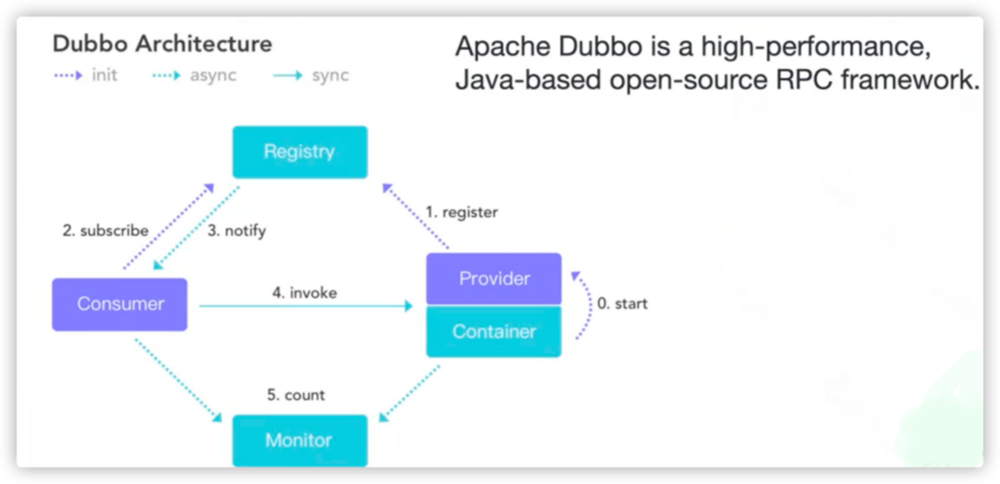
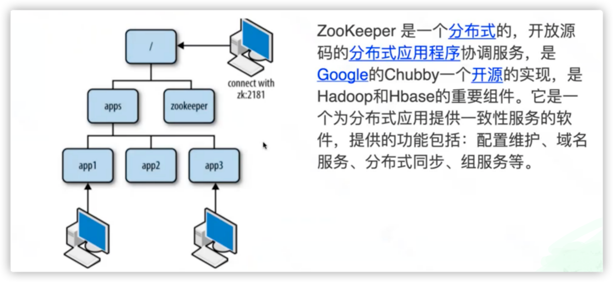

## JMeter Dubbo 接口压测实战

### 1.编译官方Dubbo服务
* git clone https://github.com/apache/dubbo-samples.git
  * [跳转](./dubbo/dubbo-samples/1-basic/dubbo-samples-api) 
### 2.使用Docker搭建Zookeeper
* docker run -dit --name zookeeper --hostname zookeeper-host -p 2181:2181 jplock/zookeeper:latest
### 3.启动Dubbo服务
* 配置zk
  * [Application.java](./dubbo/dubbo-samples-api/src/main/java/org/apache/dubbo/samples/provider/Application.java)
* 启动服务端
  * [Start the service provider](./dubbo/dubbo-samples-api/README.md) 
### 4.使用Jmeter完成Dubbo协议压测
* https:github.com/dubbo/jmeter-plugins-for-apache-dubbo/tree/master/dist

