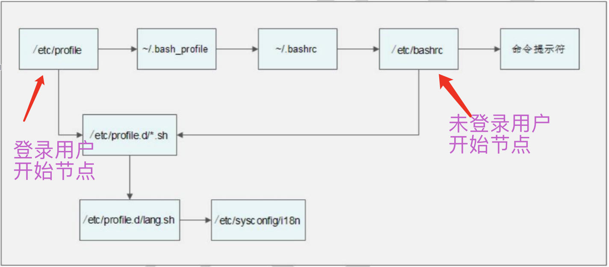

**目录 (Table of Contents)**

[TOC]
## 作业
* 1、nginx日志分析
  * https://ceshiren.com/t/topic/3321/72
## 进程vs线程
### 进程
* 可执行程序的运行态（一个进程就是一个程序的运行实例）
* 操作系统调度的基本单位
* 线程容器
* 进程本身包含指令、数据等资源
#### 进程状态
```
D uninterruptible sleep (usually IO)
R running or runnable (on run queue)
S interruptible sleep (waiting for an event to complete)
T stopped by job control signal
t stopped by debugger during the tracing
W paging (not valid since the 2.6.xx kernel)
X dead (should never be seen)
Z defunct (“zombie”) process, terminated but not reaped by its parent
```


### 线程
进程中被执行的最小单元
cpu 调度的基本单位
线程带有指令、数据等资源
### 常用进程管理命令
* ps 进程列表快照
* top 交互式进程观测
* kill  结束进程
* fg 进程切换到前台
* bg 进程切换到后台
* ctrl z 挂起进程
* jobs 查看任务
* 自定义输出指标 ps -o pid,ppid,psr,thcount,tid,cmd -M
## Shell 基础
### 一、概述
shell是命令解释器
#### 层次结构

外层应用程序-->shell命令解释器-->内核-->硬件

### 分类

* Shell 的两种主要语法类型有 Bourne 和 C，这两种语法彼此不兼容。Bourne家族主要包括 sh、

ksh、Bash、psh、zsh；

* C家族主要包括：csh、tcsh （Bash和 zsh在不同程度上支持 csh 的语法）。


```bash
# 我们可以通过/etc/shells文件来查询 Linux支持的 Shell。命令如下：
[root@localhost ~]# vi /etc/shells
/bin/sh
/bin/Bash
/sbin/nologin
/bin/tcsh
/bin/csh

# 查看当前使用的SHELL
[root@VM_0_16_centos ~]# echo $SHELL
```

### 二、Shell脚本的执行方式

#### 1、echo控制台执行

```bash
[root@localhost ~]# echo "Mr. Shen Chao is the most honest man！"
#echo的内容就会打印到屏幕上。
Mr. Shen Chao is the most honest man！
```

#### 2、Shell脚本的执行

```bash
[root@localhost sh]# vi hello.sh
#!/bin/Bash
#The first program
# Author: shenchao （E-mail: shenchao@atguigu.com）
echo -e "Mr. Shen Chao is the most honest man. "
```

* 方法一：赋予执行权限，直接运行

```bash
[root@localhost sh]# chmod 755 hello.sh
#赋予执行权限
[root@localhost sh]# /root/sh/hello.sh
Mr. Shen Chao is the most honest man.
#使用绝对路径运行
[root@localhost sh]# ./hello.sh
```

* 方法二：通过 Bash调用执行脚本

```bash
[root@localhost sh]# bash hello.sh
Mr. Shen Chao is the most honest man.
```

### 三、Bash的基本功能

#### 1、history历史命令

```
[root@localhost ~]# history [选项] [历史命令保存文件]
选项：
-c：清空历史命令
-w：把缓存中的历史命令写入历史命令保存文件。如果不手工指定历史命令保存文
件，则放入默认历史命令保存文件~/.bash_history中
```

* 历史命令调用

  ```
  如果想要使用原先的历史命令有这样几种方法：
  使用上、下箭头调用以前的历史命令
  使用“!n”重复执行第 n条历史命令
  使用“!!”重复执行上一条命令
  使用“!字串”重复执行最后一条以该字串开头的命令
  使用“!$”重复上一条命令的最后一个参数
  ```

#### 2、命令别名

```
命令格式：
[root@localhost ~]# alias
#查询命令别名
[root@localhost ~]# alias 别名='原命令'
#设定命令别名
```

#### 3、执行优先级

1、 第一顺位执行用绝对路径或相对路径执行的命令。

2、 第二顺位执行别名。

3、 第三顺位执行 Bash的内部命令。

4、 第四顺位执行按照$PATH环境变量定义的目录查找顺序找到的第一个命令。

为了让这个别名永久生效，可以把别名写入环境变量配置文件“~/.bashrc”。

#### 4、bash 快捷键


【注】Ctrl+C---停止运行

​	       Ctrl+A---后台运行

#### 5、输入输出重定向

* Bash标准输入/输出

  | **设备** | **设备文件名** | **文件描述符** |   **类型**   |
  | -------- | :------------: | :------------: | :----------: |
  | 键盘     |   /dev/stdin   |       0        |   标准输入   |
  | 显示器   |  /dev/stdout   |       1        |   标准输出   |
  | 显示器   |  /dev/stderr   |       2        | 标准错误输出 |

* 输出重定向

  ```shell
  # 标准输出重定向
  pwd > 文件/设备  # 覆盖更新
  pwd >> 文件/设备  # 追加更新
  
  # 标准错误输出重定向
  错误命令 2> 文件/设备 # 覆盖更新
  错误命令 2>> 文件/设备 # 追加更新
  
  # 正确+错误输出重定向
  ## 更新到同一个文件
  命令 > 文件 2>&1  # 覆盖
  命令 >> 文件 2>>&1 # 追加
  命令 &> 文件 # 覆盖
  命令 &>> 文件 # 追加
  
  ## 更新到不同的文件
  命令>>文件1 2>> 文件2
  ```

* 输入重定向 --了解即可

  ```shell
  [root@localhost ~]# wc [选项] [文件名]
  选项：
  -c  统计字节数
  -w  统计单词数
  -l  统计行数
  eg: wc < 文件
  ```

#### 6、多命令顺序执行

| 多命令执行符 | 格式             | 作用                                                         |
| ------------ | ---------------- | ------------------------------------------------------------ |
| ;            | 命令1;命令2      | 多个命令顺序执行，命令之间没有任何逻辑联系                   |
| &&           | 命令1 && 命令2   | 命令 1正确执行（$?=0），则命令 2才会执行<br/>当命令 1执行不正确（$? 0），则命令 2不会执行 |
| \|\|         | 命令1 \|\| 命令2 | 命令 1 执行不正确（$?≠ 0），则命令 2才会执行<br/>命令 1正确执行（$?=0），则命令 2不会执行 |

```shell
# 使用多命令执行符实现分支判断
命令 && echo yes || echo no  --固定格式
```

#### 7、管道符

* 行提取命令 grep

  ```shell
  grep [选项] "搜索内容" 文件名
  # 选项
  -A 数字：列出符合条件的行，并列出后续的 n行
  -B 数字：列出符合条件的行，并列出前面的 n行
  -c：统计找到的符合条件的字符串的次数
  -g
  -n：输出行号
  -v：反向查找
  --color=auto
  
  # 举例 -- /etc/passwd
  ## 查找用户信息文件/etc/passwd中，有多少可以登录的用户
  grep '/bin/bash' /etc/passwd|wc -l
  ## 查找可以登录的用户，并显示行号
  grep -n '/bin/bash' /etc/passwd
  ## 查找包含有“root”的行，并列出后续的 3行
  grep -A 3 'root' /etc/passwd
  ## 查找不含有“/bin/bash”的行，其实就是列出所有的伪用户
  grep -v '/bin/bash' /etc/passwd
  ```

* find和grep区别
  * find命令是在系统当中搜索符合条件的文件名，如果需要模糊查询，使用通配符进行匹配，搜索时文件名是**完全匹配**
  * grep命令是在文件当中搜索符合条件的字符串，如果需要模糊查询，使用正则表达式进行匹配，搜索时字符串是**包含匹配**

* 管道符    |

  ```shell
  ## 输出到管道使用more分配读取
  ll -a /etc/ | more
  
  ## 查看具体的已经建立网络连接数量，就可以再使用 wc命令统计行数
  netstat -an | grep "ESTABLISHED" | wc -l
  ```

#### 8、通配符

| 通配符 | 作用                                                         |
| ------ | ------------------------------------------------------------ |
| ?      | 匹配任意一个字符                                             |
| *      | 匹配 0个或任意多个任意字符，也就是可以匹配任何内容           |
| [ ]    | 匹配中括号中任意一个字符。例如：[abc]代表一定匹配一个字符，或者是 a，或者是 b，或者是 c。 |
| [-]    | 匹配中括号中任意一个字符，-代表一个范围。例如：[a-z]代表匹配一个小写字母。 |
| [^]    | 逻辑非，表示匹配不是中括号内的一个字符。例如:[  ^ 0-9 ]代表匹配一个不是数字的字符 |

#### 9、Bash中的其他特殊符号

| 符号 | 作用                                                         |
| ---- | ------------------------------------------------------------ |
| ''   | 单引号。在单引号中所有的特殊符号，如“ $ ”和“ ` ”(反引号)都没有特殊含义 |
| ""   | 双引号。在双引号中特殊符号都没有特殊含义，但是“$”、“`”和“\”是例外，拥有“调用变量的值”、“引用命令”和“转义符”的特殊含义。 |
| ``   | 反引号。反引号括起来的内容是系统命令，在 Bash中会先执行它。和$()作用一样，不过推荐使用$()，因为反引号非常容易看错 。 |
| $()  | 和反引号作用一样，用来引用系统命令。                         |
| ()   | 用于一串命令执行时，()中的命令会在子 Shell中运行             |
| {}   | 用于一串命令执行时，{}中的命令会在当前 Shell中执行。也可以用于变量变形与替换 |
| []   | 用于变量的测试                                               |
| #    | #开头行表示注释                                              |
| $    | 用于调用变量的值，如需要调用变量 name 的值时，需要用$name 的方式得到变量的值 |
| \    | 转义符，跟在\之后的特殊符号将失去特殊含义，变为普通字符。如\$将输出“$”符号，而不当做是变量引用 |

### 四、Bash的变量和运算符

#### 1、什么是变量

* 变量名称可以由字母、数字和下划线组成，但是不能以数字开头。如果变量名是“2name”则是错误的

* 在 Bash 中，变量的默认类型都是字符串型，如果要进行数值运算，则必修指定变量类型为数值型

* 变量用等号连接值，等号左右两侧不能有空格

* 变量的值如果有空格，需要使用单引号或双引号包括。如：test="hello world!"。其中双引号括起来的内容“$”、“\”和反引号都拥有特殊含义，而单引号括起来的内容都是普通字符。

* 在变量的值中，可以使用“\”转义符

* 环境变量名建议大写，便于区分

* 如果是把命令的结果作为变量值赋予变量，则需要使用反引号或$()包含命令

* 如果需要增加变量的值，那么可以进行变量值的叠加。不过变量需要用双引号包含"$变量名"或用${变量名}包含变量名。例如：

  ```shell
  # 变量值的叠加可以使用两种格式：“$变量名”或${变量名}
  [root@localhost ~]# test=123
  [root@localhost ~]# test="$test"456
  [root@localhost ~]# echo $test
  123456
  #叠加变量 test，变量值变成了 123456
  [root@localhost ~]# test=${test}789
  [root@localhost ~]# echo $test
  123456789
  #再叠加变量 test，变量值编程了 123456789
  ```

#### 2、变量的分类

* 用户自定义变量：这种变量是最常见的变量，由用户自由定义变量名和变量的值
* 环境变量：这种变量中主要保存的是和系统操作环境相关的数据
* 位置参数变量：这种变量主要是用来向脚本当中传递参数或数据的，变量名不能自定义，变量作用是固定的。
* 预定义变量：是 Bash中已经定义好的变量，变量名不能自定义，变量作用也是固定的

#### 3、用户自定义变量

```shell
# 变量定义
[root@localhost ~]# name="shen chao"

# 调用变量
[root@localhost ~]# echo $name

# --------查看变量--------
set  # 直接使用 set命令，会查询系统中所有的变量，包含用户自定义变量和环境变量
set -u #当设置了-u选项后，如果调用没有设定的变量会有报错。默认是没有任何输出的

set -x #如果设定了-x选项，会在每个命令执行之前，先把命令输出一次
root@localhost ~]# set -x
+ ls --color=auto
anaconda-ks.cfg install.log install.log.syslog sh tdir test testfile

# 删除变量
[root@localhost ~]# unset 变量名
```

#### 4、环境变量

```shell
#使用 export声明的变量即是环境变量
[root@localhost ~]# export age="18"

# 删除
[root@localhost ~]# unset age

# 查看环境变量-- env命令和 set命令的区别是，set命令可以查看所有变量，而 env命令只能查看环境变量
[root@localhost ~]# env
```

```shell
---------------- 常用环境变量 -----------------
# PATH --系统查找命令的路径
[root@localhost ~]# echo $PATH
/usr/lib/qt-3.3/bin:/usr/local/sbin:/usr/local/bin:/sbin:/bin:/usr/sbin:/usr/bin:/root/
bin
## PATH 添加值
PATH="$PATH":/root/sh  # 这样定义的 PATH 变量只是临时生效，一旦重启或注销就会消失，如果想要永久生效，需要写入环境变量配置文件

# PS1变量：命令提示符设置
\[\033[01;33m\]\u@\h\[\033[01;32m\] \W\$\[\033[00m\]
anjie@anjiedembp ~$

# LANG语系变量 --LANG变量定义了 Linux系统的主语系环境，这个变量的默认值是：
[root@localhost src]# echo $LANG
zh_CN.UTF-8
```

#### 5、位置参数变量

| 位置参数变量 | 作用                                                         |
| :----------: | :----------------------------------------------------------- |
|      $n      | n为数字，$0代表命令本身，$1-$9代表第一到第九个参数，十以上的参数需要用大括号包含，如${10}. |
|      $*      | 这个变量代表命令行中所有的参数，$*把所有的参数看成一个整体   |
|      $@      | 这个变量也代表命令行中所有的参数，不过$@把每个参数区分对待   |
|      $#      | 这个变量代表命令行中所有参数的个数                           |

```shell
[root@localhost sh]# vi count.sh
#!/bin/bash
# Author: shenchao （E-mail: shenchao@atguigu.com）
num1=$1
#给 num1变量赋值是第一个参数
num2=$2
#给 num2变量赋值是第二个参数
sum=$(( $num1 + $num2))
#变量 sum的和是 num1加 num2
#Shell当中的运算还是不太一样的，我们 Shell运算符小节中详细介绍
echo $sum
#打印变量 sum的值
```

```shell
# 对比 $* 和 $@ 的区别
#!/bin/bash
# Author:anjie[Email:anjiework@gmail.com]
for i in $#
	do
		echo "\$@ is $i"
	done
for j in $*
	do
		echo "\$* is $j"
	done
# 结果
[root@VM_0_16_centos ~]# ./vs.sh 1 2 3
$@ is 3
$* is 1
$* is 2
$* is 3
```

#### 6、预定义变量

| 预定义变量 | 作用                                                         |
| ---------- | ------------------------------------------------------------ |
| $?         | 最后一次执行的命令的返回状态。如果这个变量的值为 0，证明上一个命令正确执行；如果这个变量的值为非 0（具体是哪个数，由命令自己来决定），则证明上一个命令执行不正确了 |
| $$         | 当前进程的进程号（PID)                                       |
| $!         | 后台运行的最后一个进程的进程号（PID）                        |

#### 7、接受键盘输入

```shell
[root@localhost ~]# read [选项] [变量名]
选项：
-p “提示信息”： 在等待 read输入时，输出提示信息
-t 秒数：
-n 字符数：
-s：read命令会一直等待用户输入，使用此选项可以指定等待时间,read命令只接受指定的字符数，就会执行隐藏输入的数据，适用于机密信息的输入


[root@localhost sh]# vi read.sh
#!/bin/bash
# Author: shenchao （E-mail: shenchao@atguigu.com）
read -t 30 -p "Please input your name: " name
#提示“请输入姓名”并等待 30秒，把用户的输入保存入变量 name中
echo "Name is $name"
#看看变量“$name”中是否保存了你的输入
read -s -t 30 -p "Please enter your age: " age
#提示“请输入年龄”并等待 30秒，把用户的输入保存入变量 age中
#年龄是隐私，所以我们用“-s”选项隐藏输入
echo -e "\n"
#调整输出格式，如果不输出换行，一会的年龄输出不会换行
echo "Age is $age"
read -n 1 -t 30 -p "Please select your gender[M/F]: " gender
#提示“请选择性别”并等待 30秒，把用户的输入保存入变量 gender
#使用“-n 1”选项只接收一个输入字符就会执行（都不用输入回车）
echo -e "\n"
echo "Sex is $gender"
```

#### 8、Shell的运算符

shell进行数值运算，可以采用三种方法

##### declare  -- 了解

```shell
# 方法一：使用declare声明变量类型【 不常用--了解即可 】
[root@localhost ~]# declare [+/-][选项] 变量名
选项：
-：给变量设定类型属性
+：取消变量的类型属性
-a：将变量声明为数组型
-i：将变量声明为整数型（integer）
-r：讲变量声明为只读变量。注意，一旦设置为只读变量，既不能修改变量的值，
也不能删除变量，甚至不能通过+r取消只读属性
-x：将变量声明为环境变量
-p：显示指定变量的被声明的类型
------------- 举例 ----------------
[root@localhost ~]# aa=11
[root@localhost ~]# bb=22
#给变量 aa和 bb赋值
[root@localhost ~]# declare -i cc=$aa+$bb
#声明变量 cc的类型是整数型，它的值是 aa和 bb的和
[root@localhost ~]# echo $cc
33
#这下终于可以相加了


## 数组变量类型 -- shell很少使用，一般算法交给高级语言
[root@localhost ~]# name[0]="shen chao"
#数组中第一个变量是沈超（大办公室第一个办公桌坐最高大威猛帅气的人）
[root@localhost ~]# name[1]="li ming"
#数组第二个变量是李明（大办公室第二个办公桌坐头发锃亮的人）
[root@localhost ~]# name[2]="tong gang"
#数组第三个变量是佟刚（大办公室第三个办公桌坐眼睛比超哥还小的老师）
[root@localhost ~]# echo ${name}
shen chao
#输出数组的内容，如果只写数组名，那么只会输出第一个下标变量
[root@localhost ~]# echo ${name[*]}
shen chao li ming tong gang
#输出数组所有的内容

------------- 声明环境变量 -------------
[root@localhost ~]# declare -x test=123
#把变量 test声明为环境变量

------------- 设置只读属性 ------------
# 注意一旦给变量设定了只读属性，那么这个变量既不能修改变量的值，也不能删除变量，甚至不能使用“+r”选项取消只读属性
[root@localhost ~]# declare -r test
#给 test赋予只读属性
[root@localhost ~]# test=456
-bash: test: readonly variable
#test变量的值就不能修改了
[root@localhost ~]# declare +r test
-bash: declare: test: readonly variable
#也不能取消只读属性
[root@localhost ~]# unset test
-bash: unset: test: cannot unset: readonly variable
#也不能删除变量

# 【注】不过还好这个变量只是命令行声明的，所以只要重新登录或重启，这个变量就会消失了。
```

##### 使用 expr或 let数值运算工具 -- 了解，不推荐使用

```shell
# expr
[root@localhost ~]# aa=11
[root@localhost ~]# bb=22
#给变量 aa和变量 bb赋值
[root@localhost ~]# dd=$(expr $aa + $bb)
#dd的值是 aa和 bb的和。注意“+”号左右两侧必须有空格
[root@localhost ~]# echo $dd
33

# let
[root@localhost ~]# aa=11
[root@localhost ~]# bb=22
#给变量 aa和变量 bb赋值
[root@localhost ~]# let ee=$aa+$bb
[root@localhost ~]# echo $ee
33
#变量 ee的值是 aa和 bb的和
[root@localhost ~]# n=20
#定义变量 n
[root@localhost ~]# let n+=1
#变量 n的值等于变量本身再加 1
[root@localhost ~]# echo $n
21
# expr命令和 let命令大家可以按照习惯使用，不过 let命令对格式要求要比 expr命令宽松，所以推荐使用 let命令进行数值运算
```

##### 使用“$((运算式))”或“$[运算式]”方式运算

```shell
[root@localhost ~]# aa=11
[root@localhost ~]# bb=22
[root@localhost ~]# ff=$(( $aa+$bb ))
[root@localhost ~]# echo $ff
33
#变量 ff的值是 aa和 bb的和
[root@localhost ~]# gg=$[ $aa+$bb ]
[root@localhost ~]# echo $gg
33
#变量 gg的值是 aa和 bb的和
```

【注】这三种数值运算方式，大家可以按照自己的习惯来进行使用。不过我们推荐使用“$((运算式))”的方式

#### 9、变量的测试与内容置换

> 利用x的值来判断y的值是否为空，空字符串，有值

| 变量置换方式 | 变量y没有设置 | 变量y为空值 | 变量y设置值 |
| ------------ | ------------- | ----------- | ----------- |
| x=${y-新值}  | x=新值        | x为空       | x=$y        |
| ...          |               |             |             |


### 五、环境变量配置文件

#### 1、source命令

```shell
[root@localhost ~]# source 配置文件
```

#### 2、环境变量配置文件



##### 登录时生效的环境变量配置文件

```shell
----- /etc/profile -----
# USER变量：根据登录的用户，给这个变量赋值（就是让 USER变量的值是当前用户）。
# LOGNAME变量：根据USER变量的值，给这个变量赋值。
# MAIL变量：根据登录的用户，定义用户的邮箱为/var/spool/mail/用户名。
# PATH 变量：根据登录用户的 UID 是否为 0，判断 PATH 变量是否包含/sbin、/usr/sbin和/usr/local/sbin这三个系统命令目录。
# HOSTNAME变量：更加主机名，给这个变量赋值。
# HISTSIZE变量：定义历史命令的保存条数。
# umask：定义 umask默认权限。注意/etc/profile文件中的 umask权限是在“有用户登录过程（也就是输入了用户名和密码）”时才会生效。
### umask作用：当我们想改变创建文件和目录时的默认访问权限，则可以通过umask命令来实现。
# 调用/etc/profile.d/*.sh文件，也就是调用/etc/profile.d/目录下所有以.sh结尾的文件。
----- /etc/profile.d/*.sh -----
# 这个个目录中所有以.sh结尾的文件都会被/etc/profile文件调用，这里最常用的就是 lang.sh文件，而这个文件又会调用/etc/sysconfig/i18n 文件。/etc/sysconfig/i18n 这个文件眼熟吗？就是我们前面讲过的默认语系配置文件
# 由/etc/profile文件调用~/.bash_profile文件
----- ~/.bash_profile -----
# 调用了~/.bashrc文件
# 在 PATH 变量后面加入了“:$HOME/bin”这个目录。那也就是说，如果我们在自己的家目录中建立 bin 目录，然后把自己的脚本放入“~/bin”目录，就可以直接执行脚本，而不用通过目录执行了
----- ~/.bashrc ----- 
# 定义默认别名，所以超哥把自己定义的别名也放入了这个文件。
# 调用/etc/bashrc
----- /etc/bashrc -----
# PS1 变量：也就是用户的提示符，如果我们想要永久修改提示符，就要在这个文件中修改
# umask：定义 umask 默认权限。这个文件中定义的 umask 是针对“没有登录过程（也就是不需要输入用户名和密码时，比如从一个终端切换到另一个终端，或进入子 Shell）”时生效的。如果是“有用户登录过程”，则是/etc/profile文件中的 umask生效。
# PATH变量：会给 PATH变量追加值，当然也是在“没有登录过程”时才生效。
# 调用/etc/profile.d/*.sh 文件，这也是在“没有用户登录过程”是才调用。在“有用户登录过程”时，/etc/profile.d/*.sh文件已经被/etc/profile文件调用过了。
```

### 六、正则表达式

#### 基础正则表达式

| 元字符    | 作用                                                         |
| --------- | ------------------------------------------------------------ |
| *         | 前一个字符匹配 0次或任意多次                                 |
| .         | 匹配除了换行符外任意一个字符                                 |
| ^         | 匹配行首。例如：^hello会匹配以 hello开头的行                 |
| $         | 匹配行尾。例如：hello&会匹配以 hello结尾的行                 |
| [ ]       | 匹配中括号中指定的任意一个字符，只匹配一个字符。例如：[aoeiu] 匹配任意一个元音字母，[0-9] 匹配任意一位数字，[a-z][0-9]匹配小写字和一位数字构成的两位字符 |
| [^]       | 匹配除中括号的字符以外的任意一个字符。例如：\[^0-9\] 匹配任意一位非数字字符，\[^a-z] 表示任意一位非小写字母 |
| \         | 转义符。用于取消讲特殊符号的含义取消                         |
| \\{n\\}   | 表示其前面的字符恰好出现 n次。例如：[0-9]\\{4\\} 匹配 4位数字 |
| \\{n,\\}  | 表示其前面的字符出现不小于 n次。例如： [0-9]\\{2,\\} 表示两位及以上的数字 |
| \\{n,m\\} | 表示其前面的字符至少出现 n次，最多出现 m次。例如：[a-z]\\{6,8\\} |

```shell
# 剔除空白行
grep -v "^$" 文件  # 找到空白行，然后取返
```

#### 扩展正则表达式

熟悉正则表达式的童鞋应该很疑惑，在正则表达式中应该还可以支持一些元字符，比如“+”“？”“|”“（）”。其实 Linux是支持这些元字符的，只是 grep命令默认不支持而已。如果要想支持这些元字符，必须使用 egrep命令或 grep -E选项，所以我们又把这些元字符称作扩展元字符。如果查询 grep的帮助，对 egrep 的说明就是和 grep -E 选项一样的命令，所以我们可以把两个命令当做别名来对待。

| 扩展元字符 | 作用                                                         |
| ---------- | ------------------------------------------------------------ |
| +          | 前一个字符匹配 1次或任意多次。+如“go+gle”会匹配“gogle”、“google”或“gooogle”，当然如果“o”有更多个，也能匹配 |
| ？         | 前一个字符匹配 0次或 1次,如“colou?r”可以匹配“colour”或“color” |
| \|         | 匹配两个或多个分支选择。如“was\|his“，会匹配包含was和his的行 |
| ()         | 匹配其整体为一个字符，即模式单元。可以理解为由多个单个字符组。如“(dog)+”会匹配“dog”、“dogdog”、“dogdogdog”等 |

### 七、字符截取和替换命令

#### cut列提取命令

> 与awk对比优先使用cut

```shell
[root@localhost ~]# cut [选项] 文件名
选项：
-f 列号：提取第几列
-d 分隔符：按照指定分隔符分割列
-c 字符范围： 不依赖分隔符来区分列，而是通过字符范围（行首为 0）来进行字段提取。“n-”表示从第 n个字符到行尾；“n-m”从第 n个字符到第 m
个字符；“-m”表示从第 1个字符到第 m个字符。
```

【注】cut命令的默认分隔符是制表符，也就是“tab”键，不过对空格符可是支持的不怎么好啊

```shell
[root@VM_0_16_centos ~]# cat student.txt
ID	Name	gender	Mark
1	an1	gen1	89
2	an2	gen2	77
3	an3	gen3	199
# 提取第二列内容
cut -f 2 student.txt
cut -f 2,3 student.txt  # 多列
# 提取第八个字符开始到行尾，好像很乱啊，那是因为每行的字符个数不相等啊
cut -c 8- student.txt
# 以“：”作为分隔符，提取/etc/passwd文件的第一列和第三列
cut -d ":" -f 1,3 /etc/passwd
```
#### linux三剑客 grep awk sed
* Linux 三剑客	SQL Structured Query Language
* grep 数据查找定位	select * from table like ‘%xx’
* awk 数据切片	select field from table
* sed 数据修改	update table set field=new where field=old
#### awk编程（分段处理）
语法 awk 'pattern{action}'

##### printf格式化输出

```shell
# 语法：printf ‘输出类型输出格式’ 输出内容
## 输出类型
	%s:	输出字符串
	%i:	输出整数
	%m.nf:	输出浮点数，m和n是数字，分别代表总位数（小数+整数）和小数位数
## 输出格式
	\a:输出警告声音
	\b:输出退格键，也就是 Backspace键
	\f:清除屏幕
	\n:换行
	\r:回车，也就是 Enter键
	\t:水平输出退格键，也就是 Tab键
	\v:垂直输出退格键，也就是 Tab键
	
------------ 实例 -------------  
# 数据
[root@VM_0_16_centos ~]# cat student.txt
ID	Name	gender	Mark
1	an1	gen1	89
2	an2	gen2	77
3	an3	gen3	199

# 默认输出
[root@VM_0_16_centos ~]# printf '%s' $(cat student.txt)
IDNamegenderMark1an1gen1892an2gen2773an3gen3199 # 无任何格式
# 自定义格式输出
[root@VM_0_16_centos ~]# printf '%s\t %s\t %s\t %s\t \n' $(cat student.txt)
ID	 Name	 gender	 Mark
1	 an1	 gen1	 89
2	 an2	 gen2	 77
3	 an3	 gen3	 199
# 自定义输出浮点数
[root@VM_0_16_centos ~]# printf '%s\t %s\t %s\t %8.2f \t \n' $(cat student.txt|grep -v Name)
1	 an1	 gen1	    89.00
2	 an2	 gen2	    77.00
3	 an3	 gen3	   199.00
```

##### awk基本使用

```shell
# 使用模版
awk ‘条件 1{动作 1} 条件 2{动作 2}…’ 文件名
## 条件（Pattern）
一般使用关系表达式作为条件。这些关系表达式非常多，具体参考下表
eg:
		x > 10 判断变量 x是否大于 10
		x == y 判断变量 x是否等于变量 y
		A ~ B 判断字符串 A中是否包含能匹配 B 表达式的子字符串
		A !~ B 判断字符串 A中是否不包含能匹配 B表达式的子字符串
## 动作（Action）
	格式化输出
	流程控制语句
	
------------ 实例 ------------  
# 输出第二列和第六列
[root@VM_0_16_centos ~]# awk '{printf $2 "\t" $3 "\n"}' student.txt
Name	gender
an1	gen1
an2	gen2
an3	gen3
# 获取文件系统占用百分比
df -h|awk '{print $1 "\t" $5}'
```

##### awk的条件

| 条件类型   | 条件   | 说明                                                      |
| ---------- | ------ | --------------------------------------------------------- |
| awk保留字  | BEGIN  | 在awk程序一开始时，尚未读取任何数据之前执行。只能执行一次 |
|            | END    | 在awk程序处理完所有数据，即将结束时执行。只能执行一次     |
| 关系运算符 | >      | 大于                                                      |
|            | <      | 小于                                                      |
|            | >=     |                                                           |
|            | <=     |                                                           |
|            | ==     |                                                           |
|            | !=     |                                                           |
|            | A~B    | 判断字符串 A中是否包含能匹配 B 表达式的子字符串           |
|            | A!~B   | 判断字符串 A中是否不包含能匹配 B表达式的子字符串          |
| 正则表达式 | /正则/ | 如果在“//”中可以写入字符，也可以支持正则表达式            |

```shell
# BEGIN/END 命令演示
awk 'BEGIN {print "------begin-----"} END {print "------end-------"} {print $1 "\t" $3}' student.txt
## 执行结果
------begin-----
ID	gender
1	gen1
2	gen2
3	gen3
------end-------

# 打印成绩>80的学员
[root@VM_0_16_centos ~]# grep -v "Name" student.txt
1	an1	gen1	89
2	an2	gen2	77
3	an3	gen3	199
[root@VM_0_16_centos ~]# grep -v "Name" student.txt | awk ' $4>80 {print $2}'
an1
an3

# 查看指定学生成绩
## 方法一：使用～
[root@VM_0_16_centos ~]# awk '$2 ~ /an2/ {print $1 "\t" $2 "\t" $3 "\t" $4} ' student.txt
2	an2	gen2	77
## 方法二：直接使用正则//
[root@VM_0_16_centos ~]# awk '/an2/ {print $1 "\t" $2 "\t" $3 "\t" $4} ' student.txt
2	an2	gen2	77

# 查询包含有 sda数字的行，并打印第一字段和第五字段
[root@localhost ~]# df -h | awk '/sda[0-9]/ {printf $1 "\t" $5 "\n"} '
```

##### awk内置变量

| awk内置变量 | 作用                                                         |
| ----------- | ------------------------------------------------------------ |
| $0          | 代表目前awk读入的整行数据                                    |
| $n          | 代表目前读入行的第n个字的                                    |
| NF          | 当前行拥有的字段（列）总数                                   |
| NR          | 当前 awk所处理的行，是总数据的第几行                         |
| FS          | 用户定义分隔符。awk的默认分隔符是任何空格，如果想要使用其他分隔符（如“：”），就需要 FS变量定义。 |
| ARGC        | 命令行参数个数                                               |
| ARGV        | 命令行参数数组                                               |
| FNR         | 当前文件中的当前记录数（对输入文件起始为 1）                 |
| OFMT        | 数值的输出格式（默认为%.6g）                                 |
| OFS         | 输出字段的分隔符（默认为空格）                               |
| ORS         | 输出记录分隔符（默认为换行符）                               |
| RS          | 输入记录分隔符（默认为换行符）                               |

```shell
# 查询可以登录的用户的用户名和 UID
[root@VM_0_16_centos ~]# cat /etc/passwd | grep "/bin/bash" | awk 'BEGIN{FS=":"} {printf $1 "\t" $3 "\n"}'
## 结果
root	0    #【注意】使用BEGIN，否则第一行不生效

# 开始执行{分隔符是“：”} {输出第一字段和第三字段 输出行号（NR值） 字段数（NF值）}
cat /etc/passwd | grep "/bin/bash" | awk 'BEGIN {FS=":"} {printf $1 "\t" $3 "\t 行号：" NR "\t 字段数：" NF "\n"}'
```

##### awk流程控制

* 注意：
  * 多个条件{动作}可以用空格分割，也可以用回车分割
  * 在一个动作中，如果需要执行多个命令，需要用“；”分割，或用回车分割
  * 在 awk中，变量的赋值与调用都不需要加入“$”符
  * 条件中判断两个值是否相同，请使用“==”，以便和变量赋值进行区分

```shell
----------- 实例 -----------
[root@VM_0_16_centos awktest]# cat student.txt
ID	Name	gender	Mark
1	an1	gen1	89
2	an2	gen2	77
3	an3	gen3	199
4	an4	gen4	23
# 统计Mark的和
## -- 方法一
awk 'BEGIN{sum=0} NR>1  {sum=$4+sum} END{print sum} student.txt  
## -- 方法二
awk 'NR==2{php1=$3}
NR==3{php2=$3}
NR==4{php3=$3;totle=php1+php2+php3;print "totle php is " totle}' student.txt  

# 程序中有两个 if判断，第一个判断行号大于 2，第二个判断 Linux成绩大于 90分
## 方法一：
awk '{if (NR>=2)
{if ($4>90) printf $2 " is a good man!\n"}}' student.txt
## 方法二：
awk ' NR>=2 {test=$4}
test>90 {printf $2 " is a good man!\n"}' student.txt
```

##### awk函数

```shell
# 函数模版
function 函数名（参数列表）{
函数体
}

# 实例
[root@localhost ~]# awk 'function test(a,b) { printf a "\t" b "\n" }
#定义函数 test，包含两个参数，函数体的内容是输出这两个参数的值
{ test($2,$6) } ' student.txt
#调用函数 test，并向两个参数传递值。
Name
Average
Liming 87.66
Sc
Tg
85.66
91.66


```

##### awk中调用脚本

对于小的单行程序来说，将脚本作为命令行自变量传递给 awk 是非常简单的，而对于多行程序就比较难处理。当程序是多行的时候，使用外部脚本是很适合的。首先在外部文件中写好脚本，然后可以使用 awk 的-f 选项，使其读入脚本并且执行

```shell
[root@localhost ~]# vi pass.awk
BEGIN {FS=":"}
{ print $1 "\t" $3}

[root@localhost ~]# awk -f pass.awk /etc/passwd
root
bin
0
1
2
daemon
…省略部分输出…
```

#### sed命令

sed主要是用来将数据进行选取、替换、删除、新增的命令

```shell
sed [选项] ‘[动作]’ 文件名

# 选项
-n：一般 sed命令会把所有数据都输出到屏幕，如果加入此选择，则只会
把经过 sed命令处理的行输出到屏幕。
-e：允许对输入数据应用多条 sed命令编辑。
-f 脚本文件名： 从 sed脚本中读入 sed操作。和 awk命令的-f非常类似。
-r：在 sed中支持扩展正则表达式。
-i：用 sed的修改结果直接修改读取数据的文件，而不是由屏幕输出
动作：

a \：追加，在当前行后添加一行或多行。添加多行时，除最后 一行外，
每行末尾需要用“\”代表数据未完结。
c \：行替换，用 c后面的字符串替换原数据行，替换多行时，除最后一行
外，每行末尾需用“\”代表数据未完结。
i \：插入，在当期行前插入一行或多行。插入多行时，除最后 一行外，
每行末尾需要用“\”代表数据未完结。
d：删除，删除指定的行。
p：打印，输出指定的行。
s：字串替换，用一个字符串替换另外一个字符串。格式为“行范围 s/
旧字串/新字串/g”（和 vim中的替换格式类似）

# 【注意】
对 sed命令大家要注意，sed所做的修改并不会直接改变文件的内容（如果是用管道符接收的命令的输出，这种情况连文件都没有），而是把修改结果只显示到屏幕上，除非使用“-i”选项才会直接修改文件

```

```shell
--------------- 实例 ---------------
# 行数据操作
## 只输出第二行数据
sed -n '2p' student.txt
## 输出2-4行数据
sed -n '2,4p' student.txt
## 删除第二行到第四行的数据
sed '2,4d' student.txt
## 在第二行后加入 hello
sed '2a hello' student.txt
## 在第二行前插入两行数据
sed '2i hello \
> world' student.txt  # 添加 -i 永久保存
## 修改指定行文件
cat student.txt | sed '2c No such person'
sed -i '2c No such person' student.txt  # 永久修改

# 字符串替换
## 在第三行中，把 74换成 99
sed '3s/74/99/g' student.txt
## 替换行首
sed '4s/^/#/g' student.txt #这里使用正则表达式，“^”代表行首
## 多个指令替换
### 同时把“Liming”和“Tg”替换为空
sed -e 's/Liming//g ; s/Tg//g' student.txt

sed -e 's/Liming//g
> s/Tg//g' student.txt


```

### 八、字符处理命令（统计命令）

#### 排序命令sort

```shell
[root@localhost ~]# sort [选项] 文件名
选项：
-f：忽略大小写
-b：忽略每行前面的空白部分
-n：以数值型进行排序，默认使用字符串型排序
-r：反向排序
-u：删除重复行。就是 uniq命令
-t：指定分隔符，默认是分隔符是制表符
-k n,m： 按照指定的字段范围排序。从第 n字段开始，m字段结束（默认到行尾）

--------------- 实例 ---------------
#排序用户信息文件
sort /etc/passwd
#反向排序
sort -r /etc/passwd
# 按照 UID字段排序/etc/passwd文件
## 指定分隔符是“：”，用第三字段开头，第三字段结尾排序，就是只用第三字段排序
sort -t ":" -k 3,3 /etc/passwd 
## 安装数字排序
sort -n -t ":" -k 3,3 /etc/passwd
```

#### uniq

```shell
# uniq命令是用来取消重复行的命令，其实和“sort -u”选项是一样的
uniq [选项] 文件名
选项：
-i：忽略大小写
-c: 统计各个排序字段出现的次数
-f：跳过对前n列的比较
-s：跳过对前n个字符的比较

--------------- nginx日志所有HTTP状态及次数统计 ---------------
[root@VM_0_16_centos awktest]# cat http.log
"GET /test HTTP/1.1" 200 41581
"GET /test HTTP/1.1" 200 41581
"GET /test1 HTTP/1.1" 200 41581
"GET /test HTTP/1.1" 200 41581
"GET /test1 HTTP/1.1" 200 41581
"GET /test HTTP/1.1" 200 41581
"GET /test2 HTTP/1.1" 200 41581
"GET /test HTTP/1.1" 200 41581
"GET /test HTTP/1.1" 200 41581
"GET /test HTTP/1.1" 200 41581

# 统计
[root@VM_0_16_centos awktest]# grep 'HTTP' http.log | cut -d ' ' -f 2| sort | uniq -c
      7 /test
      2 /test1
      1 /test2

```

#### 统计命令 wc

```shell
[root@localhost ~]# wc [选项] 文件名
选项：
-l：只统计行数
-w：只统计单词数
-m：只统计字符数
```

### 九、条件判断

#### 按照文件类型进行判断

| 测试选项 | 作用                                                         |
| -------- | ------------------------------------------------------------ |
| -b 文件  | 判断该文件是否存在，并且是否为块设备文件（是块设备文件为真） |
| -c文件   | 判断该文件是否存在，并且是否为字符设备文件（是字符设备文件为真） |
| -d 文件  | 判断该文件是否存在，并且是否为目录文件（是目录为真）         |
| -e 文件  | 判断该文件是否存在（存在为真）                               |
| -f 文件  | 判断该文件是否存在，并且是否为普通文件（是普通文件为真）     |
| -L 文件  | 判断该文件是否存在，并且是否为符号链接文件（是符号链接文件为真） |
| -p 文件  | 判断该文件是否存在，并且是否为管道文件（是管道文件为真）     |
| -s 文件  | 判断该文件是否存在，并且是否为非空（非空为真）               |
| -S 文件  | 判断该文件是否存在，并且是否为套接字文件（是套接字文件为真） |

```shell
[root@localhost ~]# [ -e /root/sh/ ]
[root@localhost ~]# echo $?
0
#判断结果为 0，/root/sh/目录是存在的
[root@localhost ~]# [ -e /root/test ]
[root@localhost ~]# echo $?
1
#在/root/下并没有 test文件或目录，所以“$?”的返回值为非零

[root@localhost ~]# [ -d /root/sh ] && echo "yes" || echo "no"
#第一个判断命令如果正确执行，则打印“yes”，否则打印“no”
```

#### 按照文件权限进行判断

| 测试选项 | 作用                                                         |
| -------- | ------------------------------------------------------------ |
| r 文件   | 判断该文件是否存在，并且是否该文件拥有读权限（有读权限为真） |
| -w文件   | 判断该文件是否存在，并且是否该文件拥有写权限（有写权限为真） |
| -x 文件  | 判断该文件是否存在，并且是否该文件拥有执行权限（有执行权限为真） |
| -u 文件  | 判断该文件是否存在，并且是否该文件拥有 SUID权限（有 SUID权限为真） |
| -g 文件  | 判断该文件是否存在，并且是否该文件拥有 SGID权限（有 SGID权限为真） |
| -k 文件  | 判断该文件是否存在，并且是否该文件拥有 SBit权限（有 SBit权限为真） |

```shell
[root@localhost ~]# ll student.txt
-rw-r--r--. 1 root root 97 6月 7 07:34 student.txt
[root@localhost ~]# [ -w student.txt ] && echo "yes" || echo "no"
yes
#判断文件是拥有写权限的
```

#### 两个文件之间进行比较

| 测试选项          | 作用                                                         |
| ----------------- | ------------------------------------------------------------ |
| 文件 1 -nt 文件 2 | 判断文件 1的修改时间是否比文件 2的新（如果新则为真）         |
| 文件 1 -ot 文件 2 | 判断文件 1的修改时间是否比文件 2的旧（如果旧则为真）         |
| 文件 1 -ef 文件 2 | 判断文件 1是否和文件 2的 Inode号一致，可以理解为两个文件是否 |

```shell
[root@localhost ~]# ln /root/student.txt /tmp/stu.txt
#创建个硬链接吧
[root@localhost ~]# [ /root/student.txt -ef /tmp/stu.txt ] && echo "yes" || echo "no"
yes
#用 test测试下，果然很有用
```
#### 硬链接 vs 软链接
* 默认情况下，ln 命令产生硬链接、ln -s 命令产生软链接。
* 综上：硬链接类似于文件复制，软连接类似于为文件创建快捷方式。


#### 两个整数之间比较

| 测试选项                         | 作用                                         |
| -------------------------------- | -------------------------------------------- |
| 整数 1 -eq 整数 2                | 判断整数 1是否和整数 2相等（相等为真）       |
| 整数 1 -ne 整数 2                | 判断整数 1是否和整数 2不相等（不相等位置）   |
| 整数 1 -gt【greter than】 整数 2 | 判断整数 1是否大于整数 2（大于为真）         |
| 整数 1 -lt 整数 2                | 判断整数 1是否小于整数 2（小于位置）         |
| 整数 1 -ge 整数 2                | 判断整数 1是否大于等于整数 2（大于等于为真） |
| 整数 1 -le 整数 2                | 判断整数 1是否小于等于整数 2（小于等于为真） |

```shell
[root@localhost ~]# [ 23 -ge 22 ] && echo "yes" || echo "no"
yes
#判断 23是否大于等于 22，当然是了
[root@localhost ~]# [ 23 -le 22 ] && echo "yes" || echo "no"
no
#判断 23是否小于等于 22，当然不是了
```

#### 字符串的判断

| 测试选项         | 作用                                                         |
| ---------------- | ------------------------------------------------------------ |
| -z 字符串        | 判断字符串是否为空（为空返回真）--包含俩种情况：null或者空字符串 |
| -n 字符串        | 判断字符串是否为非空（非空返回真）                           |
| 字串 1 ==字串 2  | 判断字符串 1是否和字符串 2相等（相等返回真）                 |
| 字串 1 != 字串 2 | 判断字符串 1是否和字符串 2不相等（不相等返回真）             |

```shell
[root@localhost ~]# name=sc
#给 name变量赋值
[root@localhost ~]# [ -z "$name" ] && echo "yes" || echo "no"
no
#判断 name变量是否为空，因为不为空，所以返回 no
-------------------------------------------------------------
[root@localhost ~]# aa=11
[root@localhost ~]# bb=22
#给变量 aa和变量 bb赋值
[root@localhost ~]# [ "$aa" == "bb" ] && echo "yes" || echo "no"
no
#判断两个变量的值是否相等，明显不相等，所以返回 no
```

#### 多重条件判断

| 测试选项         | 作用                                               |
| ---------------- | -------------------------------------------------- |
| 判断 1 -a 判断 2 | 逻辑与，判断 1和判断 2都成立，最终的结果才为真     |
| 判断 1 -o 判断 2 | 逻辑或，判断 1和判断 2有一个成立，最终的结果就为真 |
| ！判断           | 逻辑非，使原始的判断式取反                         |

### 十、流程控制

#### if条件判断

##### 单分支if条件语句

```shell
# 单分支if条件语句
if [ 条件判断式 ]; then
		程序
fi 
---------- 实例 ----------
#统计根分区使用率
# Author: shenchao （E-mail: shenchao@atguigu.com）
rate=$(df -h | grep "/dev/sda3" | awk '{print $5}' | cut -d "%" -f1)
#把根分区使用率作为变量值赋予变量 rate
if [ $rate -ge 80 ]
#判断 rate的值如果大于等于 80，则执行 then程序
	then
		echo "Warning! /dev/sda3 is full!!"
#打印警告信息。在实际工作中，也可以向管理员发送邮件。
fi
```

##### 双分支if条件语句
```shell
# 双分支if条件语句
if [ 条件判断式 ]
	then
		条件成立时，执行的程序
	else
		条件不成立时，执行的另一个程序
fi
---------- 实例1:备份mysql数据库 ----------
vi sh/bakmysql.sh

#!/bin/bash

# 同步时间
ntpdate asia.pool.ntp.org &>/dev/null
# 获取当前时间字符串
date=$(date +%y%m%d)
# 查看备份文件占用字节
size=$(du -sh /var/lib/mysql)

if [ -d /tmp/dbbak ]
	then
		# 输出日志
		echo "Date : $date!" > /tmp/dbbak/dbinfo.txt
		echo "Data size : $size" >> /tmp/dbbak/dbinfo.txt
		# 进入备份目录进行备份
		cd /tmp/dbbak
		tar -zcf mysql-lib-$date.tar.gz /var/lib/mysql dbinfo.txt &>/dev/null
		rm -rf /tmp/dbbak/dbinfo.txt
  else
   	make /tmp/dabak
		echo "Date : $date!" > /tmp/dbbak/dbinfo.txt
		echo "Data size : $size" >> /tmp/dbbak/dbinfo.txt
		#把日期和数据库大小保存如临时文件
		cd /tmp/dbbak
		tar -zcf mysql-lib-$date.tar.gz dbinfo.txt /var/lib/mysql &>/dev/null
		#压缩备份数据库与临时文件
		rm -rf /tmp/dbbak/dbinfo.txt
		#删除临时文件
fi
---------- 实例2:判断apache是否启动，如果没有启动则自动启 ----------
vi sh/autostart.sh
#!/bin/bash

# 查找apache是否启动
status=$(nmap -sT 192.168.221.154|grep -v "Nmap"|grep "http"|awk '{print $2}')
if [ $status=="open"]
	then
		echo “$(date) httpd is ok!” >> /tmp/autostart-acc.log
  else
  	/etc/rc.d/init.d/httpd start &>/dev/null
		#否则证明 apache没有启动，自动启动 apache
		echo "$(date) restart httpd !!" >> /tmp/autostart-err.log
		#并在错误日志中记录自动启动 apche的时间
fi
```

##### 多分支if条件语句
```shell
# 多分支if条件语句
if [ 条件判断式 1 ]
	then
	当条件判断式 1成立时，执行程序 1
elif [ 条件判断式 2 ]
	then
	当条件判断式 2成立时，执行程序 2
	…省略更多条件…
else
当所有条件都不成立时，最后执行此程序
fi
---------- 实例:判断用户输入的是文件还是目录 ----------
#!/bin/bash

read -p "Please input a filename:" file

if [ -z "$file" ]
	then
		echo "输入字符串为空"
		exit 1 # 退出程序
elif [ ! -e "$file" ]
	then
		echo "文件不存在"
		exit 2
elif [  -f "$file" ]
	then
		echo "是普通文件"
elif [ -d "$file" ]
	then
		echo "是目录文件"
else
	echo "无法识别该文件"
fi
```

##### 多分支 case条件语句

case语句和 if…elif…else语句一样都是多分支条件语句，不过和 if多分支条件语句不同的是,case语句只能判断一种条件关系，而 if语句可以判断多种条件关系

```shell
case $变量名 in
	"value1")
		todo1
		;;
	"value2")
		todo2
		;;
  ...省略其他分支
  *）
  	todo otherthings
  	;;
esac
---------- 实例 ----------
[root@VM_0_16_centos ~]#  cat case.sh
#!/bin/bash

read -p "Please choose yes/no/other: " -t 30 cho

case $cho in
	"yes")
		echo "---yes---"
		;;
	"no")
		echo "---no---"
		;;
	*)
		echo "---other---"
esac

```

#### for循环

```shell
------ 语法一：-------
for 变量 in 值 1 值 2 值 3…
	do
		程序
	done
------ 语法二：-------
for (( 初始值;循环控制条件;变量变化 ))
	do
		程序
	done
	
------ 实例：添加用户 ------
[root@localhost ~]# vi useradd.sh
#!/bin/bash
#批量添加指定数量的用户
# Author: shenchao （E-mail: shenchao@atguigu.com）
read -p "Please input user name: " -t 30 name
#让用户输入用户名，把输入保存入变量 name
read -p "Please input the number of users: " -t 30 num
#让用户输入添加用户的数量，把输入保存入变量 num
read -p "Please input the password of users: " -t 30 pass
#让用户输入初始密码，把输入保存如变量 pass
if [ ! -z "$name" -a ! -z "$num" -a ! -z "$pass" ]
#判断三个变量不为空
	then
	y=$(echo $num | sed 's/[0-9]//g')
	#定义变量的值为后续命令的结果
	#后续命令作用是，把变量 num的值替换为空。如果能替换为空，证明 num的值为数字
	#如果不能替换为空，证明 num的值为非数字。我们使用这种方法判断变量 num的值为数字
	if [ -z "$y" ]
	#如果变量 y的值为空，证明 num变量是数字
		then
		for (( i=1;i<=$num;i=i+1 ))
		#循环 num变量指定的次数
			do
				/usr/sbin/useradd $name$i &>/dev/null
				#添加用户，用户名为变量 name的值加变量 i的数字
				echo $pass | /usr/bin/passwd --stdin $name$i &>/dev/null
				#给用户设定初始密码为变量 pass的值
			done
		fi
fi
```

#### while循环

```shell
while [ 条件判断式 ]
	do
		程序
  done
```

##### until循环

再来看看 until循环，和 while循环相反，until循环时只要条件判断式不成立则进行循环，并执行循环程序。一旦循环条件成立，则终止循环

```shell
until [ 条件判断式 ]
	do
		程序
	done
```

#### 函数

```shell
function 函数名 (){
	程序
}
```

#### 特殊流程控制语句

##### exit语句

* exit [返回值]

##### break

##### continue


