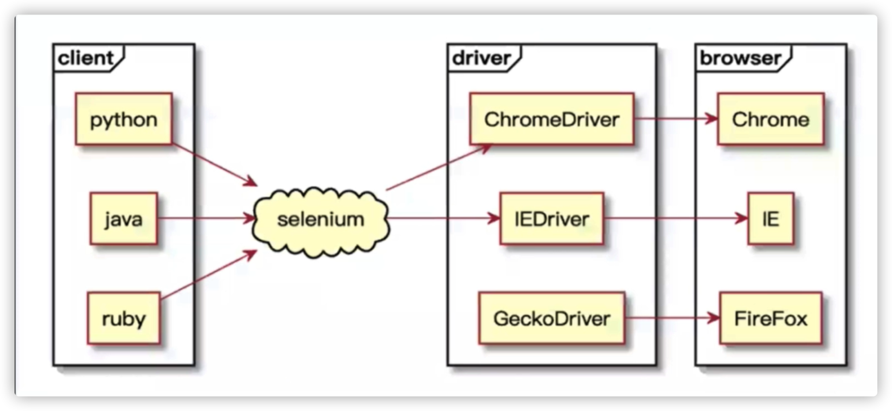
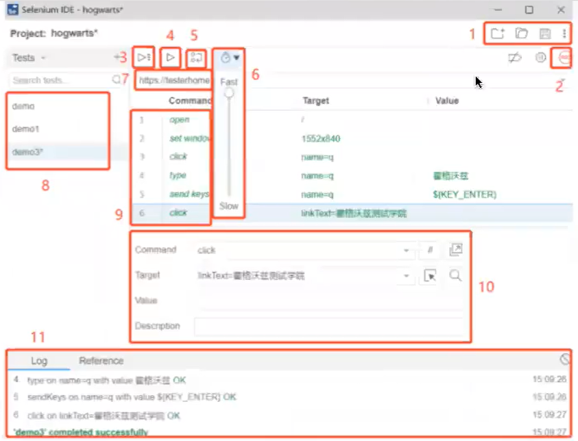

？？？
???
selenium 优化点、并行执行
## selenium架构

### 核心组件
* selenium webdriver client
* selenium drivers
* selenium IDE
* selenium grid
## 安装配置
* 安装浏览器
* 安装selenium driver，并放入Path变量中
  * [安装地址](https://www.selenium.dev/documentation/webdriver/getting_started/install_drivers/)
* 安装selenium-client
* 安装selenium ide
## selenium grid

[环境搭建-官网示例](https://github.com/SeleniumHQ/docker-selenium#quick-start)
### 什么时候应该使用Grid？
* 缩短完成测试的时间
* 在多种浏览器，多种版本的浏览器，不同操作系统里的浏览器里执行你的测试
## selenium ide
### 下载、安装
Chrome插件： https://chrome.google.com/webstore/detail/selenium-ide/mooikfkahbdckldjndioackbalphokd   
Firefox插件： https://addons.mozilla.org/en-US/firefox/addon/selenium-ide/   
github release： https://github.com/SeleniumHQ/selenium-ide/releases   
其它版本： https://addons.mozilla.org/en-GB/firefox/addon/selenium-ide/versions/   
注意:Chrome插件在国内无法下载，Firefox可以直接下载。
### 启动 ide
* 安装完成后，通过在浏览器的菜单栏中点击它的图标来启动它：
* 如果没看到图标，首先确保是否安装了Selenium IDE扩展插件
* 通过以下链接访问所有插件 
  * Chrome: chrome://extensions 
  * Firefox: about:addons
### ide的使用
#### 录制第一个用例
* 创建新项目后，系统将提示为其命名
* 然后要求提供URL：要录制测试脚本的网站URL。设置一次就可以在整个项目的所有测试中使用
* 在页面的操作都将记录在IDE中。操作完成后，请切换到IDE窗口，并单击停止录制图标：
* 停止后，我们为刚录制的Test取名
#### 图示

* 1.新建、保存、打开
* 2.开始和停止录制
* 3.运行8中的所有的实例
* 4.运行单个实例
* 5.调试模式
* 6.调整案例的运行速度
* 7.要录制的网址
* 8.实例列表
* 9.动作、目标、值
* 10.对单条命令的解释
* 11.运行日志
#### 管理用例
* Suites： 
  * 当Test越来越多时，可以将多个Test归类到Suites中，Suites就像小柜子。 
  * 创建项目时，IDE会创建一个默认Suite，并将第一个Test添加到其中，你可以点击Test，在下拉菜单中选中Test suites进入Suites管理界面。 
  * 首先进入Suites管理界面，点击+，提供名称，然后单击add。 
  * 将鼠标悬停在suite1上，点击三个点弹出Suites管理菜单。 
  * 可以对suite1进行管理，包括添加test，重命名，删除，设置，导出。
#### 保存和回放
* 保存 
  * 单击IDE右上角的save图标，输入项目的保存名称和地址。 
* 回放 
  * 选择想要播放的Test或Suite，单击play按钮，在IDE中播放测试。测试将在浏览器中回放，如果录制时窗口仍然打开，它将用于回放。否则，将打开并使用一个新窗口
#### 扩展
* 代码导出：
https://selenium.dev/selenium-ide/docs/en/introduction/code-export
* 常见问题：
https://selenium.dev/selenium-ide/docs/en/introduction/faq
## selenium 登录样例
[loginTest](src/test/java/org/study/basics/登录测试/LoginTest.java)
## 隐式等待 vs 显式等待
[代码示例](src/test/java/org/study/basics/selenium等待/WaitTest.java)

|                         隐式等待                          |                       显式等待                       |
| :-------------------------------------------------------: | :--------------------------------------------------: |
|                    全局声明，代码简洁                     |                局部声明，代码复杂冗余                |
| 等待发生在webDriver控制浏览器时，不可控，仅适用于获取元素 | 等待发生在本地编写的代码逻辑，可以自定义等待获取条件 |
|                仅支持获取元素，找不到超时                 |                也可以判断等待元素消失                |
|                 返回结果是元素或超时异常                  |                  返回结果可以自定义                  |

### 页面元素的呈现顺序
* title出现，首先出现title
* dom树出现，presence，还不完整
* css出现，(可见visibility)
* js出现，js特效执行，（可点击clickable)
* 注意
  * html文档是自上而下加载的
  * js文件加载会阻塞Html内容的加载，有些JS异步加载的方式来完成js的加载
  * 样式表下载完成之后会跟之前的样式表一起进行解析，会对之前的元素重新渲染
### 隐式等待
* 设置一个等待时间，轮询查找(默认0.5秒) 元素是否出现，如果没出现就抛出异常
  * driver.manage().timeouts().implicitlyWait(5, TimeUnit.SECONDS);
### 显式等待
[官方api](https://www.selenium.dev/selenium/docs/api/java/org/openqa/selenium/support/ui/ExpectedConditions.html)
* 在代码中定义等待条件，当条件发生时才继续执行代码
* WebDriverWait配合until()方法。 根据判断条件进行等待
* 程序每隔一段时间（默认为0.5秒）进行条件判断，如果条件成立，则执行下一步，否则继续等待，直到超过设置的最长时间
* 实例：
  * presenceOfElementLocated 判断元素是否被加到了DOM里，并不代表该元素一定见
  * visibilityOfElementLocated 判断某个元素是否可见，可见代表元素非隐藏，并且元素的宽和高都不等于0
### 直接等待
* 强制等待，线程休眠一定时间 
  * Thread.sleep(2000);
### 三种等待机制总结
* 隐式等待：尽量默认都加上，时间限定在*3-6s*，不要太长，为了所有的find_element方法都有一个很好的缓冲
* 显式等待：用来处理隐式等待无法解决的一些问题，比如:文件上传(可以设置长一点)，文件上传需要设置20s以上，但是如果设置隐式等待，它会在每个find方法都等这么长时间，一旦发现没有找到元素，就会等20s以后才抛出异常，影响case的执行效率，这时候就需要用显式等待，显式等待可以设置的长一点
* 强制等待：一般不推荐，前两种基本能解决绝大部分问题，如果某个控件没有任何特征，只能强制等待，这种情况比较少
## web 控件定位
### 元素定位
```
         #  定位元素的九种方法
            * 元素属性定位
               *  By.id
               *  By.name
               *  By.className
            * 元素标签定位
               *  By.tagName  eg：<input></input>
            * 超链接定位
               *  By.linkText（"糯米"） eg:<a>糯米<a/>
               *  By.partialLinkText //模糊匹配 
            * 元素路径定位   
               *  By.xpath  //常用
            * CSS选择器定位
               *  By.css("#kw")
            *  层级定位
```
### Xpath、CSS定位
#### ---Xpath---
[W3C](https://www.w3school.com.cn/xpath/xpath_syntax.asp)
#### Xpath定位策略(方式)
```
1. 路径-定位
绝对路径：从最外层元素到指定元素之间所有经过元素层级路径 ；如:/html/body/div/p[2]
          提示：
              1). 绝对路径以/开始
              2). 使用Firebug可以快速生成，元素XPath绝对路径

相对路径：从第一个符合条件元素开始(一般配合属性来区分)；如：//input[@id='userA']
          提示：
              1). 相对路径以//开始
              2). 使用Firebug扩展插件FirePath可快速生成，元素相对路径

提示：为了方便练习Xpath，可以在FireBug内安装扩展插件-FireFinder插件；
      1). 火狐浏览器-->组件管理器-->搜索FireFinder

2. 利用元素属性-定位
说明：快速定位元素，利用元素唯一属性；
示例：//*[@id='userA']   

3. 层级与属性结合-定位
1>说明：要找的元素没有属性，但是它的父级有；
示例：//*[@id='p1']/input
2> 子节点，找父节点的相关节点
//*[@id='p1']/../../input

4. 属性与逻辑结合-定位
说明：解决元素之间个相同属性重名问题
示例：//*[@id='telA' and @class='telA']
```
| 表达式                             | 结果                                                         |
| :--------------------------------- | :----------------------------------------------------------- |
| /bookstore/book[1]                 | 选取属于bookstore子元素的第一个book元素。                    |
| /bookstore/book[last()]            | 选取属于bookstore子元素的最后一个book元素。                  |
| /bookstore/book[last()-1]          | 选取属于bookstore子元素的倒数第二个book元素。                |
| /bookstore/book[position()<3]      | 选取最前面的两个属于bookstore元素的子元素的book元素。        |
| //title[@lang='eng']               | 选取所有title元素，且这些元素拥有值为eng的 lang属性。        |
| /bookstore/book[price>35.00]       | 选取bookstore元素的所有book元素，且其中的price元素的值须大于35.00。 |
| /bookstore/book[price>35.00]/title | 选取 bookstore元素中的 book元素的所有title元素，且其中的price元素的值须大于35.00。 |

#### Xpath-延伸

```
//*[text()="xxx"]                            文本内容是xxx的元素
//*[starts-with(@attribute,'xxx')]                属性以xxx开头的元素
//*[contains(@attribute,'Sxxx')]                属性中含有xxx的元素
```
#### ---CSS定位---
#### CSS定位策略(方式)
```
1. id选择器
说明：根据元素id属性来选择
格式：#id 如：#userA <选择id属性值为userA的所有元素>

2. class选择器
说明：根据元素class属性来选择
格式：.class 如：.telA <选择class属性值为telA的所有元素>

3. 元素选择器
说明：根据元素的标签名选择
格式：element 如：input <选择所有input元素>

4. 属性选择器
说明：根据元素的属性名和值来选择
格式：[attribute=value] 如：[type="password"] <选择所有type属性值为password的值>

5. 层级选择器
说明：根据元素的父子关系来选择
格式：element>element 如：p>input <返回所有p元素下所有的input元素>
提示：> 可以用空格代替 如：p input 或者 p [type='password']

```
| 选择器          | 例子       | 例子描述                                 |
| :-------------- | :--------- | :--------------------------------------- |
| .class          | .intro     | 选择class=“intro”的所有元素              |
| #id             | #firstname | 选择id=“firstname”的所有元素             |
| *               | *          | 选择所有元素。                           |
| element         | p          | 选择所有`<p>`元素。                      |
| element,element | div,p      | 选择所有`<div>`元素和所有`<p>`元素。     |
| element element | div p      | 选择`<div>`元素内部的所有`<p>`元素。     |
| element>element | div>p      | 选择父元素为`<div>`元素的所有`<p>`元素。 |
| element+element | div+p      | 选择紧接在`<div>`元素之后的所有`<p>`元素 |

#### CSS延伸

```
1. input[type^='p'] 说明：type属性以p字母开头的元素
2. input[type$='d'] 说明：type属性以d字母结束的元素
3. input[type*='w'] 说明：type属性包含w字母的元素
```
#### XPath与CSS类似功能对比

| 定位方式 | XPath                                                        | CSS                                                         |
| :------: | ------------------------------------------------------------ | ----------------------------------------------------------- |
|  元素名  | //input                                                      | input                                                       |
|    id    | //input[@id='userA']                                         | #userA                                                      |
|  class   | //*[@class='telA']                                           | .telA                                                       |
|   属性   | 1. //※[text()="xxx"] 2. //※[starts-with(@attribute,'xxx')] 3. //※[contains(@attribute,'xxx')] | 1. input[type^='p'] 2. input[type$='d'] 3. input[type*='w'] |

* * * *

* 鼠标操作
```
Actions action=new Actions(dirver);
//左击
Action.click(webElement).perform();
//双击
Action.doubleClick(webElement).perform();
//右击
Action.contextClick(webElement).perform();
//悬停
Action.moveToElement(webElement).perform();
```
* 窗体操作
  * iframe
  * 弹框
    * switchTo()
    * getWindowHandles()
  * 对话框

## 元素操作｜浏览器操作

### 常见元素操作

* 文本框
  * sendkeys
  * clear
  * getAttribute-获取元素的各个属性
* 单选框
  * click
  * clear
  * isSelected(判断某个元素是否被选中)
* 多选框
  * click
  * clear
  * isSelected
  * isEnabled(元素当前是否已启用？除了禁用的输入元素之外，这通常会返回true。)
* 按钮
  * click
  * isEnabled
  * isDisplayed(这个元素是否显示？此方法避免了必须解析元素的“样式”属性的问题。)
* 表单
* 关闭窗口
  * 关闭所有页面quit
  * 关闭单个页面close
* 操作JS

```
        JavascriptExecutor jsdriver = (JavascriptExecutor) driver;
        jsdriver.executeScript("window.scrollTo(0,document.body.scrollHeight)");
```

* 上传文件
  * input标签，直接使用sendkeys("文件路径")
  * 使用第三分插件（au3）
    
    
* 下拉框
  * 下拉框定位 Select list=new Select(locator);
  * 下拉框操作
    * 选择对应元素
      * Text
      * Value
      * Index
    * 不选择对应元素(适用于多选下拉框【isMultiple()】)
      * deselectAll
      * deselectByValue
      * deselectByVisibleText
    * 获取选择项的值(只有被选中的值)
      * getAllSelectedOptions()
      * getFirstSelectedOptions().getText

### 常见问题处理

* 在点击页面按钮时，有其他控件遮挡，可以使用js隐藏其他按钮
  * document.getElementById("id).style.display="none"
### 操作浏览器常用方法
[webdriver/browser](https://www.selenium.dev/documentation/webdriver/browser/)
### 多浏览器操作
```
@BeforeAll
public static void initData(){
    String browserName= System.getenv("browser");
    if(browserName.equals("chrome")){
        System.setProperty("webdriver.chrome.driver","Users/naruto0728/Downloads/chromedriver");
        driver=new ChromeDriver();
    }else if(browserName.equals("firefox")){
        System.setProperty("webdriver.gecko.driver","Users/naruto0728/Downloads/geckodriver");
        driver=new FirefoxDriver();
    }
}
```
## Actions接口 键盘｜鼠标｜滚轮

[actions](https://www.selenium.dev/zh-cn/documentation/webdriver/actions_api/)
