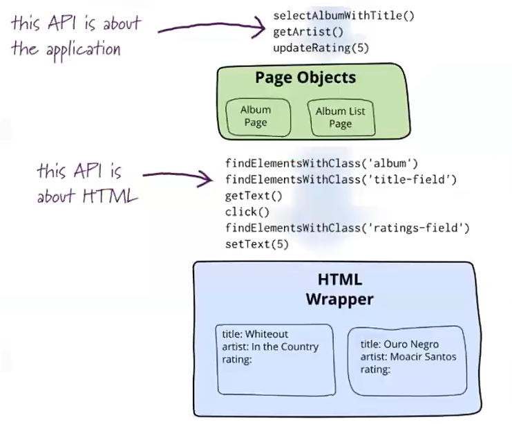

### 操作细节

### 历史
2013 Martin Flower https://martinfowler.com/bliki/PageObject.html   
2015 Selenium https://github.com/SeleniumHQ/selenium/wiki/PageObjects   
2020 https://www.selenium.dev/documentation/en/guidelines_and_recommendations/page_object_models/
### PageObject 六大原则
* Summary
  * The public methods represent the services that the page offers
  * Try not to expose the internals of the page
  * Generally don’t make assertions
  * Methods return other PageObjects
  * Need not represent an entire page
  * Different results for the same action are modelled as different methods
### 授课 todo
### 官网review
https://www.selenium.dev/zh-cn/documentation/about/
作业回顾
css vs xpath 源码阅读
selenium原理
书籍回顾
### Domain specific language
