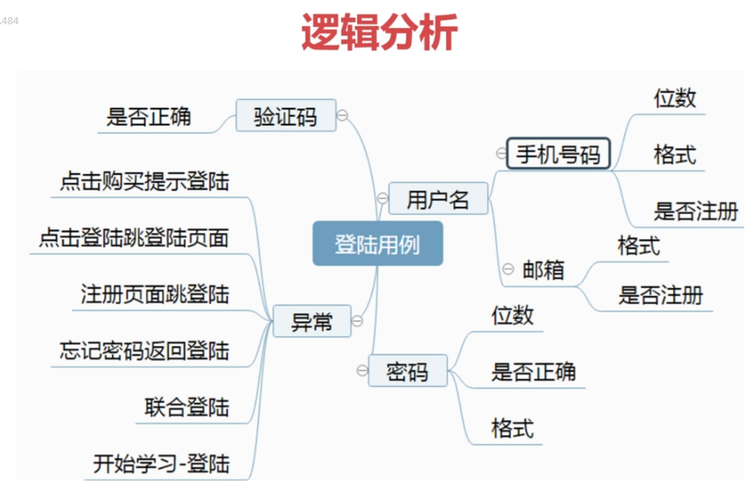
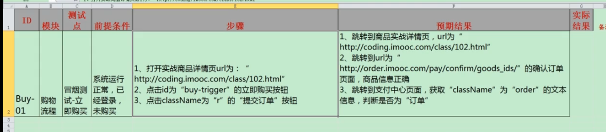

## 自动化测试的前提和整体介绍
### 需求到框架

### 功能测试VS性能测试
### 自动化测试流程
* 分析测试需求
* 选择方案
* 制定测试计划
* 环境
* 测试用例准备
* 编码
* 分析结果
### Selenium简介


### Selenium优势
* 开源
* 多浏览器支持
* 多平台
* api齐全
* 浏览器内运行
### 工作原理

## Selenium基础知识
### 元素定位
```
         *  定位元素的九种方法
         *  By.id
         *  By.name
         *  By.tagName
         *  By.className
         *  By.xpath  //常用
         *  By.css("#kw")
         *  By.partialLinkText //模糊匹配
         *  By.linkText（"糯米"） eg:<a>糯米<a/>
         *  层级定位
```
### 常见元素处理
* 文本框
    * sendkeys
    * clear
    * getAttribute-获取元素的各个属性
* 单选框
    * click
    * clear
    * isSelected(判断某个元素是否被选中)
* 多选框
    * click
    * clear
    * isSelected
    * isEnabled(元素当前是否已启用？除了禁用的输入元素之外，这通常会返回true。)
* 按钮
    * click
    * isEnabled
    * isDisplayed(这个元素是否显示？此方法避免了必须解析元素的“样式”属性的问题。)
* 表单
* 关闭窗口
    * 关闭所有页面quit
    * 关闭单个页面close
* 操作JS
```
        JavascriptExecutor jsdriver = (JavascriptExecutor) driver;
        jsdriver.executeScript("window.scrollTo(0,document.body.scrollHeight)");
```
* 上传文件
    * input标签，直接使用sendkeys("文件路径")
    * 使用第三分插件（au3）
     
     
* 下拉框
    * 下拉框定位 Select list=new Select(locator);
    * 下拉框操作
        * 选择对应元素
            * Text
            * Value
            * Index
        * 不选择对应元素(适用于多选下拉框【isMultiple()】)
            * deselectAll
            * deselectByValue
            * deselectByVisibleText
        * 获取选择项的值(只有被选中的值)
            * getAllSelectedOptions()
            * getFirstSelectedOptions().getText

* 鼠标操作
```
Actions action=new Actions(dirver);
//左击
Action.click(webElement).perform();
//双击
Action.doubleClick(webElement).perform();
//右击
Action.contextClick(webElement).perform();
//悬停
Action.moveToElement(webElement).perform();
```
* 窗体操作
    * iframe
    * 弹框
        * switchTo()
        * getWindowHandles()
    * 对话框
* 等待函数
    * 强制等待【死等】 Thread.sleep()
    * 显示等待【显示等待就是有条件的等待】【规定时间内找到继续执行；否则报错】 new WebDriverWait(driver,15).until(   
                   ExpectedConditions.presenceOfElementLoacted(By.id("id"))
              ) 
    * 隐式等待【隐式等待就是无条件的等待】【一直查找直到制定时间，超过报错】driver.manage().timeouts().implicitlyWait(10,TimeUnit.SECONDS)
       
### 常见问题处理
* 在点击页面按钮时，有其他控件遮挡，可以使用js隐藏其他按钮
    * document.getElementById("id).style.display="none"
### selenium面试技巧
* 自动化测试用例来源：部分功能测试用例（冒烟测试）
* 开发框架选型：maven+testng+log4j+webdriver+jenkins+第三方jar包
* 解决遇见的问题：
* 自动化目的：没有发现新bug
* 如何判断case是否通过：Assert判断预期接口和实际结果
* 有多少case？通过率？老手（一个系统上千条case）;case越多通过率约高（一般70-80%）
* 失败截图实现原理：testng监听+webdriver截图方法
* 报告来源？统计什么？
* Testng如何管理case
* 实现多浏览器运行
* case之间依赖处理（使用cookie）
    * cookie
    * 然后直接跳转到测试页面可以了
* 常用断言
    * 百度。。。
* case如何运行
    * 登录jenkins运行
    * pom运行
    * maven命令运行
* 如何持续集成--？
* 对工作满意吗？
* 你做的最好的项目是什么？
* 自动化流程是什么？
* 如何控制项目进度？
    * 测试时间尽量提前
    * 无法完成，找产品砍功能模块
    * 将风险降到最低
* 你最大的优点？
    * 体现在工作方面
* 测试认为是bug,开发不认同该如何处理
    
## 慕课网帐号登录测试实战
### 登陆功能需求分析及用例设计
* 逻辑分析（从功能点分析测试点）
    
* 功能用例设计
    
* 自动化用例设计
    * 自动化目的
        * 减少人力成本
        * 完成重复大量工作
        * 提高测试效率
        * 保证工作一致性
        * 完成手工不能完成的工作
    
    
### 代码封装
* base层-存放driver、封装driver相关方法（findelement、open、...）   
	SelectDriver类     
	DriverBase类   
* 元素层-存放页面所有元素    
	LoginPage类（封装所有查询页面元素的方法）     
	BasePage类（封装所有操作元素的方法）   
* 操作层-点击、输入操作（调用元素层的方法实现元素的操作）
* 业务层-业务逻辑控制（调用操作层+业务逻辑控制）
* 工具类-查询数据
* case层-执行测试用例   
	CaseBase类（初始化driver）    
	loginCase（执行测试用例）     
* 业务逻辑：case层-业务层-操作层-元素层-base层    
	   dvier对象由case层初始化传递给base层   
	   各层直接单链式通信，实现解耦      
### 引入log4j
### 引入Testng
#### 常用断言
```
    //常用方法
    Assert.assertEquals();
    Assert.assertTrue();
    ...
```
#### 配置文件
```
<?xml version="1.0" encoding="UTF-8"?>
<!DOCTYPE suite SYSTEM "http://testng.org/testng-1.0.dtd">
<!--paralll设置多线程：目的缩短运行时间，提高测试效率-->
<suite name="Default Suite" parallel="methods" thread-count="3">
    <!--testng参数话-->
    <parameter name="username" value="value1"/>
  <test name="Auto-Selenium">
    <classes>
      <class name="com.CourseCase">
        <methods>
          <include name="test"/>
          <include name="test2"/>
        </methods>
      </class> <!-- com.CourseCase -->
    </classes>
  </test> <!-- Auto-Selenium -->
</suite> <!-- Default Suite -->
@Test
    @Parameters({"username"})
    public void getCourseHome(String username) throws IOException {
        System.out.println(username);
        driverBase.open("https://coding.imooc.com/");
        driverBase.maximize();
        coursesPro.clickCourse();
    }
    @Test
    public void test(){
        System.out.println("=========="+Thread.currentThread().getId());
    }
    @Test
    public void test2(){
        System.out.println("=========="+Thread.currentThread().getId());
    }
```
### 优化测试报告    
## 慕课网购物流程测试实战
### 需求分析
### 用例设计

### 功能测试用例编写

### 功能测试用例执行
### 自动化测试用例编写

### 引入Jenkins
### 邮件服务
### chrome无界面运行
https://www.cnblogs.com/cation/p/8954918.html
### maven配置多环境


